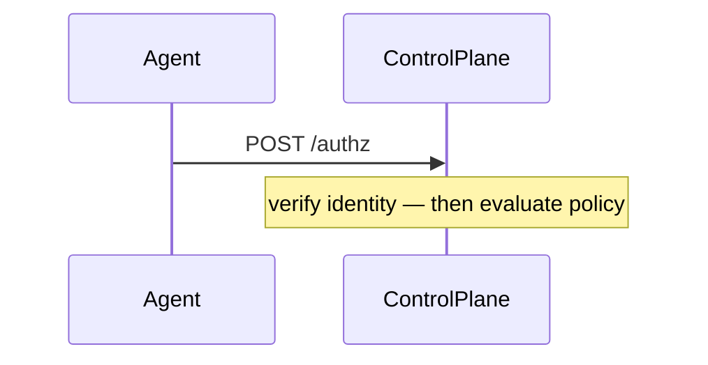

# Contributing to the PaloNexus docs

This is the contributor guide for the PaloNexus documentation site (`palonexus-web/`),
an [Astro](https://astro.build) + [Starlight](https://starlight.astro.build) static site
served under the `/docs` base path. It collects the conventions that keep the docs
consistent, accessible, and honest — read it before opening a docs PR.

If you just want the short version: **write pages as Markdown under
`src/content/docs/<section>/`, introduce every diagram and screenshot in prose with an
italic caption, keep terminology IdP-neutral, make Python snippets offline-runnable, and
verify diagrams in a browser before you call it done.**

## Project layout

Pages are MDX/Markdown files under `src/content/docs/`. Each subdirectory maps to one
sidebar section (the sidebar is configured in `astro.config.mjs`):

| Directory | Sidebar section |
|---|---|
| `src/content/docs/getting-started/` | Getting Started |
| `src/content/docs/concepts/` | Architecture & Features |
| `src/content/docs/develop/` | Developer Integration |
| `src/content/docs/sdk/` | SDK Reference (Python) |
| `src/content/docs/operations/` | Operations (Go + Terraform) |
| `src/content/docs/reference/` | Reference |

A seventh section, **the interactive API reference**, is *generated* — it is not authored
by hand. The `starlight-openapi` plugin renders it from the OpenAPI 3.1 spec at
`openapi/agent-idp.json` into `reference/api/agent-idp` (see the `starlightOpenAPI(...)`
block and `...openAPISidebarGroups` in `astro.config.mjs`). To change the interactive
reference, update the spec, not the generated pages.

Other key locations:

- **`public/screenshots/`** — all portal PNGs. Every screenshot is catalogued in
  `public/screenshots/MANIFEST.md` (route, screen name, accessibility alt text, suggested
  caption, suggested doc home, capture state). Add a manifest row whenever you add a PNG.
- **`openapi/agent-idp.json`** — the OpenAPI spec that drives the generated API reference.
- **`src/content/docs/index.mdx`** — the front-door landing/path-picker page.

## Diagrams (Mermaid)

Diagrams are authored as fenced ` ```mermaid ` code blocks and rendered **client-side** by
[`astro-mermaid`](https://github.com/joey-mckenzie/astro-mermaid). The integration is
configured in `astro.config.mjs` and **must precede `starlight()`** so it transforms the
fences before Expressive Code does — don't reorder the integrations.

Use the supported diagram types: `flowchart`, `sequenceDiagram`, `stateDiagram-v2`.

**Do not put semicolons in `Note` / label / message text.** A `;` is a Mermaid statement
separator and will break the parser. Use an em dash (`—`) or a comma instead:

````markdown

````

Always **introduce a diagram in prose** before it appears, and follow it with an *italic
caption* that says what the reader should take away. Example:

```markdown
The egress decision runs five stages in order before any call leaves the cluster:

<diagram here>

*The egress decision path: allowlist, budget, delegation/TBAC, OPA veto, then audit.*
```

> ⚠️ Because Mermaid renders in the browser, `npm run build` does **not** catch diagram
> syntax errors. You must verify diagrams visually (see [Validation](#validation-workflow)).

## Screenshots

Embed screenshots with an **absolute** path under the `/docs` base and always pair them
with an italic caption:

```markdown


*Live posture of the PaloNexus control plane in one view.*
```

- The file lives in `public/screenshots/overview.png`; under the `/docs` base it is served
  at `/docs/screenshots/overview.png`.
- **Alt text describes what is shown** for accessibility — the actual content of the image,
  not "screenshot of the overview page". `MANIFEST.md` already has good alt text and a
  suggested caption for every shipped PNG; reuse it.
- Add a row to `public/screenshots/MANIFEST.md` for any new capture (route, screen name,
  alt text, caption, doc home, and capture state — `rich` / `initial` / `empty`). Caption
  honestly: if a queue is empty, say so rather than implying populated data.

## Terminology and IdP-neutral positioning

PaloNexus is positioned as **IdP-neutral**. Keep these distinctions exact:

- **The workforce IdP owns humans; PaloNexus owns agents.** Don't blur the two. Employee
  identity is synced *in* (SCIM); agent identity is issued *by* PaloNexus.
- **Logto is the labeled reference/demo IdP** — not a dependency. Any OIDC/SCIM workforce
  IdP (Okta, Microsoft Entra ID, Auth0, Ping, Google Workspace, Amazon Cognito, Keycloak,
  Logto, …) integrates via the standard patterns. When you mention Logto, label it as the
  reference/demo IdP.
- **Standards-first.** Lead with the standard — **OIDC / SAML / SCIM** — and name vendors
  as examples of it, never as the mechanism.
- **Keep real artifact names verbatim.** Tools, env vars, and routes are literal: `seed-logto`,
  `LOGTO_*`, `FakeLogtoClient`, `/settings/logto`. Don't "neutralize" a real identifier —
  neutralize the *positioning*, keep the *name*.

## Cross-links and frontmatter

Within an autogenerated section, ordering is controlled by `sidebar.order` in a page's
frontmatter (lower numbers sort first):

```markdown
---
title: HTTP API
description: One-sentence summary used for SEO and the section index.
sidebar:
  order: 2
---
```

Cross-link generously. End reference pages with a **"Related"** or **"See also"** list of
absolute `/docs/...` links, and inline-link the first mention of any concept that has its
own page. Use absolute paths with a trailing slash (e.g. `/docs/reference/headers/`).

## Doc-test gate (Python snippets are executed)

Every fenced ` ```python ` / ` ```py ` block in the docs tree is **executed in CI** against
the shipped `palonexus` package in `offline()` mode by
`platform/palonexus/tests/test_docs_snippets.py`. Each block runs in a fresh namespace
pre-wired with an offline `PaloNexus` instance exposed as both `pn` and `offline_pn`.

So a Python snippet must be **offline-runnable**:

```python
pn = PaloNexus.offline()          # in-memory, no cluster, no network
# ... self-contained, runs to completion ...
```

If a snippet is intentionally illustrative or live-only (a real `from_env()` against a
cluster, a narrative fragment, a `…` placeholder), **mark it** — never let it fail silently.
Put an HTML comment on the line immediately before the opening fence:

````markdown
<!-- no-doctest: live-only — needs a real cluster -->
```python
pn = PaloNexus.from_env()   # talks to the cluster
```
````

The reason after `no-doctest:` is logged in the skip report. (The bare token `no-doctest`
in the fence info string also works.) Non-Python fences (`bash`, `text`, `yaml`, `json`,
`mermaid`) are never executed.

Run it locally from the platform repo:

```bash
cd platform/palonexus
python -m pytest tests/test_docs_snippets.py          # or:
python tests/test_docs_snippets.py                    # standalone found/passed/skipped report
```

## Validation workflow

Before opening a PR:

1. **Build clean.** `npm run build` must finish with **0 errors**. This catches broken
   Markdown, bad frontmatter, and dead internal links.
2. **Verify diagrams in a browser.** The build does **not** validate Mermaid (it renders
   client-side). Serve the built site and load every page that has a diagram:
   ```bash
   npm run preview      # serves the build at http://localhost:4321/docs/
   ```
   A broken diagram shows a Mermaid parse error in the rendered page instead of the figure —
   the most common cause is a stray semicolon in a `Note`/label.
3. **Check images and links.** Confirm each screenshot resolves (`/docs/screenshots/<file>.png`)
   and that "Related"/"See also" links land on real pages.
4. **Run the doc-test gate** if you touched any Python snippet (see above).

> Note: a parallel build/validation process may already own `npm run build` in some
> workflows — coordinate before running it yourself if so.

## Releasing (CI-only deployment)

Deployment is automated and **cannot** be done from a laptop. A push to `main` (a merged,
reviewed PR) is the only way to publish, and only after the end-to-end tests pass.

1. **Validate locally** exactly as CI does:
   ```bash
   npm run validate     # Prettier check + docs build + Playwright E2E
   ```
2. **Open a PR** to `main`. The `validate` job (format → build → Playwright E2E) runs on the
   PR; it must be green to merge. The Playwright report is attached as an artifact.
3. **Merge to `main`.** CI re-runs `validate`, then the `deploy` job publishes the
   `palonexus-docs` worker and runs a post-deploy smoke test.

`npm run deploy` is disabled on purpose (`scripts/no-manual-deploy.mjs`). The end-to-end
tests live in `tests/e2e/docs.spec.ts`. The complete release runbook — verification, rollback,
required Cloudflare secrets, and troubleshooting — is the
[Releasing the docs site](src/content/docs/operations/releasing-the-docs.md) operations page.

## Quick checklist

- [ ] Page is in the right `src/content/docs/<section>/` directory with `title`,
      `description`, and (if needed) `sidebar.order` frontmatter.
- [ ] Diagrams use `flowchart`/`sequenceDiagram`/`stateDiagram-v2`, have no semicolons in
      label text, and are introduced in prose + an italic caption.
- [ ] Screenshots use absolute `/docs/screenshots/...` paths, descriptive alt text, an
      italic caption, and a `MANIFEST.md` row.
- [ ] Terminology is IdP-neutral; Logto labeled as reference/demo; real artifact names kept
      verbatim; standards (OIDC/SAML/SCIM) lead.
- [ ] "Related"/"See also" cross-links added.
- [ ] Python snippets are offline-runnable or marked `<!-- no-doctest: reason -->`.
- [ ] `npm run build` is clean and diagrams verified in `npm run preview`.
