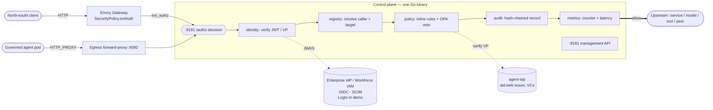

PaloNexus's decision engine is **one Go binary** — the control plane — that every
request in the cluster ultimately consults. This page describes its internal shape:
the decision spine, the listeners it exposes, and the trust zones it sits in.

## The decision spine

The spine is [`internal/authz`](https://github.com/). Envoy's HTTP `ext_authz` filter
forwards each request here; the handler dispatches on the `X-Palonexus-Actor` header:

- **present** → `serveEgress` (the agent on-ramp)
- **absent** → `serveIngress` (north-south)

Both paths call the same dependency packages in order:

| Package | Concern | On failure |
|---|---|---|
| `internal/identity` | verify the bearer JWT (vs OIDC JWKS) | `401` invalid credential |
| `internal/agentid` | verify the agent Verifiable Presentation (egress only) | `403` identity failure / mismatch |
| `internal/registry` | resolve the caller + target service | `403` unknown service / agent / target |
| `internal/policy` | inline rules, then OPA veto (deny-overrides); egress adds allowlist + budget + delegation | `403` deny (or `401` needs-approval on egress) |
| `internal/audit` | append a hash-chained record of the outcome | — |
| `internal/metrics` | bump the decision counter + latency histogram | — |

Read `internal/authz/authz.go` first if you read nothing else — every other package
is a dependency of it.

### The request path, end to end

The diagram below traces a single request from the two entry points — a north-south
**client** through the Envoy Gateway, and a **governed agent pod** through the egress
forward-proxy — into the *same* `/authz` decision. Read it left to right: both paths
converge on the `:9191` decision listener, which runs the internal stages in order
(identity → registry → policy → audit → metrics) and only forwards to the upstream on an
**allow** (the bold edge). The dashed edges are the two identity sources the decision
consults but does not embed: **the enterprise IdP (OIDC)** supplies human sign-in keys (JWKS)
and the workforce directory (Logto in the demo), while **agent-idp** verifies each agent's
Verifiable Presentation.
The `:8181` management API sits beside the hot path so operators and CI can read the
registry, audit, and metrics without touching the decision listener.



*The two entry points (gateway ext_authz and egress proxy) converge on one `/authz`
decision; identity is verified against the enterprise IdP (OIDC) and agent-idp (Logto is the
demo's IdP), and only an allow reaches the upstream.*

## Two listeners (plus the egress proxy)

The control plane runs **two HTTP listeners**, deliberately split so the data path
can be locked down mesh-only while the management API is exposed separately:

| Listener | Default addr | Purpose |
|---|---|---|
| **Decision / ext_authz** | `:9191` (`DECISION_ADDR`) | the `/authz` hot path the gateway calls |
| **Management** | `:8181` (`MGMT_ADDR`) | registry CRUD, `/v1/audit`, `/v1/egress/requests`, `/metrics`, `/healthz`, `/readyz` |

A third listener — the **egress forward-proxy** — is started only when
`AGENT_IDP_URL` is set (it needs the IdP to verify agent identities):

| Listener | Default addr | Purpose |
|---|---|---|
| **Egress proxy** | `:9092` (`EGRESS_PROXY_ADDR`) | a standard HTTP forward proxy that runs the *same* egress decision before forwarding any outbound agent call |

The egress proxy is fronted by the `egress-proxy.palonexus.svc:80` Service; agent pods
are pinned to reach only it. See [Egress enforcement](/docs/concepts/egress-enforcement/).

```
                       ┌──────────────────────────────────────────┐
                       │  CONTROL PLANE  (one Go binary)            │
                       │                                            │
  gateway ──ext_authz──▶  :9191  /authz   (decision hot path)       │
                       │                                            │
  operators / CI ──────▶  :8181  registry · audit · egress · /metrics
                       │                                            │
  agent pods ──────────▶  :9092  egress forward-proxy (same decision)
                       └──────────────────────────────────────────┘
```

For the precise routes on each listener, see the
[HTTP API reference](/docs/reference/http-api/).

## Namespaces and trust zones

The platform deploys into three namespaces, each a trust boundary:

| Namespace | Contents | Role |
|---|---|---|
| `palonexus` | control-plane, OPA, Dex, OTel collector, model-broker, portal, egress proxy | the control layer |
| `apps` | the governed agents, upstream services, runbooks-api, incy | the workloads being governed |
| `observability` | Grafana LGTM (Tempo / Prometheus / Loki) | telemetry sink |

`agent-idp` runs in its own `agent-idp` namespace so its `did:web` issuer DID resolves
at a stable in-cluster name (`did:web:agent-idp.agent-idp.svc`).

**NetworkPolicy is part of the design, not an afterthought.** Agent egress is confined
to **DNS + agent-idp:8090 + egress-proxy:80 only** — the direct paths to the
model-broker, runbooks-api, and peer agents are removed, so nothing reaches a target
except through the proxy (which routes it through `/authz`). The Envoy Gateway is the
only component intended to take external client traffic, and every request through it
is gated.

## Design invariants

These hold across the whole control plane — do not break them:

- **Deny-by-default / fail-closed.** Every unknown, every failure, every unreachable
  dependency denies. An unreachable OPA denies; a timed-out egress-approval hold
  transitions to `expired` (a deny).
- **Deny-overrides policy.** Inline allow + OPA deny = deny.
- **Identity propagation, not token forwarding.** On an allow the control plane stamps
  `X-Palonexus-Subject` / `-Upstream` (and `-Actor` / `-Agent-DID` on egress);
  upstreams trust the edge.
- **Tamper-evident audit.** The hash chain is the integrity guarantee; `/v1/audit/verify`
  recomputes it and reports the sequence where it first breaks.
- **Same image everywhere.** All behavior is env-driven (see
  [Environment variables](/docs/reference/env-vars/)); the dev overlay simply removes
  the OIDC env vars to allow anonymous passthrough while policy still enforces
  public-vs-private from the registry.

## Related

- [Egress enforcement](/docs/concepts/egress-enforcement/)
- [Persistence & identity](/docs/concepts/persistence-and-identity/)
- [Operating the control plane](/docs/operations/control-plane/)
