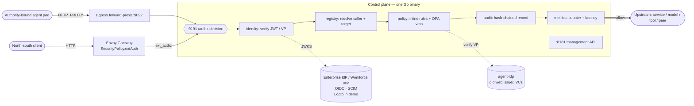

This page describes the internal shape of PaloNexus's **authorization decision
service** — the component that answers, for every governed action, *may this agent do
this, on whose authority, right now?* It is implemented as **one Go binary** (the
component is named the control plane) that every request ultimately consults. First
the decision spine and its invariants; then the Kubernetes deployment mechanics
underneath — one way to run the service, not what the service *is*.

## The decision spine

The spine is [`internal/authz`](https://github.com/). Every request reaches it and the
handler dispatches on the `X-Palonexus-Actor` header — the headline path is **agent
egress**, with north-south ingress as the foundation underneath it:

- **present** → `serveEgress` (the agent on-ramp — *may this agent make this outbound
  call, on behalf of this human, for this task, right now?*)
- **absent** → `serveIngress` (north-south, forwarded by Envoy's `ext_authz` filter)

Both paths call the same dependency packages in order:

| Package | Concern | On failure |
|---|---|---|
| `internal/identity` | verify the bearer JWT (vs OIDC JWKS) | `401` invalid credential |
| `internal/agentid` | verify the agent Verifiable Presentation (egress only) | `403` identity failure / mismatch |
| `internal/registry` | resolve the caller + target service | `403` unknown service / agent / target |
| `internal/policy` | inline rules, then OPA veto (deny-overrides); egress adds allowlist + budget + delegation | `403` deny (or `401` needs-approval on egress) |
| `internal/audit` | append a hash-chained record of the outcome | — |
| `internal/metrics` | bump the decision counter + latency histogram | — |

Read `internal/authz/authz.go` first if you read nothing else — every other package
is a dependency of it.

### The request path, end to end

The diagram below traces a single request from the two entry points — a **governed
agent pod** through the egress forward-proxy (the headline path), and a north-south
**client** through the Envoy Gateway (the foundation underneath) — into the *same*
`/authz` decision. Read it left to right: both paths
converge on the `:9191` decision listener, which runs the internal stages in order
(identity → registry → policy → audit → metrics) and only forwards to the upstream on an
**allow** (the bold edge). The dashed edges are the two identity sources the decision
consults but does not embed: **the enterprise IdP (OIDC)** supplies human sign-in keys (JWKS)
and the workforce directory (Logto in the demo), while **agent-idp** verifies each agent's
Verifiable Presentation.
The `:8181` management API sits beside the hot path so operators and CI can read the
registry, audit, and metrics without touching the decision listener.



*The two entry points (egress proxy and gateway ext_authz) converge on one `/authz`
decision; identity is verified against the enterprise IdP (OIDC) and agent-idp (Logto is the
first supported enterprise IdP), and only an allow reaches the upstream.*

## Design invariants

These hold across the whole decision service — do not break them:

- **Deny-by-default / fail-closed.** Every unknown, every failure, every unreachable
  dependency denies. An unreachable OPA denies; a timed-out egress-approval hold
  transitions to `expired` (a deny).
- **Deny-overrides policy.** Inline allow + OPA deny = deny.
- **Identity propagation, not token forwarding.** On an allow the control plane stamps
  `X-Palonexus-Subject` / `-Upstream` (and `-Actor` / `-Agent-DID` on egress);
  upstreams trust the edge.
- **Verifiable authority trail.** The hash chain is the integrity guarantee — each
  record is tamper-evident; `/v1/audit/verify` recomputes the chain and reports the
  sequence where it first breaks.
- **Same image everywhere.** All behavior is env-driven (see
  [Environment variables](/docs/reference/env-vars/)); the dev overlay simply removes
  the OIDC env vars to allow anonymous passthrough while policy still enforces
  public-vs-private from the registry.

## Deployment mechanics (Kubernetes)

Everything below is how the decision service is *deployed* on Kubernetes — listeners,
namespaces, network policy — not what it decides. Operational detail lives in
[Operating the control plane](/docs/operations/control-plane/) and
[Credential-Safe Action Enforcement (Ops)](/docs/operations/egress-enforcement-ops/).

### Two listeners (plus the egress proxy)

The control plane runs **two HTTP listeners**, deliberately split so the data path
can be locked down mesh-only while the management API is exposed separately:

| Listener | Default addr | Purpose |
|---|---|---|
| **Decision / ext_authz** | `:9191` (`DECISION_ADDR`) | the `/authz` hot path the gateway calls |
| **Management** | `:8181` (`MGMT_ADDR`) | registry CRUD, `/v1/audit`, `/v1/egress/requests`, `/metrics`, `/healthz`, `/readyz` |

A third listener — the **egress forward-proxy** — is started only when
`AGENT_IDP_URL` is set (it needs the IdP to verify agent identities):

| Listener | Default addr | Purpose |
|---|---|---|
| **Egress proxy** | `:9092` (`EGRESS_PROXY_ADDR`) | a standard HTTP forward proxy that runs the *same* egress decision before forwarding any outbound agent call |

The egress proxy is fronted by the `egress-proxy.palonexus.svc:80` Service; agent pods
are pinned to reach only it. See [Credential-Safe Action Enforcement](/docs/concepts/egress-enforcement/).

```
                       ┌──────────────────────────────────────────┐
                       │  CONTROL PLANE  (one Go binary)            │
                       │                                            │
  agent pods ──────────▶  :9092  egress forward-proxy (same decision)
                       │                                            │
  gateway ──ext_authz──▶  :9191  /authz   (decision hot path)       │
                       │                                            │
  operators / CI ──────▶  :8181  registry · audit · egress · /metrics
                       └──────────────────────────────────────────┘
```

For the precise routes on each listener, see the
[HTTP API reference](/docs/reference/http-api/).

### Namespaces and trust zones

The platform deploys into three namespaces, each a trust boundary:

| Namespace | Contents | Role |
|---|---|---|
| `palonexus` | control-plane, OPA, Dex, OTel collector, model-broker, portal, egress proxy | the control layer |
| `apps` | the authority-bound agents, upstream services, runbooks-api, incy | the workloads being governed |
| `observability` | Grafana LGTM (Tempo / Prometheus / Loki) | telemetry sink |

`agent-idp` runs in its own `agent-idp` namespace so its `did:web` issuer DID resolves
at a stable in-cluster name (`did:web:agent-idp.agent-idp.svc`).

**NetworkPolicy is part of the design, not an afterthought.** Agent egress is confined
to **DNS + agent-idp:8090 + egress-proxy:80 only** — the direct paths to the
model-broker, runbooks-api, and peer agents are removed, so nothing reaches a target
except through the proxy (which routes it through `/authz`). The Envoy Gateway is the
only component intended to take external client traffic, and every request through it
is gated.

## Consoles

PaloNexus deliberately splits its UI into focused portals. **None is exposed to the
public internet.** Each is reachable only over your **Tailscale tailnet** (the
production path) or via `kubectl port-forward` (the local fallback). `make port-forward`
opens all of them at once.

| Portal | In-cluster | What it's for |
|---|---|---|
| **Control-plane console** | `svc/portal:3000` (ns `palonexus`) | the operator cockpit — the tabs below |
| **Grafana (LGTM)** | `svc/lgtm:3000` (ns `observability`) | traces with DID/VC attributes (Tempo), decision/latency/token/cost metrics (Prometheus), audit/log search (Loki) |
| **Incy** *(optional backdrop)* | `svc/web` (ns `incy`) | a realistic SRE incident-management app the agents can act against |

### Control-plane console — the tabs

| Tab | Shows | Backed by |
|---|---|---|
| **Overview** | KPIs (decisions, allow/deny, agents, active delegations, tokens/cost) + a live activity feed | `/metrics` + `/v1/audit`, agent-idp |
| **Registry** | every service / agent / model / tool: kind, allowlists, budgets, scopes, data-class | `/v1/registry/services` |
| **Decisions** | allow-vs-deny by target + a live decision table | `/v1/audit` |
| **Audit** | the hash-chained log + **Verify chain** (tamper-evidence) | `/v1/audit`, `/v1/audit/verify` |
| **Identity** | the **did:web** issuer anchor + each agent's **did:key**, capabilities, delegations, revocations | agent-idp `/v1/issuer`, `/v1/agents`, `/v1/delegations`, `/v1/revocations` |
| **Approvals** | the **human-in-the-loop console** — Approve / Deny pending delegations, **Revoke** active ones | agent-idp delegation + revoke APIs |
| **Egress Approvals** | held egress requests (actor DID, target, action, resource, reason, countdown) with Approve / Deny | `/v1/egress/requests` (+ `/approve`, `/deny`) |
| **Agents** | per-agent identity (`did:key`) + allowlist / budget + **what was delegated, by whom, when it expires** + usage | aggregated control-plane + agent-idp |
| **Traces** | embedded Grafana Tempo Explore for DID/VC-tagged spans | Grafana (`GRAFANA_PUBLIC_URL`) |

The **Approvals** and **Egress Approvals** tabs are the two human-in-the-loop
surfaces: Approvals resumes a *delegation* (the regulated DID/VC runbook gate); Egress
Approvals resumes a *held network call* at the egress proxy. Both poll every few
seconds and resume the waiting decision on approve.

The same console also carries the two enterprise-IAM surfaces — **Directory** and
**Governance** — documented under [Connect agents to enterprise authority](/docs/concepts/enterprise-iam/). The
Governance tab is where accountable ownership and the revocation cascade are visible: owners,
sponsors, risk and lifecycle per agent, plus delegation authority and token exchange.


*The Governance console: accountable agent ownership and the revocation cascade — owners,
sponsors, delegations, and short-lived token exchange in one place.*

The **Decisions** tab derives an allow-versus-deny breakdown per target straight from the
audit trail — every bar is a real `ext_authz` verdict:


*The Decisions console: allow versus deny per target, derived from the audit trail — every
bar is a real `ext_authz` verdict.*

Screenshots of each tab live in `docs/walkthrough/` in the platform repo (e.g.
`01-overview.png`, `04-audit-verify.png`, `05-approvals.png`,
`05b-egress-approvals.png`, `06-identity.png`, `08-traces.png`).

### Grafana (LGTM)

A single-binary `grafana/otel-lgtm` deployment bundles Tempo, Prometheus, and Loki.
The control-plane and agent-idp emit OTLP spans carrying **DID / VC attributes**
(`did`, `vcJti`, decision), so a single agent task shows its model + tool + A2A hops
on one timeline, each decided at the same `/authz` ("one trace, three gates"). The
portal's **Traces** tab embeds the Tempo Explore view.

### Exposure model

- **Tailscale** is the intended access path. The portal and incy ship Tailscale node
  manifests; set `TS_AUTHKEY` (a Secret) to join them to your tailnet. If the auth key
  is absent the deploy still succeeds — a failed/absent tailnet never blocks the
  platform.
- **Port-forward** is the always-available local fallback (`make port-forward`):
  portal `:3000`, control-plane mgmt `:8181`, egress `/authz` `:9191`, agent-idp
  `:8090`, Grafana `:3001`.
- The Envoy **Gateway** (north-south data plane) is a `LoadBalancer` Service — the
  only component intended to take external client traffic, and every request through
  it is gated by `/authz`.

## Related

- [Credential-Safe Action Enforcement](/docs/concepts/egress-enforcement/)
- [Agent identity & credentials](/docs/concepts/identity-and-credentials/)
- [Operating the control plane](/docs/operations/control-plane/)
- [Audit & the HTTP API](/docs/reference/http-api/)
- [Feature matrix](/docs/concepts/feature-matrix/)
