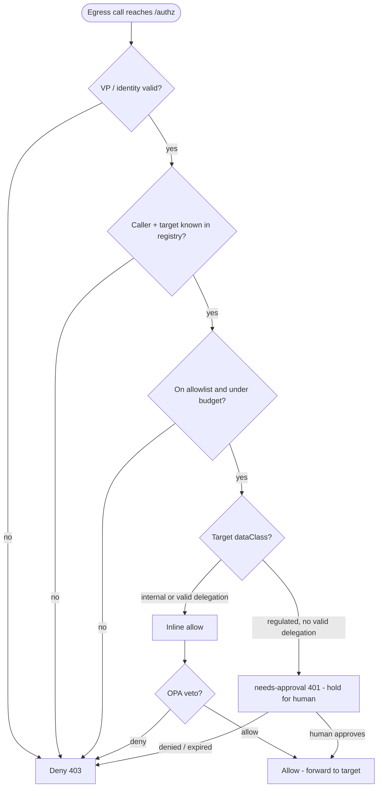

The hard part of governing agents is not the inbound request — it is **egress**:
making every outbound action an agent takes (a model call, a tool call, an
agent→agent hop, an external webhook) pass through the *same* `/authz` decision,
**regardless of framework** (`create_agent`, a hand-rolled `StateGraph`, raw
`httpx`/`curl`), enforced at the **network layer** rather than by cooperative
middleware, and with a **human egress-approval** path for risky calls.

> **Status: shipped and verified live on a managed Kubernetes cluster (DOKS example).** This page summarizes the canonical
> design (`docs/egress-enforcement.md` in the platform repo).

## Defense in depth: the layers

```
 agent pod ──HTTP(S)_PROXY──▶ egress forward-proxy ──▶ /authz ──▶ target
            (or Envoy egress gateway, transparent data plane)
            admission webhook guarantees the wiring + provisioning
            egress identity sidecar carries a fresh, revocable VP
```

### 1. Control-plane egress forward-proxy — the enforcement floor

A standard HTTP forward proxy built into the control plane
([`internal/egressproxy`](https://github.com/)), listening on `EGRESS_PROXY_ADDR`
(default `:9092`), fronted by the `egress-proxy.palonexus.svc:80` Service. It is the
quick, real enforcement floor. Agent pods get `HTTPS_PROXY`/`HTTP_PROXY` pointed at
it and are NetworkPolicy-confined to reach **only** it (plus DNS + agent-idp), so
*every* outbound call flows through `/authz`. Started only when `AGENT_IDP_URL` is set.

It handles two request shapes:

- a plaintext absolute-URI forward request (in-cluster, e.g.
  `http://model-broker.palonexus.svc:8080/...`), and
- `CONNECT host:port` (a TLS tunnel for external `https://...`).

**Identity.** It reads `Proxy-Authorization: Bearer <Membership-VP>` and verifies it
via agent-idp:

| Condition | Result |
|---|---|
| missing `Proxy-Authorization` | **407** Proxy Authentication Required — this is what blocks raw `curl` |
| invalid / spoofed / revoked VP | **403** |
| valid VP | proceeds to the decision |

**Target resolution.** The request host:port is reverse-mapped to a registry Service
(by upstream host, with a name-prefix fallback, e.g. `model-broker.*` → a `model-*`
service). A host the registry doesn't know is treated as `external` → requires approval.

**Decision + outcomes** (the *same* egress logic as `/authz`, audited as `egress.proxy`):

| Outcome | Behavior |
|---|---|
| allow | forward to the target, stream the response |
| deny | **403** with `X-Palonexus-Deny-Reason` |
| needs-approval / external | create a pending egress request and **hold** (poll its status up to `ApprovalTimeout`, default 120s): approved → forward; denied/expired → **403** |

The hold queue is the [`/v1/egress/requests`](/docs/reference/http-api/) API and the
portal's **Egress Approvals** tab — where an operator releases or blocks each held call:


*The Egress Approvals console: where operators release or block outbound agent calls held at
the proxy — shown here with a clear queue.*

### 2. Envoy egress gateway — the transparent data plane

The proper, transparent alternative: an Envoy egress gateway with
`SecurityPolicy.extAuth` pointed at `/authz`, so agent traffic is decided without the
pod needing proxy env at all. Shipped as the `components/egress-gateway` Kustomize
component.

### 3. Mutating/validating admission webhook — the registration-time guarantee

A webhook ([`admission/`](https://github.com/)) on pods labeled
`palonexus.io/agent=true`:

- **mutate** — inject the `HTTPS_PROXY`/`HTTP_PROXY`/`NO_PROXY` env (if absent), so
  the wiring can't be forgotten.
- **validate** — look the agent name up at agent-idp; if it is not
  registered **and** provisioned, **reject** the pod.

Shipped as `components/agent-admission`.

### 4. Egress identity sidecar — for clients that strip proxy env

The framework-agnostic `HTTP(S)_PROXY` floor covers any cooperating Python HTTP lib,
but `langchain_openai`'s transport injection *drops* the proxy env. The fix is a
localhost **sidecar** container in each agent pod (`components/egress-sidecar`):

- the agent points its broker `base_url` at the sidecar (a setting LangChain honors
  and cannot strip);
- the agent writes its identity (`did`, `privateKeyB64`, `membershipVc`) to a shared
  `emptyDir`; the sidecar reads it each call;
- per request the sidecar mints a **fresh, long-TTL (12h), revocable** Membership VP
  and forwards to the real broker **through** the egress proxy, with the VP as
  `Proxy-Authorization`.

A long TTL is safe because the proxy re-checks the Membership VC against the
revocation StatusList on *every* call — revocation still cuts egress immediately.

## The egress decision, step by step

Whichever layer above carries the call, the *decision* itself is the same `/authz` egress
logic. The flowchart below walks one egress call through it. It is **deny-by-default**: every
diamond can only move forward on an explicit yes, and any "no" falls straight to a **403
deny**. After identity (the VP) is verified and the caller and target are resolved from the
registry, the call must clear the **allowlist + budget** gate. Then the target's `dataClass`
forks the path: a `regulated` target with no valid, human-approved delegation becomes a
**needs-approval `401`** that is *held* for a human (the TBAC branch), while an `internal`
target or one already covered by a valid delegation proceeds to the inline allow. The last
gate is the **deny-overrides OPA veto** — an inline allow plus an OPA deny still denies, so
OPA can veto but never rubber-stamp.



*One egress decision: identity → registry → allowlist/budget → delegation (the
needs-approval/TBAC branch) → OPA deny-overrides veto, ending in allow, deny, or a held
needs-approval.*

You can dry-run this exact decision path before shipping a policy change. The portal's
**Policy simulator** runs design-time authority previews and runtime-faithful live decisions
against the real paths:


*The Policy simulator: what-if over the real decision paths — a design-time authority preview
versus a runtime-faithful live dry-run of the flow above.*

## Coarse vs fine: the layering decision

The egress proxy is the **coarse** gate: it proves identity, enforces the allowlist,
and meters the budget. It sees only raw HTTP, so it cannot match a fine-grained
delegation like `runbook:read` on a specific resource.

Fine-grained, human-approved DID/VC enforcement is therefore done **server-side** by
the protected resource (runbooks-api). The consequence for the registry's `dataClass`:

| `dataClass` | Where enforced | Behavior at the proxy |
|---|---|---|
| `internal` | server-side DID/VC challenge (e.g. runbooks-api) | allowlist-gated only; the *server* runs the fine-grained delegation/challenge |
| `regulated` | the proxy itself (no server-side gate, e.g. `scale_deployment`) | the proxy **holds** for human approval |

So runbooks-api is registered `internal` (its own server does the regulated
challenge), while a target with no server-side gate stays `regulated` so the proxy
holds it. See [Persistence & identity](/docs/concepts/persistence-and-identity/) for
the cryptographic identity that underpins all of this.

## The autonomous hero flow

End to end through the real LangGraph agents: `incident-triage` summarizes (model call
via its sidecar → `/authz`) → reads a runbook → **DENIED** → escalates A2A to
`access-broker` (carrying a VP) → broker requests a delegation *for the actor* and
block-polls the IdP → **a human approves in the portal** → the Delegation VC is
granted → triage reads the runbook via the DID/VC challenge through the proxy → a
grounded plan. **Every hop is decided at `/authz`.**

## Related

- [HTTP API — the egress-request API](/docs/reference/http-api/)
- [Headers — Proxy-Authorization VP](/docs/reference/headers/)
- [Consoles — Egress Approvals](/docs/concepts/consoles/)
- [Delegations & approvals (how-to)](/docs/develop/delegations-and-approvals/) — the needs-approval branch, end to end.
- [Egress enforcement (operations)](/docs/operations/egress-enforcement-ops/) — wiring the proxy, gateway, and admission webhook.
