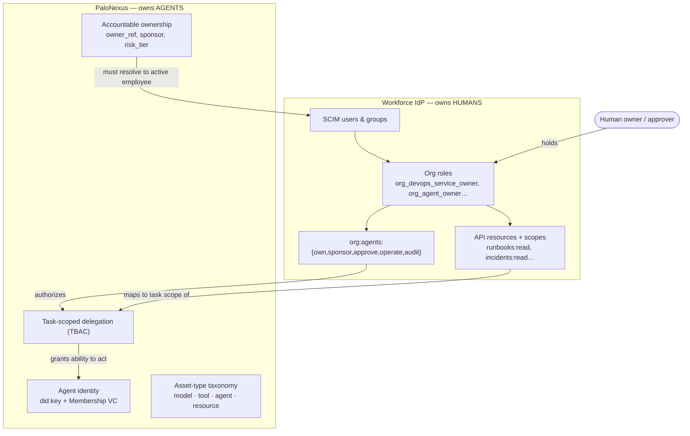

PaloNexus runs **alongside** your workforce IdP (Okta, Entra ID, Google Workspace,
JumpCloud) — it does not replace it. The IdP stays the source of truth for employees;
PaloNexus is the *agent* identity, delegation, authorization, and audit control plane
that sits next to it and keeps agent authority tied to current human authority.

## Division of ownership: the workforce IdP owns humans, PaloNexus owns agents

The whole model rests on a clean split of responsibility. **Your workforce IdP owns humans**
(Logto in the demo) — it is the IdP that holds employees and groups (kept current by SCIM), the organization
roles people are assigned, the `org:agents:*` authority scopes those roles carry, and the
scenario API resources/scopes (`runbooks:read`, `incidents:read`, …). **PaloNexus owns
agents** — it issues each agent a cryptographic identity (`did:key` + Membership VC),
records accountable ownership, classifies targets in its asset-type taxonomy, and mints the
task-scoped **delegations** that let an agent act. The bridge between the two halves is a
human: a delegation is only valid when the person granting it *holds* the matching authority
in the workforce IdP (Logto in the demo).

The diagram reads top-to-bottom on each side. On the left, SCIM populates the people that
org roles are assigned to, and those roles carry the `org:agents:*` scopes plus the API
scopes. On the right, PaloNexus's agent identity, ownership, and delegations live entirely
inside the platform. The cross-edges are the load-bearing links: a human *holds* an org
role; that authority *authorizes* a delegation; the API scope the role carries *maps to* the
delegation's task scope; agent ownership *must resolve to* an active SCIM employee; and the
delegation *grants* the agent its short-lived ability to act.

*The workforce IdP (Logto in the demo) holds workforce identity, org roles, and the
`org:agents:*` and API scopes; PaloNexus holds agent identity, ownership, and delegations —
and a human's authority is what authorizes each delegation.*

### Responsibility matrix

The split above, stated as a who-owns-what. The **human/operator** column is the
accountable person acting through the consoles; they never own raw identity records — they
exercise authority that Logto records and PaloNexus enforces.

| Concern | Workforce IdP / IAM | PaloNexus (agent control plane) | Human / operator |
|---|---|---|---|
| Employee & group identity | **Owns** (SCIM source of truth) | Reads stable subject | — |
| Workforce roles & `org:agents:*` scopes | **Owns** (assigns org roles) | Reads to evaluate authority | Is assigned a role |
| API resource scopes (`runbooks:read`…) | **Owns** | Maps to delegation task scope | — |
| Agent identity (`did:key`, Membership VC) | — | **Owns** (agent-idp issues) | — |
| Accountable agent ownership | Provides the employee it points to | **Owns** (`owner_ref`, sponsor, risk_tier) | Named as owner / sponsor |
| Task-scoped delegations (TBAC) | Provides the authority that justifies them | **Owns** (records, enforces, expires) | Requests / **approves** |
| Temporary elevation (approvals) | — | **Owns** the queue + STS exchange | **Approves / denies** |
| Audit trail | Logs its own admin events | **Owns** the hash-chained decision log | Reviews / verifies |

> **Logto is the reference IdP used in the demo seed.** The "Workforce IdP / IAM" column
> describes the IdP's role generically — any OIDC/SCIM-compliant IdP (Okta, Microsoft Entra
> ID, Auth0, Ping, Google Workspace, Amazon Cognito, Keycloak, Logto) fills it the same way.
> See the [IdP Support Model](/docs/concepts/idp-support/).

## The problem federation doesn't solve

Federation (OIDC / SAML) proves a **sign-in**. That is necessary but not sufficient for
governing AI agents:

- A login token proves who *signed in*; it doesn't keep **joiner / mover / leaver** state
  current. Someone can be deactivated in the directory and still hold a valid-looking
  token.
- Federation makes a *human* accountable; it says nothing about whether an **agent** has
  an accountable owner, or whether the human who authorized it still has the authority to
  do so.
- When authority disappears — an owner is disabled, an approver leaves, a group is
  removed — nothing automatically **revokes** what the agent was allowed to do.

PaloNexus closes that gap without becoming your IdP. SCIM directory sync is authoritative
for lifecycle and organizational state; token claims are auth-time context only.

## The two phases as one control loop

The capability is delivered as two phases that compose into a single loop — the Phase-2
executive story:

> A human owner authorizes an AI agent to perform a narrowly scoped task. PaloNexus
> verifies the human's authority, records the delegation, and exchanges the agent's proof
> and delegation evidence for a short-lived, audience-bound token. When the human loses
> authority or the agent loses valid ownership, PaloNexus automatically revokes the
> delegation, marks the related credentials revoked, quarantines the orphaned agent, and
> refuses to mint new tokens.

**Phase 1** establishes durable identity and accountable ownership (directory sync →
stable employee identity → agent ownership governance). **Phase 2** turns that state into
*enforcement* (revocation cascade → human-authority delegation → STS token exchange). The
loop only holds because each link reads the same authoritative state: an employee
deactivated by a SCIM sync immediately orphans their agents, invalidates the delegations
they granted, and is refused by the token endpoint — all from one change.

## The six building blocks

Each is a thin, composable piece with one load-bearing invariant. All of Phase 1 + Phase 2
ships in the `agent-idp` service.

### F1 — Directory lifecycle sync

Ingests SCIM 2.0 Users and Groups (including the enterprise extension for manager and
department) and reconciles a per-tenant snapshot into durable employee, group, and
sync-run records. Joiner = create, mover = update, leaver = deactivate, rehire =
reactivate the **same** record; re-sync is idempotent and tenant-isolated.

> **Invariant:** the stable subject is `<idp>:<tenant_id>:<external_id>` (e.g.
> `entra:acme-corp:oid-1001`) — **never** email — so an email change never forks a person.

### F2 — Stable employee identity

Distinguishes *authentication claims* (a login token) from *durable enterprise identity*
(SCIM). A resolver derives the stable subject from token claims (Entra `iss`/`tid`+`oid`,
Okta `iss`+`sub`) and applies explicit source-precedence; conflicts are surfaced, never
silently applied.

> **Invariant:** SCIM is authoritative for status, manager, department, and durable groups.
> A token contributes non-authoritative session context only — a stale token can **never**
> reactivate a deactivated employee, and raw token roles never auto-promote to privileged
> PaloNexus roles.

### F3 — Agent ownership governance

Replaces the registry's free-form `owner` string with accountable, tenant-scoped
ownership: `owner_ref`, `owner_type`, `team_ref`, `business_sponsor`, `risk_tier`,
`approved_runtime`, `status`, `created_by`, `last_reviewed_at`. The owner must resolve to
an **active** employee or team from F2 in the same tenant. An activation gate refuses to
make an agent active unless it has a valid active owner, sponsor, risk tier, and approved
runtime.

> **Invariant:** no agent may be orphaned — every governed agent has an accountable owner,
> and owner-health is re-derived from the live directory.

### F4 — Revocation cascade

Turns F3's *detection* into *enforcement*. When the owner, sponsor, approver, group,
delegation, or agent state becomes invalid, the cascade suspends or quarantines the agent,
revokes or invalidates its delegations, and marks the credential status revoked. It runs
automatically at the end of every directory sync and on demand.

> **Invariant:** every revocation is **durable** (an append-only log row, not a transient
> denial), **reason-coded** (`owner_inactive`, `group_removed`,
> `delegation_grantor_lost_authority`, …), and **idempotent** — re-running the same event
> never double-revokes.

### F5 — Human-authority delegation

Makes creating a delegation an *authorization decision*. The requester and approver must
both be authenticated active employees in the agent's tenant, and the approver must hold
real authority over the resource or task before authority is granted. Authority is
evaluated first-match across the bases below and the basis + evidence is recorded on the
delegation.

> **Invariant:** an approver must actually **hold** authority — owner / business sponsor /
> service owner / team owner / resource owner / manager chain / group / PaloNexus admin, or
> an explicit, prominently-logged `manual_break_glass`. No authority → deny.

### F6 — STS token exchange

An MVP Security Token Service that exchanges agent identity + delegation evidence + agent
proof-of-possession into a short-lived, audience-bound JWT a normal resource server can
consume. It validates fail-closed against every prior link — agent governance, delegation
usability (the F4 cascade composes here), task/action/resource match, human actor status,
audience, proof, and TTL.

> **Invariant:** the token carries `sub`=agent / `act`=human / `cnf` (proof-of-possession),
> a tight TTL, and is signed with the issuer's Ed25519 key — and it is **refused** from a
> revoked, expired, or invalidated delegation.

## Permission model: org roles → agent authority

The `org:agents:*` scopes are the concrete authority an org role carries. The table below
maps the five **devops-incident** personas to the scopes their seeded Northstar org roles
grant — exactly as the `seed-logto` Northstar fixture assigns them. Read each row as "what
this person is allowed to do with agents":

| Persona | Seeded org role(s) | `own` | `sponsor` | `approve` | `operate` | `audit` |
|---|---|:--:|:--:|:--:|:--:|:--:|
| **Maya Chen** — DevOps sponsor/approver | `org_devops_service_owner`, `org_agent_owner`, `org_agent_sponsor`, `org_agent_approver` | ✅ | ✅ | ✅ | — | — |
| **Ethan Park** — DevOps agent owner | `org_devops_service_owner`, `org_agent_owner`, `org_agent_operator` | ✅ | — | ✅ | ✅ | — |
| **Arjun Mehta** — DevOps operator | `org_agent_operator` | — | — | — | ✅ | — |
| **Omar Haddad** — Security triage owner/approver | `org_agent_owner`, `org_agent_sponsor`, `org_agent_approver`, `org_agent_auditor` | ✅ | ✅ | ✅ | — | ✅ |
| **Claire Evans** — negative-test employee | `org_negative_test_employee` | — | — | — | — | — |

> **Scope grants the ability; domain authority gates the use.** Holding `org:agents:approve`
> lets a persona approve delegations *in principle*, but F5 still checks they hold real
> authority over the **specific** resource or task. Ethan can approve a DevOps incident
> delegation (he is the DevOps service owner) but is denied approving a Finance
> reconciliation; Claire, with no agent authority at all, is denied every privileged
> action. That deny-by-default is the point of the negative-test personas.

> **Reference demo (Logto).** Logto is the **demo/reference IdP** PaloNexus ships its
> walkthroughs and seeded data against — it is **not** a required dependency. The `seed-logto`
> fixture, the `logto-m2m` Secret, the `LOGTO_*` env vars, and the portal's
> `/settings/logto` connector page below all belong to this reference demo. Production
> deployments keep their own workforce IdP and integrate it via standard OIDC/SCIM. See the
> [IdP Support Model](/docs/concepts/idp-support/).

In the demo you connect Logto and confirm exactly these credentials and the directory sync
from the portal's **Logto connector** page; secrets are validated server-side and never
exposed to the browser:

*Reference demo: the portal's **Logto connector** page validating the demo's sandbox Logto
tenant. This connector is specific to the Logto reference IdP; production deployments
integrate their own IdP via OIDC/SCIM — see [IdP Support Model](/docs/concepts/idp-support/).*

## Where it lives

It is **one FastAPI service**, `agent-idp` — no new microservice was introduced; each
feature extends the existing identity pillar and reuses its pluggable persistence
(`IDP_STORE_BACKEND`: `memory` · `sqlite` · `postgres` · `mysql` · `mongodb`), so on a
durable backend the directory, governance, and revocation state survive restarts. Audit is
emitted as OTel spans (`directory.sync`, `governance.transition`, `revocation.cascade`,
`delegation.authorize`, `sts.exchange`) into the same observability and audit fabric the
rest of the platform uses.

In the operator portal it surfaces as two tabs:

- **Directory** — employees keyed by stable subject, groups, sync history, governance
  conflicts, and a sign-ins / token-precedence panel.
- **Governance** — governed agents and their owners, delegations and authority evidence,
  the durable revocation log, and an interactive token-exchange (STS) panel.

## Try it / see also

- [Enterprise IAM (how-to)](/docs/develop/enterprise-iam/) — run the sync, ownership,
  delegation, and STS flows end to end.
- [Enterprise IAM API](/docs/reference/enterprise-iam-api/) — the exact request/response
  shapes for `/v1/directory`, `/v1/governance`, `/v1/authority`, `/v1/revocation`, and
  `/v1/sts`.
- [Consoles](/docs/concepts/consoles/) — the portal Directory and Governance walkthrough
  screenshots.
- [Delegations & approvals (how-to)](/docs/develop/delegations-and-approvals/) — request,
  approve, and temporarily elevate, end to end.

## Scope note

This is an **MVP IAM control plane** for AI agents, deliberately scoped to prove the
control loop. Deferred enterprise cases — full SCIM provisioning, an ABAC policy engine,
DPoP / mTLS-bound tokens, a JWKS endpoint and key rotation, multi-approver workflows,
token introspection / revocation lists, and more — are tracked in the repository
`BACKLOG.md` rather than silently omitted.
