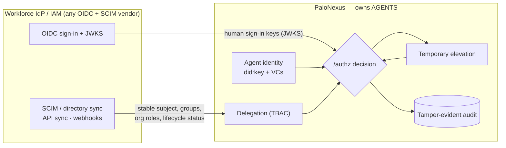

PaloNexus is **IdP-neutral**. It does not authenticate your workforce, store employee
records, or replace your identity provider — it sits **behind** your existing workforce IAM
and consumes it through open standards. Your **workforce IdP** stays the source of truth for
human identity (who works here, what groups and org roles they hold, and whether they are
active); PaloNexus owns the layer your IdP has no concept of — **AI agents, delegation, task
authorization, temporary elevation, and tamper-evident audit evidence**. Any
OIDC/SCIM-compliant IdP — **Okta, Microsoft Entra ID, Auth0, Ping, Google Workspace, Amazon
Cognito, Keycloak, Logto**, or any other — plugs into exactly the same surfaces.

## How an IdP connects

The diagram reads left to right. Your workforce IdP exposes **standard surfaces** — OIDC
sign-in plus a JWKS endpoint, SCIM / directory sync (or API sync / webhooks) — and PaloNexus
consumes them to learn a **stable employee subject**, **groups**, **org roles**, and
**lifecycle status**. From that human authority, PaloNexus runs everything your IdP does not:
agent identity, human-authorized delegation, the `/authz` decision, time-boxed elevation, and
the audit chain. The IdP never learns about agents; PaloNexus never re-invents humans.

*Your workforce IdP supplies human identity through standard surfaces (OIDC/JWKS for sign-in,
SCIM/directory sync for lifecycle and org state); PaloNexus consumes that authority and owns
agents, delegation, the `/authz` decision, temporary elevation, and audit.*

## Three tiers: demo, supported, production

"Which IdPs does PaloNexus support" has three honest answers. The **demo** ships against one
concrete reference IdP so walkthroughs and seed data are reproducible; **supported** is the
standards surface any IdP integrates through; **production** is your own IdP, brought via
those same standards.

| Tier | What it means | Examples | How it's wired | Status |
|---|---|---|---|---|
| **Demo IdP** | The concrete reference IdP PaloNexus seeds its Northstar demo data into, so every walkthrough is reproducible. **Not** a required dependency. | **Logto** (sandbox tenant) | `seed-logto` fixture, `LOGTO_*` env, the `logto-m2m` Secret, and the portal `/settings/logto` connector — all demo-only | Shipped (reference demo) |
| **Supported IdP** | Any OIDC/SCIM-compliant IdP can supply human identity through the standard surfaces below. | Okta, Microsoft Entra ID, Auth0, Ping, Google Workspace, Amazon Cognito, Keycloak, Logto, and any OIDC/SCIM IdP | OIDC sign-in + JWKS (`OIDC_ISSUER` / `OIDC_AUDIENCE` / `OIDC_JWKS_URL`); SCIM / directory sync into agent-idp `/v1/directory` | Standards-based (see honesty note) |
| **Production customer IdP** | Your own workforce IdP, in your tenant, kept as the source of truth. PaloNexus runs beside it and is configured to verify its tokens and consume its directory. | Whatever your org already runs | Point OIDC env at your issuer/JWKS (the `oidc` component) + feed your directory into agent-idp — see [Bring your own IdP](/docs/operations/bring-your-own-idp/) | Bring-your-own via OIDC/SCIM |

:::note[Logto is the first supported IdP]
Logto is more than the demo seed — it is the **first IdP PaloNexus ships an end-to-end
integration for** (the `seed-logto` seeder, the portal connector, and a worked
[bring-your-own-Logto runbook](/docs/operations/bring-your-own-idp/)). It is **supported
now**, not the only future one: Okta, Microsoft Entra ID, Auth0, and any OIDC/SCIM provider
integrate through the identical standard surfaces below, and shipped vendor connectors for
them are near-term roadmap.
:::

## Integration patterns

These are the standard surfaces PaloNexus consumes and the concrete seam each lands on. The
seams are real: the platform verifies OIDC JWTs against JWKS today, and the agent-idp
directory model is the workforce-sync integration point.

| Capability | Standard | PaloNexus seam | Notes |
|---|---|---|---|
| **Human sign-in** | OIDC + JWKS | `OIDC_ISSUER` / `OIDC_AUDIENCE` / `OIDC_JWKS_URL` — the control plane verifies each bearer JWT against the IdP's JWKS | Auth-time context only; never the source of lifecycle truth |
| **Workforce directory** | SCIM 2.0 / directory sync / API sync / webhooks | agent-idp `/v1/directory` — ingests Users & Groups into durable per-tenant records | SCIM is authoritative for status, manager, department, durable groups |
| **Stable employee subject** | Durable subject claim | `<idp>:<tenant_id>:<external_id>` (e.g. `entra:acme-corp:oid-1001`) | The **durable** subject, **not** email — an email change never forks a person |
| **Groups + org roles** | Group / role membership | mapped to `org:agents:{own,sponsor,approve,operate,audit}` authority | Org roles carry the agent-authority scopes a human exercises |
| **Lifecycle status** | Joiner / mover / leaver | the revocation cascade (runs at end of every directory sync) | A deactivated employee orphans their agents and invalidates their delegations |

## Reference demo setup (Logto)

Everything Logto-specific in PaloNexus belongs to the **reference demo** — it is how the
project ships reproducible walkthroughs and seeded personas, **not** a production requirement.
These pages are demo-only:

- [Environment variables → Reference demo seeder (Logto)](/docs/reference/env-vars/) — the
  `LOGTO_*` seeder variable table.
- [DOKS runbook → Step 4: Seed the demo identity model](/docs/operations/doks-runbook/) — the
  seed step (portal `/settings/seed` button or the `seed-logto` CLI).
- [Quickstart (local)](/docs/getting-started/quickstart-local/) and
  [Quickstart — your first governed agent](/docs/getting-started/quickstart-agent-dev/) — the
  demo flows.
- [Enterprise IAM for AI agents](/docs/concepts/enterprise-iam/) — the ownership model the
  demo seed populates.

In a production deployment you would skip `seed-logto`/`LOGTO_*`/the `logto-m2m` Secret and
instead point the OIDC env vars at your own issuer and feed your own directory into
agent-idp.

## Honesty: standards vs. shipped connectors

To set expectations precisely:

- **What is built and enforced today:** OIDC JWT verification against JWKS
  (`OIDC_ISSUER`/`OIDC_AUDIENCE`/`OIDC_JWKS_URL`), and the agent-idp `/v1/directory`
  model that is the workforce-sync integration point. The demo's concrete IdP is **Logto**,
  wired through the `seed-logto` fixture and the portal connector.
- **What "supported" means:** any IdP integrates through the **standard** OIDC and
  SCIM/directory surfaces above. Where PaloNexus does **not** yet ship a vendor-specific,
  one-click connector (e.g. a turnkey Okta or Entra ID connector with branded setup UI),
  integration is via **standard OIDC/SCIM** rather than a pre-built vendor module. We say so
  plainly rather than imply connectors that are not shipped.
- **Tracked for the backlog:** vendor-specific connector packages, SAML sign-in (OIDC is the
  verified path today), and broader directory-sync transports beyond SCIM are candidates
  flagged for the backlog — see the repository `BACKLOG.md` and the
  [Feature matrix](/docs/concepts/feature-matrix/).

## See also

- [Enterprise IAM for AI agents](/docs/concepts/enterprise-iam/) — the agent ownership,
  delegation, and revocation control loop that runs beside your IdP.
- [Architecture](/docs/concepts/architecture/) — where IdP verification sits on the `/authz`
  path.
- [Overview](/docs/getting-started/overview/) — the one-sentence framing.
- [Feature matrix](/docs/concepts/feature-matrix/) — shipped vs. optional vs. backlog.
