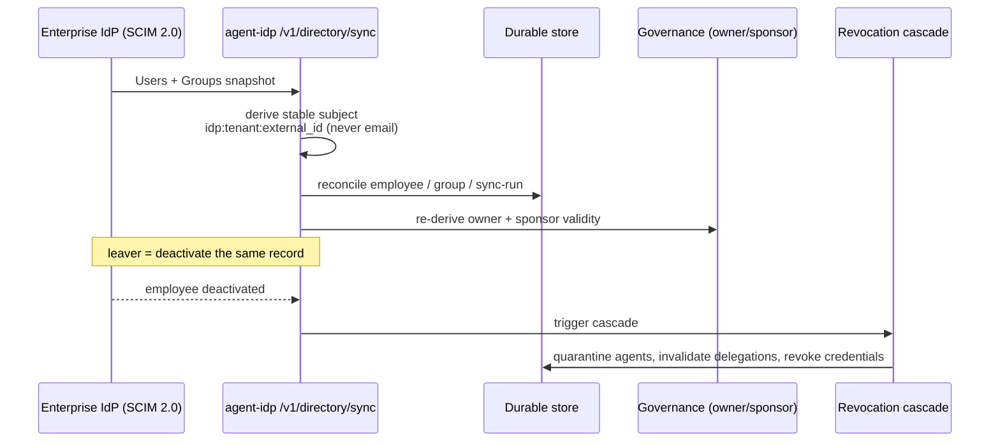

Two production-hardening capabilities make the control plane safe to run beyond a
demo: **durable, pluggable persistence** and **cryptographic egress identity**. Both
are shipped and verified live on a managed Kubernetes cluster (DOKS example).

> Canonical design: `docs/persistence-and-identity.md` in the platform repo.

## Pluggable persistence

**The problem.** The control-plane registry and the agent-idp store (agents,
delegations, revocations / the StatusList) were in-process maps. A pod restart wiped
every registration, delegation, and revocation. The in-memory default is also
per-replica, so any multi-replica/HA deployment needs a shared backend.

**The design.** Both components keep their existing storage *interface* and gain a
backend **factory** selected by env. Records are stored as a JSON document keyed by
primary key, so one SQL implementation serves Postgres / MySQL / SQLite, and a
document implementation serves MongoDB. Memory remains the zero-config default.

| | Control-plane (Go) | agent-idp (Python) |
|---|---|---|
| Interface | `registry.Store` (`Upsert` / `Get` / `List`) | `app.store.Store` (agents / delegations / revocations) |
| Backends | `memory` · `postgres` · `mysql` · `sqlite` · `mongodb` | same |
| Select via | `REGISTRY_BACKEND` + `REGISTRY_DB_URL` | `IDP_STORE_BACKEND` + `IDP_DB_URL` |

The Go SQLite driver is pure-Go (`modernc.org/sqlite`), which keeps the static
distroless build. **Fail-closed:** if the configured DB is unreachable at startup the
process exits rather than silently falling back to memory.

**DSN examples**

```bash
REGISTRY_BACKEND=postgres  REGISTRY_DB_URL='postgres://palonexus:pw@pg-rw.palonexus.svc:5432/palonexus?sslmode=disable'
REGISTRY_BACKEND=sqlite    REGISTRY_DB_URL=/var/lib/palonexus/registry.db
REGISTRY_BACKEND=mysql     REGISTRY_DB_URL='palonexus:pw@tcp(mysql.palonexus.svc:3306)/palonexus'
REGISTRY_BACKEND=mongodb   REGISTRY_DB_URL=mongodb://mongo.palonexus.svc:27017/palonexus
IDP_STORE_BACKEND=postgres IDP_DB_URL='postgresql://palonexus:pw@pg-rw.agent-idp.svc:5432/agentidp'
```

**Postgres operator.** Production Postgres is provisioned by **CloudNativePG** (CNPG):
a `Cluster` CR per component gives a managed primary + replica with a `*-rw` Service
the apps point their `*_DB_URL` at. Shipped as the `components/postgres` Kustomize
component. Registrations, delegations, and revocations now survive a restart.

## Cryptographic egress identity

**The problem.** Egress identified the calling agent by the `X-Palonexus-Actor`
**header**, which any pod in `apps` can set. NetworkPolicy + registry + policy still
enforced, but the *identity* was spoofable.

**The design — bind the actor to a Verifiable Credential.** Each agent holds a
`did:key` private key and an issuer-signed **Membership VC** (from agent-idp
provisioning). On every egress call the middleware presents a **Verifiable
Presentation** (VP): the Membership VC wrapped with a fresh holder signature over an
audience (`palonexus-egress`) and a nonce, in the `X-Palonexus-Agent-VP` header (or
as `Proxy-Authorization` at the egress proxy).

Because the crypto lives in `agentdid` (Python) and the control plane is Go,
verification reuses the **control-plane → agent-idp over HTTP** pattern: a fail-closed
`internal/agentid` client calls `POST /v1/agents/verify-presentation`, which:

1. verifies the holder `did:key` signature on the VP, the audience, and the nonce;
2. finds the issuer-signed Membership VC inside it, verifies it chains to the
   `did:web` issuer for this holder and is **not revoked** (the StatusList); and
3. maps the proven `did:key` back to the registered agent name.

The control plane derives the actor from that **proven, registry-bound** result — the
header name, if present, must match it or the call is denied.

### Identity modes — `AGENT_IDENTITY_MODE`

| Mode | Behavior |
|---|---|
| `header` *(default, demo / back-compat)* | trust `X-Palonexus-Actor`; verify a VP if one is present (defense in depth) but don't require it |
| `vc` *(production)* | a verified `X-Palonexus-Agent-VP` is **required**; a missing/invalid VP, or an actor-name mismatch, denies |

In `vc` mode, header-only egress is denied by design — flip back to `header` for a
narrated header-only demo.

## Revocation enforced at `/authz`

Revocation is not advisory — it is enforced on the decision path. The Membership VC
and every Delegation VC carry a `vcJti`; agent-idp keeps a StatusList of revoked
JTIs (`GET /status/{list}`). Revoking a JTI (`POST /v1/revoke`) means the **next**
`/authz` (or egress-proxy) call that depends on it denies, because verification
re-checks the StatusList every time. This powers the **live-revocation race** demo:
revoke a VC in the portal and the next decision denies in under a second.

This makes agent identity *cryptographic and revocable* end-to-end, while
delegation / TBAC for regulated targets layers on top exactly as before.

## Durable identity: SCIM directory sync

Cryptographic agent identity only stays trustworthy if the **human** identity behind it is
current. That is what the agent-idp directory sync persists: the enterprise IdP pushes its
workforce over **SCIM 2.0**, agent-idp reconciles it into the same durable store, and the
result is a **stable subject** that survives email changes, re-syncs, and pod restarts.

The sequence below shows one sync. The IdP sends a Users + Groups snapshot to
`/v1/directory/sync`; agent-idp derives the stable subject `idp:tenant:external_id`
(**never** email, so changing an address never forks a person), reconciles employee, group,
and sync-run records into the durable backend, and re-derives owner/sponsor validity for
governance. The lower half is the lifecycle teeth: when the same sync reports a **leaver**,
agent-idp deactivates that one record and fires the revocation cascade, which quarantines the
person's agents, invalidates their delegations, and marks the dependent credentials revoked —
all from a single directory change.



*One SCIM sync: the stable subject is reconciled into durable storage, and a leaver in the
same snapshot triggers the revocation cascade — joiner/mover/leaver state stays accountable.*

The portal's **Directory** tab is the read-out of this durable state — employees keyed by
stable subject, the SCIM sync history, and a sign-in precedence panel that flags stale and
group-conflict tokens:


*The Directory console: workforce identity synced from the enterprise IdP via SCIM, keyed by
stable subject so joiner/mover/leaver state stays accountable.*

The **Identity** tab pivots to the agent side of the same persisted state — the `did:web`
issuer trust anchor, the agents it has provisioned with their `did:key` identifiers, and the
task-scoped delegations (and revocations) that grant them access:


*The Identity console: the trust anchor, the agents it provisions, and the task-scoped
delegations granting (and revoking) access — the cryptographic identity described above,
made visible.*

## Related

- [Enterprise IAM for AI agents](/docs/concepts/enterprise-iam/) — the directory → ownership → delegation control loop.
- [Egress enforcement](/docs/concepts/egress-enforcement/)
- [HTTP API — agent-idp](/docs/reference/http-api/)
- [Environment variables](/docs/reference/env-vars/)
- [Persistence (operations)](/docs/operations/persistence/) — provisioning the durable backends.
- [Agent identity (how-to)](/docs/develop/agent-identity/) — provisioning VCs and the revocation race.
