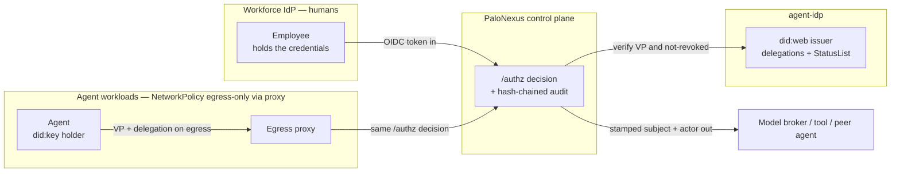

PaloNexus is built **deny-by-default** and **audit-by-construction**: every request — human
ingress or agent egress — is gated by one [`/authz`](/docs/concepts/security-model/) decision, and
recording that decision *is* the audit step in the same code path that makes it. PaloNexus sits
**beside** your workforce IdP, not in front of it: it never holds your employees' credentials, and
it acts on agent egress only when a human has delegated authority for a specific, time-boxed task.
This page is the scannable overview for security reviewers; the authoritative invariants live in
the [Security model](/docs/concepts/security-model/).

:::note[Honest framing]
PaloNexus does **not** claim formal certifications (SOC 2, ISO 27001). The
[compliance posture](#compliance-posture-honest) below is stated as **posture + roadmap**, not
attainment. Where a control is *designed-for* rather than *shipped*, this page says so.
:::

## Trust boundaries

Four trust zones meet at the control plane, and PaloNexus is explicit about **what crosses each
boundary**. Your workforce IdP owns human identity and keeps the credentials. The PaloNexus control
plane makes the `/authz` decision and writes the tamper-evident audit. The agent-idp service is the
`did:web` issuer and the authority for delegations and revocations. The agents themselves are
confined by NetworkPolicy so their only route out is the egress proxy — there is no un-governed path
to a model, tool, or peer agent.

*Trust boundaries: OIDC tokens enter from the IdP, agent egress presents a Verifiable Presentation
plus a delegation through the proxy, the control plane verifies identity against agent-idp, and only
a trusted, stamped subject and actor cross to the target. Credentials never leave the IdP, and
agents have no path out except the proxy.*

## What PaloNexus verifies

Every decision is the conjunction of these checks. Any one failing is a **deny** — and when a
dependency can't return a trustworthy *yes*, the decision **fails closed** rather than assuming
allow.

| Surface | What is checked | Failure mode |
|---|---|---|
| **Human token** | OIDC JWT validated against the IdP's JWKS (`OIDC_ISSUER` / `OIDC_AUDIENCE` / `OIDC_JWKS_URL`), required scope present verbatim | deny — missing/invalid token or scope |
| **Agent identity** | In `vc` mode, a fresh holder-signed **Membership VP** over audience + nonce, proven `did:key` mapped to the registered agent name | deny — `verified agent credential required`; actor-header mismatch denies |
| **Delegation (TBAC)** | A human-approved, time-boxed Delegation VC scoped to (actor, task, action, resource) for regulated targets | deny / needs-approval — missing or expired delegation |
| **Revocation** | Membership and Delegation `vcJti` re-checked against the StatusList on **every** call | deny — `CredentialRevoked`, in under a second after revoke |
| **Policy** | Inline registry rules (public? scope? allowlisted? under budget?) then an **OPA** deny-overrides veto over org Rego | deny — inline or OPA deny; unreachable OPA fails closed |
| **Budget** | Per-agent rolling ceilings (calls/hour, tokens/hour, USD/day) from broker usage callbacks | deny — over budget |
| **Audit chain** | Each record hash-chains to its predecessor; `/v1/audit/verify` recomputes the chain | tamper detected — names the first broken sequence |

## Core guarantees

These are the load-bearing invariants — stated authoritatively on the
[Security model](/docs/concepts/security-model/) page and summarized here for reviewers:

- **Deny-by-default / fail-closed.** The default answer is *no*; access requires an explicit,
  current allow. When a dependency (OPA, agent-idp, the DB, the control plane itself) is
  unreachable, the decision **denies** — an IAM product that "allows on error" is worse than none.
- **Identity propagation, not token forwarding.** On an allow the control plane verifies the
  credential at the edge and stamps trusted headers (`X-Palonexus-Subject`, `X-Palonexus-Actor`,
  `X-Palonexus-Agent-DID`); upstreams trust the edge and never re-parse raw tokens.
- **Tamper-evident, hash-chained audit.** Recording the decision is the audit step in the same code
  path; any edit or deletion breaks the chain and is detectable by recomputation.
- **Network-layer egress confinement.** Agents reach models, tools, and peers **only** through the
  egress proxy (forward proxy + NetworkPolicy + admission webhook), so governance holds for *any*
  framework — not just cooperating SDK code.

## Data handling

PaloNexus stores the minimum needed to make and prove decisions. It **does not** store workforce
passwords or credentials — those stay with your IdP. Secrets are **never baked into images**
(see [Secrets](/docs/operations/secrets/)); they arrive at runtime from a secret manager.

| Data | Where | Sensitivity | Retention |
|---|---|---|---|
| **Registry** (services, agents, models, tools, allowlists, budgets, ownership) | control-plane store (`REGISTRY_DB_URL`) | Config / metadata — no end-user credentials | Operational; re-creatable from declarative source |
| **agent-idp store** (provisioned agents, delegations, revocations / StatusList) | agent-idp store (`IDP_DB_URL`) | Identity metadata; losing revocation state could resurrect a revoked credential | Operational; back up so revocation survives |
| **Audit hash-chain** | control-plane audit store → Loki / durable object storage | Decision system-of-record (metadata: actor, subject, target, outcome, reason, hash) — **not** payloads | Set to your regulatory window; the long-term artifact |
| **LangGraph checkpointer** | `PALONEXUS_AGENT_DB_URL` | In-flight HITL thread state (paused approvals) | Operational; needed to resume paused runs |
| **Issuer key** | `agent-idp` Secret, from a secret manager | High — signs every VC/STS | Must be stable; never rotated as part of a code upgrade |
| **Workforce passwords / credentials** | **Not stored — held by your IdP** | n/a | n/a |

The audit trail records decision **metadata** (who, on behalf of whom, against what target, the
outcome and reason, and the chain hash) — it is not a content/payload store. See
[Persistence & identity](/docs/concepts/persistence-and-identity/) for what each store holds and
[Backups & restore](/docs/operations/backups/) for proving the audit chain survives intact.

## Supported versions & hardening

Production posture is opt-in and documented as a checklist. Turn the dev/demo overlay's open
defaults into the strict settings with the [Production hardening](/docs/operations/hardening/)
checklist, and keep components within the supported set in the
[Upgrades compatibility matrix](/docs/operations/upgrades/#image--version-compatibility-live-tags)
(control-plane / agent-idp / portal `:h13`, `remediation :h12`, `model-broker :dev`).

**Production hardening at a glance:**

- **OIDC on** — real human identity (`OIDC_ISSUER` / `OIDC_AUDIENCE` / `OIDC_JWKS_URL`).
- **`AGENT_IDENTITY_MODE=vc`** — a verified Membership VP is mandatory; header-only egress denied.
- **OPA org veto** — `OPA_URL` set, deny-overrides, fails closed when unreachable.
- **NetworkPolicy egress-only-to-proxy** — agents reach only DNS, agent-idp, and the proxy.
- **Postgres-backed** durable registry + agent-idp store (CNPG), so revocation survives restarts.
- **Audit retention** — ship the hash-chained audit to durable storage with a retention window.
- **External Secrets** — no secret in any image; deliver via External Secrets / sealed-secrets.

## Responsible disclosure

If you believe you've found a security vulnerability in PaloNexus, please report it privately:

- **Email:** `security@palonexus.example` *(placeholder — confirm the real security contact before
  publishing this page externally)*.
- **Please do not** open a public GitHub issue, discussion, or PR for a suspected vulnerability, and
  avoid posting proof-of-concept details publicly until a fix is available.
- Include the affected component and version (e.g. `control-plane :h13`), reproduction steps, and
  impact. We aim to acknowledge reports and coordinate a fix and disclosure timeline with you.

The full policy — supported components, scope (what's in/out), expected handling, and a safe-harbor
statement — lives in the repository's **`SECURITY.md`** at the repo root, and a machine-readable
contact is published as **`/.well-known/security.txt`**
([RFC 9116](https://www.rfc-editor.org/rfc/rfc9116)). Under this site's `/docs` base that file serves
at `/docs/.well-known/security.txt`; the canonical site should also serve it at the domain root.

:::caution[Placeholder contact]
The `security@palonexus.example` address above — and the same address in `SECURITY.md` and
`security.txt` — is a **placeholder**. Replace it with the project's real security mailbox before
this page (and those artifacts) go to external reviewers.
:::

## Compliance posture (honest)

PaloNexus is **designed to support common control objectives** that enterprise audits care about —
least-privilege / just-in-time access, a complete and tamper-evident audit trail, separation of
duties, and deny-by-default. It does **not** currently hold formal attestations (SOC 2, ISO 27001);
those are **roadmap, not current state**. The table maps control objectives to how the platform
supports them and the honest status.

| Control objective | How PaloNexus supports it | Status |
|---|---|---|
| **Least privilege / JIT access** | Task-based access (TBAC): delegations are human-approved, time-boxed to one task, and not retained after | Shipped |
| **Complete, tamper-evident audit trail** | Every decision is a hash-chained record; `/v1/audit/verify` proves integrity | Shipped |
| **Separation of duties** | Agent ownership governance requires an accountable owner; delegation approval requires a human with real authority (owner ≠ approver, or logged break-glass) | Shipped |
| **Deny-by-default / fail-closed** | The default answer is deny; unreachable dependencies deny rather than allow | Shipped |
| **Identity lifecycle (joiner/mover/leaver)** | SCIM directory sync + revocation cascade auto-suspends agents and invalidates delegations on a leaver | Shipped |
| **Key management (issuer key)** | Issuer key delivered out-of-band via a secret manager; **KMS/HSM-backed key + automated rotation** is on the roadmap | Partial |
| **WORM / retention-locked audit sink** | Audit ships to durable storage today; a **retention-locked object store** for WORM durability is on the roadmap | Partial |
| **Formal attestation (SOC 2 / ISO 27001)** | The control objectives above are designed-for; no certification is claimed | Roadmap — not attained |

Status terms match the [Feature matrix](/docs/concepts/feature-matrix/): **Shipped** is built and
verified live; **Partial** is shipped with a production-grade hardening upgrade still open; the
formal attestations are explicitly **not** claimed.

## See also

- [Security model](/docs/concepts/security-model/) — the authoritative invariants, in depth.
- [Production hardening](/docs/operations/hardening/) — the checklist to turn this posture on.
- [Secrets](/docs/operations/secrets/) — the never-in-image rule and External Secrets.
- [Backups & restore](/docs/operations/backups/) — proving the audit chain survives intact.
- [Observability](/docs/operations/observability/) — where the audit chain and metrics ship.
- [Feature matrix](/docs/concepts/feature-matrix/) — every capability, with Shipped/Partial/Planned status.
