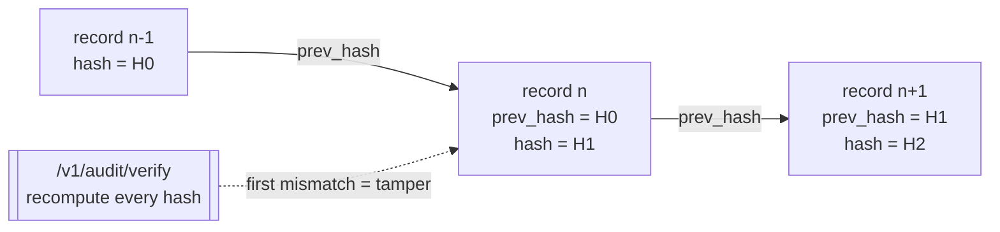

:::tip[For security reviewers]
For a scannable, enterprise-buyer overview — trust boundaries, what we verify, data handling,
responsible disclosure, and an honest compliance posture — see
[Security & Trust](/docs/concepts/security-and-trust/). This page is the authoritative
invariants underneath it.
:::

This is the **authoritative** page for PaloNexus's security posture. It states the invariants
once and links out to the pages that show each in depth — it does not re-explain the egress
plumbing ([Egress enforcement](/docs/concepts/egress-enforcement/)), the credential crypto
([Persistence & identity](/docs/concepts/persistence-and-identity/)), or the deny-reason catalog
([Troubleshooting](/docs/develop/troubleshooting/)).

The whole system reduces to **one question, asked of every agent action**:

> *May this agent make this outbound call, on behalf of this human, for this task, right now?*

The same question gates ordinary inbound calls too (*may this caller reach this service?*) —
that north-south capability is the foundation egress is built on, not the headline.

[`/authz`](/docs/getting-started/glossary/) answers it. Identity, registry, policy, audit,
and metrics converge there (`internal/authz/authz.go`); everything else is a dependency of that
one decision.

## The four invariants

### 1. Deny-by-default

The default answer is **no**. Access is granted only by an explicit, current allow; the absence
of a grant is a deny. Concretely, all of these deny:

- unknown service / unknown agent / unknown target (not in the [registry](/docs/getting-started/glossary/));
- anonymous caller to a non-public service, or a token missing the verbatim `requireScope`;
- a target not on the calling agent's egress **allowlist**;
- a `regulated` target with no valid, human-approved, task-scoped [delegation](/docs/getting-started/glossary/);
- an invalid, mismatched, expired, or **revoked** agent credential.

Every one of these emits a specific [`X-Palonexus-Deny-Reason`](/docs/develop/troubleshooting/);
in the SDK it surfaces as a typed exception, never a silent failure.

### 2. Fail-closed on every dependency

When the decision point cannot get a **trustworthy yes**, it denies — it never assumes allow:

| Dependency unreachable | Behavior |
|---|---|
| OPA (`OPA_URL` set but down) | deny — `opa unavailable: …` |
| agent-idp delegation check | deny — `delegation authority unreachable: …` |
| egress approval not decided in time | deny — `egress approval expired` (default 120s) |
| a durable DB backend misconfigured at startup | the process **exits** rather than silently falling back to in-memory (would lose registrations/delegations/revocations) |
| the control plane itself, from the SDK | raises [`ControlPlaneUnavailable`](/docs/sdk/quickstart/) — never a silent allow |

This is a deliberate design choice: an IAM product that "allows on error" is worse than none.

### 3. Policy is deny-overrides

Two layers decide, in order: fast **inline** rules from the registry entry (public? required
scope? allowlisted? under budget?), then an optional **[OPA](/docs/getting-started/glossary/)**
veto over org-wide Rego. An inline *allow* plus an OPA *deny* equals **deny**. OPA can veto;
it can never rubber-stamp. This lets platform teams ship org policy (geo, time-of-day,
data-class) without redeploying the control plane, and guarantees the stricter answer always
wins.

### 4. Tamper-evident audit

Every decision — allow or deny, ingress or egress — is recorded to a **hash chain**: each
record's `prev_hash` equals the previous record's `hash`. Editing or deleting any entry breaks
the chain, and `pn.audit.verify_chain()` (control-plane `/v1/audit/verify`) detects it. Audit is
**by construction**, not an afterthought: recording the decision *is* the audit step in the same
code path that makes it.

The diagram shows why tampering can't hide. Each record hashes its own contents **plus** the
previous record's `hash` into its `prev_hash`, so the records form an append-only chain. If
anyone edits or removes record *n*, its recomputed hash no longer matches the `prev_hash`
stored in record *n+1*; `verify` walks the chain recomputing each hash and reports the exact
sequence number where the first mismatch occurs.

*Each record links to its predecessor by hash; `verify` recomputes the chain and names the
sequence where it first breaks — so any edit or deletion is detectable.*

In the portal, the **Audit explorer** exposes exactly this: the hash-chained log with a
**Verify chain** button, per-event Tempo trace deep-links, and task/agent/scenario filters:

*The Audit explorer: the tamper-evident, hash-chained decision log — filter it, deep-link any
event to its Tempo trace, and verify the chain.*

## One decision for egress and ingress

The same `/authz` covers both directions, so there is **no per-service auth code** — just one
place to reason about access:

- **Egress** (the headline, and the hard part): every outbound action an agent takes — model
  call, tool call, agent-to-agent hop — passes the decision, carrying agent **and**
  on-behalf-of identity, answering *may this agent make this outbound call, on behalf of this
  human, for this task, right now?* Enforced at the **network layer** (forward proxy +
  NetworkPolicy + admission webhook), so it holds for *any* framework, not just cooperating SDK
  code. See [Egress enforcement](/docs/concepts/egress-enforcement/).
- **Ingress** (north-south): `client → gateway → /authz → upstream`. Envoy's
  [`ext_authz`](/docs/getting-started/glossary/) filter routes every request through the *same*
  `/authz` before it reaches a service (the keystone, `SecurityPolicy.extAuth`). This is the
  foundation egress is built on, not the MVP headline.

A request is an agent egress call iff it carries an `X-Palonexus-Actor` header; otherwise it
takes the ingress path.

## Identity propagation, not token forwarding

On an **allow**, the control plane does not forward the caller's raw token upstream. It verifies
the credential at the edge and stamps trusted headers — `X-Palonexus-Subject` (the human),
`X-Palonexus-Actor` (the agent), `X-Palonexus-Agent-DID` (the proven `did:key`),
`X-Palonexus-Upstream` — and upstreams trust the edge and **never re-parse** tokens. The target
service is named by `X-Palonexus-Service` (set by the HTTPRoute), falling back to `Host`.

For regulated work an agent never acts **as itself**: it acts
**[on-behalf-of](/docs/getting-started/glossary/)** a human subject, and the audit
records both actor and subject. Authorization is **[task-based](/docs/getting-started/glossary/)**
(TBAC): a delegation is granted for one task (e.g. `INC-4821`), time-boxed, and the agent does
not retain the privilege afterward.

## Cryptographic, revocable agent identity

Header-asserted actor identity is spoofable, so the production posture binds the actor to a
**Verifiable Credential**:

- each agent holds a `did:key` private key + an issuer-signed **Membership VC** (from
  `agent.provision()`);
- on every egress call it presents a fresh, holder-signed **[VP](/docs/getting-started/glossary/)**
  over an audience + nonce;
- the control plane verifies it via agent-idp, maps the proven `did:key` to the **registered**
  agent name, and treats *that* as authoritative — the `X-Palonexus-Actor` header, if present,
  must match or the call is denied;
- `AGENT_IDENTITY_MODE=vc` makes a verified VP **mandatory**.

**Revocation is enforced on the decision path**, not advisory: verification re-checks the
[StatusList](/docs/getting-started/glossary/) on *every* call, so
revoking a credential denies the **next** decision in under a second — even mid-run. See the
[revocation race recipe](/docs/develop/recipes/revocation-race/). Full design in
[Persistence & identity](/docs/concepts/persistence-and-identity/).

## How the SDK reflects the model

The SDK makes the posture a **typed contract**, so deny-by-default is something you handle, not
something you might forget to check:

| Platform behavior | SDK surface |
|---|---|
| hard deny (403) | `PolicyDenied` (carries the `reason`) |
| needs-approval (401 + needs-approval) | `ApprovalRequired` → drives `request_delegation` / `interrupt()` |
| delegation timed out | `DelegationExpired` |
| credential revoked mid-run | `CredentialRevoked` |
| decision point unreachable | `ControlPlaneUnavailable` (**raised, never swallowed**) |
| missing owner/sponsor at registration | `GovernanceError` (client-side, before any network call) |

Offline (`PaloNexus.offline()`), a `FakeControlPlane` mirrors the same deny-by-default semantics
so tests prove the contract with no cluster.

## Related

- [Egress enforcement](/docs/concepts/egress-enforcement/) — the network-layer enforcement design.
- [Persistence & identity](/docs/concepts/persistence-and-identity/) — VCs, identity modes, revocation.
- [Troubleshooting](/docs/develop/troubleshooting/) — every `X-Palonexus-Deny-Reason`, decoded.
- [Production hardening](/docs/operations/hardening/) — turning each invariant on for production.
- [Glossary](/docs/getting-started/glossary/) — every term used above.
