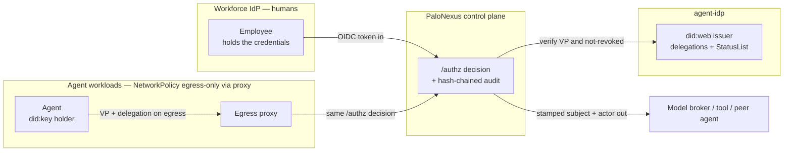
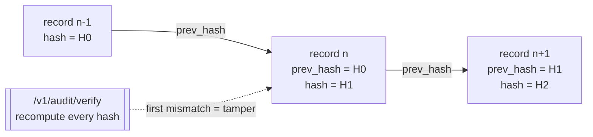

This is the **authoritative** page for PaloNexus's security posture — both the invariants
the platform is built on and the scannable overview a security reviewer needs (trust
boundaries, what is verified, data handling, disclosure, compliance posture). It states the
invariants once and links out to the pages that show each in depth — it does not re-explain
the egress plumbing ([Credential-safe action enforcement](/docs/concepts/egress-enforcement/)), the credential crypto
([Agent identity & credentials](/docs/concepts/identity-and-credentials/)), or the deny-reason catalog
([Troubleshooting](/docs/develop/troubleshooting/)).

The whole system reduces to **one question, asked of every agent action**:

> *May this agent make this outbound call, on behalf of this human, for this task, right now?*

The same question gates ordinary inbound calls too (*may this caller reach this service?*) —
that north-south capability is the foundation egress is built on, not the headline.

[`/authz`](/docs/getting-started/glossary/) answers it. Identity, registry, policy, audit,
and metrics converge there (`internal/authz/authz.go`); everything else is a dependency of that
one decision. PaloNexus is built **deny-by-default** and **audit-by-construction**: recording
the decision *is* the audit step in the same code path that makes it. And PaloNexus sits
**beside** your workforce IdP, not in front of it: it never holds your employees' credentials,
and it acts on agent egress only when a human has delegated authority for a specific,
time-boxed task.

## Trust boundaries

Four trust zones meet at the control plane, and PaloNexus is explicit about **what crosses each
boundary**. Your workforce IdP owns human identity and keeps the credentials. The PaloNexus control
plane makes the `/authz` decision and writes the tamper-evident audit. The agent-idp service is the
`did:web` issuer and the authority for delegations and revocations. The agents themselves are
confined by NetworkPolicy so their only route out is the egress proxy — there is no un-governed path
to a model, tool, or peer agent.

*Trust boundaries: OIDC tokens enter from the IdP, agent egress presents a Verifiable Presentation
plus a delegation through the proxy, the control plane verifies identity against agent-idp, and only
a trusted, stamped subject and actor cross to the target. Credentials never leave the IdP, and
agents have no path out except the proxy.*

## What PaloNexus verifies

Every decision is the conjunction of these checks. Any one failing is a **deny** — and when a
dependency can't return a trustworthy *yes*, the decision **fails closed** rather than assuming
allow.

| Surface | What is checked | Failure mode |
|---|---|---|
| **Human token** | OIDC JWT validated against the IdP's JWKS (`OIDC_ISSUER` / `OIDC_AUDIENCE` / `OIDC_JWKS_URL`), required scope present verbatim | deny — missing/invalid token or scope |
| **Agent identity** | In `vc` mode, a fresh holder-signed **Membership VP** over audience + nonce, proven `did:key` mapped to the registered agent name | deny — `verified agent credential required`; actor-header mismatch denies |
| **Delegation (TBAC)** | A human-approved, time-boxed Delegation VC scoped to (actor, task, action, resource) for regulated targets | deny / needs-approval — missing or expired delegation |
| **Revocation** | Membership and Delegation `vcJti` re-checked against the StatusList on **every** call | deny — `CredentialRevoked`, in under a second after revoke |
| **Policy** | Inline registry rules (public? scope? allowlisted? under budget?) then an **OPA** deny-overrides veto over org Rego | deny — inline or OPA deny; unreachable OPA fails closed |
| **Budget** | Per-agent rolling ceilings (calls/hour, tokens/hour, USD/day) from broker usage callbacks | deny — over budget |
| **Audit chain** | Each record hash-chains to its predecessor; `/v1/audit/verify` recomputes the chain | tamper detected — names the first broken sequence |

## The four invariants

### 1. Deny-by-default

The default answer is **no**. Access is granted only by an explicit, current allow; the absence
of a grant is a deny. Concretely, all of these deny:

- unknown service / unknown agent / unknown target (not in the [registry](/docs/getting-started/glossary/));
- anonymous caller to a non-public service, or a token missing the verbatim `requireScope`;
- a target not on the calling agent's egress **allowlist**;
- a `regulated` target with no valid, human-approved, task-scoped [delegation](/docs/getting-started/glossary/);
- an invalid, mismatched, expired, or **revoked** agent credential.

Every one of these emits a specific [`X-Palonexus-Deny-Reason`](/docs/develop/troubleshooting/);
in the SDK it surfaces as a typed exception, never a silent failure.

### 2. Fail-closed on every dependency

When the decision point cannot get a **trustworthy yes**, it denies — it never assumes allow:

| Dependency unreachable | Behavior |
|---|---|
| OPA (`OPA_URL` set but down) | deny — `opa unavailable: …` |
| agent-idp delegation check | deny — `delegation authority unreachable: …` |
| egress approval not decided in time | deny — `egress approval expired` (default 120s) |
| a durable DB backend misconfigured at startup | the process **exits** rather than silently falling back to in-memory (would lose registrations/delegations/revocations) |
| the control plane itself, from the SDK | raises [`ControlPlaneUnavailable`](/docs/getting-started/quickstart/) — never a silent allow |

This is a deliberate design choice: an IAM product that "allows on error" is worse than none.

### 3. Policy is deny-overrides

Two layers decide, in order: fast **inline** rules from the registry entry (public? required
scope? allowlisted? under budget?), then an optional **[OPA](/docs/getting-started/glossary/)**
veto over org-wide Rego. An inline *allow* plus an OPA *deny* equals **deny**. OPA can veto;
it can never rubber-stamp. This lets platform teams ship org policy (geo, time-of-day,
data-class) without redeploying the control plane, and guarantees the stricter answer always
wins.

### 4. Verifiable authority trail

Every decision — allow or deny, ingress or egress — is recorded to a **hash chain**: each
record's `prev_hash` equals the previous record's `hash`. Editing or deleting any entry breaks
the chain, and `pn.audit.verify_chain()` (control-plane `/v1/audit/verify`) detects it. Audit is
**by construction**, not an afterthought: recording the decision *is* the audit step in the same
code path that makes it.

The diagram shows why tampering can't hide. Each record hashes its own contents **plus** the
previous record's `hash` into its `prev_hash`, so the records form an append-only chain. If
anyone edits or removes record *n*, its recomputed hash no longer matches the `prev_hash`
stored in record *n+1*; `verify` walks the chain recomputing each hash and reports the exact
sequence number where the first mismatch occurs.

*Each record links to its predecessor by hash; `verify` recomputes the chain and names the
sequence where it first breaks — so any edit or deletion is detectable.*

In the portal, the **Audit explorer** exposes exactly this: the hash-chained log with a
**Verify chain** button, per-event Tempo trace deep-links, and task/agent/scenario filters:

*The Audit explorer: the tamper-evident, hash-chained decision log — filter it, deep-link any
event to its Tempo trace, and verify the chain.*

## One decision for egress and ingress

The same `/authz` covers both directions, so there is **no per-service auth code** — just one
place to reason about access:

- **Egress** (the headline, and the hard part): every outbound action an agent takes — model
  call, tool call, agent-to-agent hop — passes the decision, carrying agent **and**
  on-behalf-of identity, answering *may this agent make this outbound call, on behalf of this
  human, for this task, right now?* Enforced at the **network layer** (forward proxy +
  NetworkPolicy + admission webhook), so it holds for *any* framework, not just cooperating SDK
  code. See [Credential-safe action enforcement](/docs/concepts/egress-enforcement/).
- **Ingress** (north-south): `client → gateway → /authz → upstream`. Envoy's
  [`ext_authz`](/docs/getting-started/glossary/) filter routes every request through the *same*
  `/authz` before it reaches a service (the keystone, `SecurityPolicy.extAuth`). This is the
  foundation egress is built on, not the MVP headline.

A request is an agent egress call iff it carries an `X-Palonexus-Actor` header; otherwise it
takes the ingress path.

## Identity propagation, not token forwarding

On an **allow**, the control plane does not forward the caller's raw token upstream. It verifies
the credential at the edge and stamps trusted headers — `X-Palonexus-Subject` (the human),
`X-Palonexus-Actor` (the agent), `X-Palonexus-Agent-DID` (the proven `did:key`),
`X-Palonexus-Upstream` — and upstreams trust the edge and **never re-parse** tokens. The target
service is named by `X-Palonexus-Service` (set by the HTTPRoute), falling back to `Host`.

For regulated work an agent never acts **as itself**: it acts
**[on-behalf-of](/docs/getting-started/glossary/)** a human subject, and the audit
records both actor and subject. Authorization is **[task-based](/docs/getting-started/glossary/)**
(TBAC): a delegation is granted for one task (e.g. `INC-4821`), time-boxed, and the agent does
not retain the privilege afterward.

## Cryptographic, revocable agent identity

Header-asserted actor identity is spoofable, so the production posture binds the actor to a
**Verifiable Credential**:

- each agent holds a `did:key` private key + an issuer-signed **Membership VC** (from
  `agent.provision()`);
- on every egress call it presents a fresh, holder-signed **[VP](/docs/getting-started/glossary/)**
  over an audience + nonce;
- the control plane verifies it via agent-idp, maps the proven `did:key` to the **registered**
  agent name, and treats *that* as authoritative — the `X-Palonexus-Actor` header, if present,
  must match or the call is denied;
- `AGENT_IDENTITY_MODE=vc` makes a verified VP **mandatory**.

**Revocation is enforced on the decision path**, not advisory: verification re-checks the
[StatusList](/docs/getting-started/glossary/) on *every* call, so
revoking a credential denies the **next** decision in under a second — even mid-run. See the
[revocation race recipe](/docs/develop/recipes/revocation-race/). Full design in
[Agent identity & credentials](/docs/concepts/identity-and-credentials/).

## How the SDK reflects the model

The SDK makes the posture a **typed contract**, so deny-by-default is something you handle, not
something you might forget to check:

| Platform behavior | SDK surface |
|---|---|
| hard deny (403) | `PolicyDenied` (carries the `reason`) |
| needs-approval (401 + needs-approval) | `ApprovalRequired` → drives `request_delegation` / `interrupt()` |
| delegation timed out | `DelegationExpired` |
| credential revoked mid-run | `CredentialRevoked` |
| decision point unreachable | `ControlPlaneUnavailable` (**raised, never swallowed**) |
| missing owner/sponsor at registration | `GovernanceError` (client-side, before any network call) |

Offline (`PaloNexus.offline()`), a `FakeControlPlane` mirrors the same deny-by-default semantics
so tests prove the contract with no cluster.

## Data handling

PaloNexus stores the minimum needed to make and prove decisions. It **does not** store workforce
passwords or credentials — those stay with your IdP. Secrets are **never baked into images**
(see [Secrets](/docs/operations/secrets/)); they arrive at runtime from a secret manager.

| Data | Where | Sensitivity | Retention |
|---|---|---|---|
| **Registry** (services, agents, models, tools, allowlists, budgets, ownership) | control-plane store (`REGISTRY_DB_URL`) | Config / metadata — no end-user credentials | Operational; re-creatable from declarative source |
| **agent-idp store** (provisioned agents, delegations, revocations / StatusList) | agent-idp store (`IDP_DB_URL`) | Identity metadata; losing revocation state could resurrect a revoked credential | Operational; back up so revocation survives |
| **Audit hash-chain** | control-plane audit store → Loki / durable object storage | Decision system-of-record (metadata: actor, subject, target, outcome, reason, hash) — **not** payloads | Set to your regulatory window; the long-term artifact |
| **LangGraph checkpointer** | `PALONEXUS_AGENT_DB_URL` | In-flight HITL thread state (paused approvals) | Operational; needed to resume paused runs |
| **Issuer key** | `agent-idp` Secret, from a secret manager | High — signs every VC/STS | Must be stable; never rotated as part of a code upgrade |
| **Workforce passwords / credentials** | **Not stored — held by your IdP** | n/a | n/a |

The audit trail records decision **metadata** (who, on behalf of whom, against what target, the
outcome and reason, and the chain hash) — it is not a content/payload store. See
[Persistence (operations)](/docs/operations/persistence/) for what each store holds and
[Backups & restore](/docs/operations/backups/) for proving the audit chain survives intact.

## Supported versions & hardening

Production posture is opt-in and documented as a checklist. Turn the dev/demo overlay's open
defaults into the strict settings with the [Production hardening](/docs/operations/hardening/)
checklist, and keep components within the supported set in the
[Upgrades compatibility matrix](/docs/operations/upgrades/#image--version-compatibility-live-tags)
(control-plane / agent-idp / portal `:h13`, `remediation :h12`, `model-broker :dev`).

**Production hardening at a glance:**

- **OIDC on** — real human identity (`OIDC_ISSUER` / `OIDC_AUDIENCE` / `OIDC_JWKS_URL`).
- **`AGENT_IDENTITY_MODE=vc`** — a verified Membership VP is mandatory; header-only egress denied.
- **OPA org veto** — `OPA_URL` set, deny-overrides, fails closed when unreachable.
- **NetworkPolicy egress-only-to-proxy** — agents reach only DNS, agent-idp, and the proxy.
- **Postgres-backed** durable registry + agent-idp store (CNPG), so revocation survives restarts.
- **Audit retention** — ship the hash-chained audit to durable storage with a retention window.
- **External Secrets** — no secret in any image; deliver via External Secrets / sealed-secrets.

## Responsible disclosure

If you believe you've found a security vulnerability in PaloNexus, please report it privately:

- **Email:** `security@palonexus.example` *(placeholder — confirm the real security contact before
  publishing this page externally)*.
- **Please do not** open a public GitHub issue, discussion, or PR for a suspected vulnerability, and
  avoid posting proof-of-concept details publicly until a fix is available.
- Include the affected component and version (e.g. `control-plane :h13`), reproduction steps, and
  impact. We aim to acknowledge reports and coordinate a fix and disclosure timeline with you.

The full policy — supported components, scope (what's in/out), expected handling, and a safe-harbor
statement — lives in the repository's **`SECURITY.md`** at the repo root, and a machine-readable
contact is published as **`/.well-known/security.txt`**
([RFC 9116](https://www.rfc-editor.org/rfc/rfc9116)). Under this site's `/docs` base that file serves
at `/docs/.well-known/security.txt`; the canonical site should also serve it at the domain root.

:::caution[Placeholder contact]
The `security@palonexus.example` address above — and the same address in `SECURITY.md` and
`security.txt` — is a **placeholder**. Replace it with the project's real security mailbox before
this page (and those artifacts) go to external reviewers.
:::

## Compliance posture (honest)

PaloNexus is **designed to support common control objectives** that enterprise audits care about —
least-privilege / just-in-time access, a complete and tamper-evident audit trail, separation of
duties, and deny-by-default. It does **not** currently hold formal attestations (SOC 2, ISO 27001);
those are **roadmap, not current state**. Where a control is *designed-for* rather than *shipped*,
the table says so — it maps control objectives to how the platform supports them and the honest
status.

| Control objective | How PaloNexus supports it | Status |
|---|---|---|
| **Least privilege / JIT access** | Task-based access (TBAC): delegations are human-approved, time-boxed to one task, and not retained after | Shipped |
| **Complete, tamper-evident audit trail** | Every decision is a hash-chained record; `/v1/audit/verify` proves integrity | Shipped |
| **Separation of duties** | Agent ownership governance requires an accountable owner; delegation approval requires a human with real authority (owner ≠ approver, or logged break-glass) | Shipped |
| **Deny-by-default / fail-closed** | The default answer is deny; unreachable dependencies deny rather than allow | Shipped |
| **Identity lifecycle (joiner/mover/leaver)** | SCIM directory sync + revocation cascade auto-suspends agents and invalidates delegations on a leaver | Shipped |
| **Key management (issuer key)** | Issuer key delivered out-of-band via a secret manager; **KMS/HSM-backed key + automated rotation** is on the roadmap | Partial |
| **WORM / retention-locked audit sink** | Audit ships to durable storage today; a **retention-locked object store** for WORM durability is on the roadmap | Partial |
| **Formal attestation (SOC 2 / ISO 27001)** | The control objectives above are designed-for; no certification is claimed | Roadmap — not attained |

Status terms match the [Feature matrix](/docs/concepts/feature-matrix/): **Shipped** is built and
verified live; **Partial** is shipped with a production-grade hardening upgrade still open; the
formal attestations are explicitly **not** claimed.

## Related

- [Credential-safe action enforcement](/docs/concepts/egress-enforcement/) — the network-layer enforcement design.
- [Agent identity & credentials](/docs/concepts/identity-and-credentials/) — VCs, identity modes, revocation.
- [Troubleshooting](/docs/develop/troubleshooting/) — every `X-Palonexus-Deny-Reason`, decoded.
- [Production hardening](/docs/operations/hardening/) — turning each invariant on for production.
- [Secrets](/docs/operations/secrets/) — the never-in-image rule and External Secrets.
- [Backups & restore](/docs/operations/backups/) — proving the audit chain survives intact.
- [Observability](/docs/operations/observability/) — where the audit chain and metrics ship.
- [Feature matrix](/docs/concepts/feature-matrix/) — every capability, with Shipped/Partial/Planned status.
- [Glossary](/docs/getting-started/glossary/) — every term used above.
