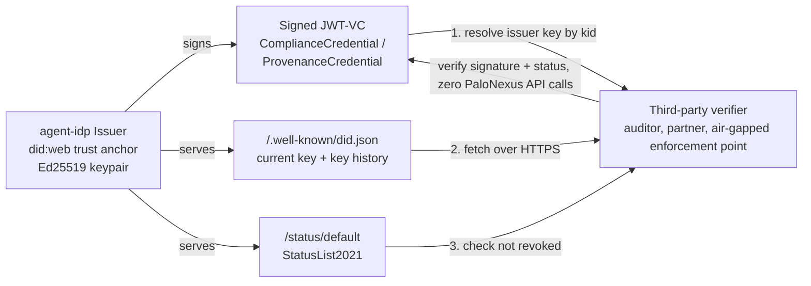

Agent ownership and delegation (the [six building blocks](/docs/concepts/enterprise-iam/))
answer *is this agent allowed to act*. Two more credential types answer a different
question a downstream consumer — a regulator, an auditor, a partner enterprise ingesting an
agent's output — actually needs answered: **what does this agent attest about itself, and can
I check that attestation without trusting PaloNexus's live API?**

- **Compliance credential** — "this agent's *operation* meets standard X" (GDPR, HIPAA,
  SOC2-TypeII, EU AI Act Art. 50), attested by a third-party auditor.
- **Provenance credential** — "this agent's *outputs* came from base model X, trained on Y,
  under declared owner Z," self-declared by whoever operates the agent.

Both are real, signed `agentdid` JWT-VCs anchored to the issuer's `did:web` document — not
JSON rows a caller has to trust agent-idp's live API to report honestly.

## The gap this closes

Every identity credential PaloNexus issues for agent *authority* — Membership and Delegation
VCs (see the [Glossary](/docs/getting-started/glossary/)) — was a real, Ed25519-signed JWT-VC
from day one, independently verifiable by resolving the issuer's `did:web` document over
HTTPS. The compliance credential did not start that way: it shipped as a plain JSON row with
no signature, so a party checking an agent's compliance posture had no choice but to trust
agent-idp's live API response. That gap is closed — compliance credentials are now signed the
same way membership and delegation credentials always were, and provenance credentials (a new
credential type) were built on that corrected foundation from their first line of code.

## What "cryptographically verifiable" actually means here

**It means:** the credential was signed by the claimed issuer, it hasn't been revoked, and it
hasn't been tampered with since issuance — checkable by anyone who can resolve the issuer's
`did:web` document, with **zero calls to agent-idp's live API**.

**It does not mean:** the claim inside the credential is true. There is no watermark
detection, no training-data audit, no independent compliance audit performed by PaloNexus.
Both credential types are **self-attested** exactly the way an SOC2 report or a signed vendor
attestation is self-attested elsewhere in enterprise trust — the value is a durable,
verifiable, revocable **attribution record**, not proof of the underlying technical or
regulatory claim. State this caveat plainly to anyone evaluating these credentials; it is not
a footnote.

## Compliance credentials

A named-standard attestation about an agent, issued by an accountable human holding the
`compliance_auditor` role. Query is public; issuance requires the role. **Revocation does
not currently check the role** — a known, tracked gap (unlike provenance credentials below,
where revoke does check it).

| Field | Meaning |
|---|---|
| `standard` | e.g. `GDPR`, `HIPAA`, `SOC2-TypeII`, `EU-AI-Act-Art50` |
| `scope` | free-text scope of the attestation, e.g. `"PII access during containment actions"` |
| `evidence_ref` | pointer to the audit evidence — not the document itself |
| `expires_at` | optional; an expired credential is treated as absent |
| `status` | `valid` \| `revoked` \| `expired` (expiry is wall-clock derived, not a stored transition) |

Wired into agent governance two ways:

- **Activation gate.** A governed agent's `required_compliance_standards` blocks it from
  reaching `active` until every listed standard has a valid, unexpired credential.
- **Revocation cascade.** A required credential that expires or is explicitly revoked
  suspends the agent with a dedicated reason code (`compliance_credential_expired` /
  `compliance_credential_revoked`) through the same cascade that handles an owner going
  inactive — see [Enterprise IAM](/docs/concepts/enterprise-iam/#f4--revocation-cascade).

## Provenance credentials

A self-declared attestation of what produced an agent's outputs: base model, model version,
training-data lineage, declared model owner. Issued by a distinct `provenance_attestor`
role — deliberately not overloaded onto `compliance_auditor` or the agent's governance owner,
since the person who knows an agent's model lineage is often not its compliance auditor or its
business owner.

| Field | Meaning |
|---|---|
| `base_model` | e.g. `"claude-sonnet-5"`, `"gpt-5.4"`, `"internal-finetune-v3"` |
| `model_version` | a specific snapshot/build identifier, if known |
| `training_data_sources` | free-text refs — not independently verified |
| `watermarking_scheme` | e.g. `"PDW"`, `"none declared"` — self-attested |
| `declared_owner` | the entity accountable for the base model, e.g. `"Anthropic"` |
| `evidence_ref` | pointer to a model card / internal doc backing the declaration |
| `status` | `valid` \| `superseded` \| `revoked` |

**Supersession, not just revocation.** An agent's provenance legitimately changes — a base
model upgrade, a training-data refresh. Issuing a new provenance credential for an agent that
already has one automatically marks the prior one `superseded` (`superseded_by` set to the
new credential's id). Supersession is a routine, non-cascading store update: it never writes
a revocation-log row and never suspends the agent. Only an **explicit revoke** — a declared
base model turning out to be false, for example — feeds the revocation cascade, with a
dedicated reason code (`provenance_credential_revoked`).

A governed agent can require one the same way it can require a compliance standard: set
`require_provenance_credential: true` and activation blocks until a current (valid,
non-superseded, non-revoked) credential exists.

## Disclosure: both credentials, one artifact

`GET /v1/agents/{agent_id}/disclosure` assembles an agent's current compliance credentials
and current provenance credential into one machine-readable object — the EU AI Act Art.
50-shaped answer to "what is this agent, who backs it, and is it compliant," in one call. See
the exact response shape in the [Enterprise IAM API reference](/docs/reference/enterprise-iam-api/#7-compliance-credentials-f20).

## How the cryptography actually works — no blockchain

Three pieces, all pre-existing in PaloNexus's identity stack and reused rather than
reinvented for these two credential types:

1. **`did:web` as the trust root.** The issuer's public key lives at a resolvable
   `/.well-known/did.json`, the same anchor Membership and Delegation VCs already use. No
   wallet, no gas fee, no chain-sync latency — the trade-off is that trust is anchored in DNS
   + TLS + whoever controls the issuer's domain, the same model enterprise PKI already runs
   on.
2. **StatusList2021 revocation**, the same endpoint (`GET /status/{list_id}`) delegation VCs
   already serve. Revoking a compliance or provenance credential flips its position in the
   same list a verifier already knows how to check — no new revocation mechanism to learn.
3. **Issuer key history.** `GET /v1/issuer/key-history` lists the issuer's current and prior
   (superseded) signing keys, so a credential signed before a key rotation still verifies —
   the DID document lists every key a verifier might need to resolve.

An **offline verification bundle** — `{vc_jwt, did_document, status_snapshot}` — combines all
three into one artifact a verifier can check with a standalone script, no PaloNexus import, no
network access to agent-idp at all. This is what makes the "auditor self-service, no API
access grant" and "break-glass enforcement in an air-gapped segment" use cases real rather
than aspirational.

**Known limitation, stated plainly:** status-list fetch is fail-open — an unreachable status
endpoint reads as "not revoked," the same availability-over-security default Membership and
Delegation VCs already accept. An attacker who can block the status endpoint makes a revoked
credential look valid until the block lifts. Hardening this (fail-closed with a cached
last-known-good snapshot) is a tracked follow-up, not built today.

## Try it / see also

- [Enterprise IAM API](/docs/reference/enterprise-iam-api/#7-compliance-credentials-f20) — the
  exact request/response shapes for `/v1/compliance/credentials`, `/v1/provenance/credentials`,
  `/v1/issuer/key-history`, and the disclosure endpoint.
- [Enterprise IAM](/docs/concepts/enterprise-iam/) — the ownership + delegation control loop
  these credentials plug into.
- [Feature matrix](/docs/concepts/feature-matrix/) — status of every platform capability.
- [Glossary](/docs/getting-started/glossary/) — DID, VC, StatusList2021, and related terms.

## Scope note

Both credential types are self-attested — PaloNexus verifies the **signature and revocation
status**, never the underlying technical or regulatory claim. Independent verification of the
claims themselves (watermark detection, training-data audits, third-party compliance
verification) is explicitly out of scope; PaloNexus is the attribution and disclosure layer,
not the auditor. Deferred hardening (fail-closed status checks, a KMS/HSM-backed issuer key,
an issuance hash-chain checkpoint) is tracked in the repository `BACKLOG.md`, not silently
omitted.
