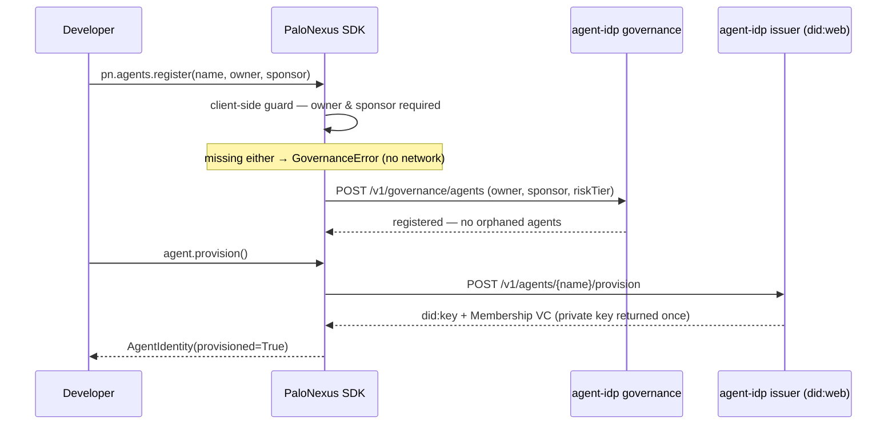

The problem accountable agent identity solves: prove **which agent acted, whose
authority it used, whether that authority was still valid, and why the action was
allowed** — even against a workload willing to lie about who it is. That is why an
agent's identity on PaloNexus is **cryptographic, not a trusted header**: a signed
agent credential, revocable at any moment, tied through governance to an accountable
human owner. DID/VC is **one supported credential format** — the mechanism used here,
not the category. Concretely, the actor is a self-certifying `did:key` anchored to
the org's `did:web` issuer, behind a non-revoked Membership Verifiable Credential
(VC). The `X-Palonexus-Actor` header is honoured only when it matches the proven DID.

## Self-provision at agent-idp

Before any DID is minted, an authority-bound agent must be **accountably owned**. The SDK
makes that a typed, two-call path: `pn.agents.register(name, owner, sponsor)`
enforces the *no-orphaned-agents* rule (a missing `owner` **or** `sponsor` raises
`GovernanceError` client-side, before any network call), then `agent.provision()`
mints the `did:key` and Membership VC. The sequence below shows both calls and
where the mandatory-ownership gate sits:



*Sequence: registration enforces mandatory owner + sponsor (deny-by-default,
client-side first then re-validated at agent-idp), and only a registered agent can
provision a `did:key` + Membership VC.*

The agent gets a **`did:key`** subject (offline-verifiable) anchored to the org's
**`did:web`** issuer. The IdP mints the DID plus a Membership VC and one Capability
VC per requested capability. Run agent-idp locally on `:8090`:

```bash
cd agent-idp
python -m venv .venv && . .venv/bin/activate
pip install -e ../agentdid        # the real crypto — install FIRST
pip install -e '.[test]'
uvicorn app.main:app --port 8090
```

Onboard, then provision (the private key is returned **once**):

```bash
# 1. Onboard (idempotent on name) — declares the capabilities it may later hold.
curl -s -XPOST localhost:8090/v1/agents -H 'content-type: application/json' -d '{
  "name":"triage-agent","role":"incident-triage",
  "capabilities":[{"action":"runbook:read","resource":"runbooks-api:/runbooks/*"}]}'
# -> 201 {"name":"triage-agent","status":"registered"}

# 2. Provision -> mints did:key + Membership/Capability VCs. privateKeyB64 ONCE.
curl -s -XPOST localhost:8090/v1/agents/triage-agent/provision
# -> {"name","did":"did:key:z6Mk…","privateKeyB64","membershipVc","capabilityVcs","issuerDid"}
```

Discover the trust anchor any verifier can resolve offline-or-over-HTTPS:

```bash
curl -s localhost:8090/.well-known/did.json    # the did:web issuer DID document
curl -s localhost:8090/v1/issuer               # {issuerDid, issuerPubMultibase}
```

The [`palonexus_agent` SDK](/docs/sdk/palonexus-agent/) self-provisions on startup
via these same endpoints (`identity.py`) and holds the private key + VCs in memory.
It also writes its identity to the shared file the egress sidecar reads — see
[Credential-Safe Action Enforcement](/docs/develop/egress-enforcement/).

:::note[Identity bootstrap bypasses the proxy]
The agent has no VP until it has provisioned, so the call to agent-idp must bypass
the egress proxy. `NO_PROXY` carves out `agent-idp`, and the NetworkPolicy allows
`agent-idp:8090` directly. Everything afterward routes through the proxy.
:::

## The VP on egress

On every outbound call the agent (or its sidecar) presents a short-lived
**Verifiable Presentation (VP)** of its Membership VC as
`Proxy-Authorization: Bearer <VP>`. The egress proxy:

1. verifies the VP signature against the agent's `did:key`,
2. confirms the wrapped Membership VC is non-revoked (StatusList check),
3. derives the proven `actorName` / `actorDid`,
4. runs the egress decision (allowlist → budget → delegation → OPA).

Because the proxy re-checks the StatusList on **every** call, the VP itself can
carry a long TTL (the sidecar mints 12h VPs) without weakening revocation.

## AGENT_IDENTITY_MODE: header vs vc

The control plane has two ways to establish the actor, selected by
`AGENT_IDENTITY_MODE`:

| Mode | Component | The actor is… | Trust |
|---|---|---|---|
| `header` | default | the `X-Palonexus-Actor` header value | trusted because the proxy-only NetworkPolicy + admission webhook ensure only registered agents can reach the proxy |
| `vc` | `components/egress-identity-vc` | the **proven** `did:key` behind a non-revoked Membership VC | the header is honoured *only if it matches* the proven DID; spoofing it gets a `403` |

`vc` is the strong mode and the Phase-3 path. In either mode the carried subject
(the on-behalf-of user) and task flow through to the audit row, so the chain proves
*"user U, via agent A, on task T, invoked X"*.

## Revocation

Revoking the Membership VC cuts the agent's egress on its **next** call —
immediately, regardless of any VP TTL — because the proxy re-checks the StatusList
every time:

```bash
curl -s -XPOST localhost:8090/v1/revoke -H 'content-type: application/json' \
  -d '{"vcJti":"<membership-vc-jti>"}'
```

The same mechanism revokes a time-boxed Delegation VC mid-flight (the
live-revocation race) — see [Authority delegation](/docs/develop/delegations-and-approvals/).
For the crypto primitives (Ed25519, did:web/did:key, JWT-VC, delegation chains) see
the [`palonexus_agent` / agentdid SDK](/docs/sdk/palonexus-agent/) and the exact
endpoints in the [HTTP API reference](/docs/reference/http-api/).
