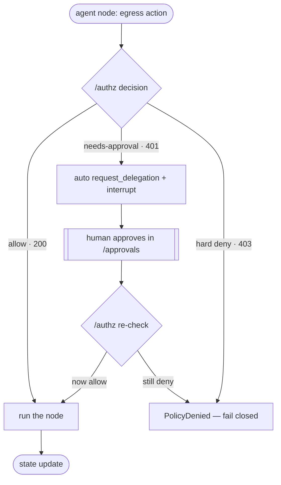

This is the payoff: two real LangGraph agents collaborating end-to-end, where
**every hop is decided at `/authz`**, no agent holds a standing runbook credential,
and a single human approval unlocks exactly one time-boxed, resource-scoped read.

The agents are real: [`agents/incident-triage`](/docs/develop/deploy-an-agent/) and
[`agents/access-broker`](/docs/develop/delegations-and-approvals/). The flow:

```
incident-triage:
  summarize (model via sidecar)        --> /authz (model-openai allow)
  attempt_read runbook                 --> DENIED (only a Membership VC; no Delegation)
  escalate (A2A) to access-broker      --> /authz (Target-Kind=agent, VP via proxied_client)
access-broker:
  request_delegation FOR the actor     --> agent-idp POST /v1/delegations/request
  await_approval (hitl_mode="poll")    --> block-poll the IdP for the human's approval
  [human approves in the portal]       --> Delegation VC granted
  return the VC to incident-triage
incident-triage:
  attempt_read runbook (retry)         --> DID/VC challenge-response --> ALLOW (grounded read)
  propose grounded triage plan
```

Every node that performs egress — a model call, a tool read, or an agent-to-agent
hop — passes through the *same* gate first. The `governed_node` decorator (and the
egress middleware) collapse the autonomous loop into one decision diamond: `/authz`
either **allows** (the node runs), returns **needs-approval** (the node auto-opens a
delegation and `interrupt()`s for a human), or **hard-denies** (fail closed). This is
the loop every step below is an instance of:



*Flowchart: the gated agent loop. A needs-approval decision is the only branch that
pauses for a human; on approval the node re-checks `/authz` (challenge-response) and
runs only if it is now allowed, otherwise it fails closed. An unreachable decision
point is also a deny (`ControlPlaneUnavailable`), never a silent allow.*

## Step by step

### 1. incident-triage summarizes (model egress)

Given an incy incident id, the agent's `summarize` node calls the LLM via the model
broker. The model call goes through the localhost egress sidecar, which mints a VP
and forwards through the proxy — decided at `/authz` as
`egress.proxy … model-openai allow=True`. The summary names the most relevant
runbook slug.

### 2. attempt_read is denied

The `attempt_read` node tries the runbook via the DID/VC challenge-response. It
holds only a **Membership VC** — no Capability/Delegation for runbooks-api — so the
read is denied. The node branches to `escalate` (and is wired to retry the read
after escalation):

```python
def attempt_read(state) -> Command[Literal["escalate", "propose"]]:
    result = challenge_response_access(state["runbook_name"], _runbook_ctx(state))
    if result.get("status") == "ok":
        return Command(update={"runbook_steps": ...}, goto="propose")
    if state.get("escalated"):                 # already tried; give up gracefully
        return Command(update={...}, goto="propose")
    return Command(update={...}, goto="escalate")
```

### 3. escalate to the access-broker (A2A egress)

The `escalate` node calls the access-broker agent — an **agent-to-agent** hop. This
edge is itself egress: it goes through the PaloNexus egress proxy carrying
incident-triage's Membership VP via `proxied_client`, so the A2A hop is decided at
`/authz` like any other egress (without the VP the proxy returns `407`). Crucially
it asks the broker to **block-poll** for the human's approval and return the VC in
this one call (`hitl_mode="poll"`), so the autonomous loop closes without resuming
incident-triage's thread:

<!-- no-doctest: legacy `palonexus_agent` scaffold (graduated into `palonexus`) — not the shipped package; page pending REM-159 -->
```python
from palonexus_agent.egress_proxy import proxied_client
client = proxied_client(timeout=120.0)
r = client.post(f"{broker_url}/invoke",
                headers={"X-Palonexus-Subject": subject},
                json={"input": {"actor": actor, "task": task, "action": "runbook:read",
                                "resource": resource, "reason": reason,
                                "hitl_mode": "poll"}})       # block-poll the IdP inline
```

### 4. access-broker requests the delegation FOR the actor

The broker's `request_delegation` node requests a delegation at agent-idp. The
critical detail: it passes `actor_name=state["actor"]` so the VC is issued to
**incident-triage's** `did:key` — the holder that will retry the runbook read — not
to the broker's own identity:

<!-- no-doctest: illustrative fragment — uses `identity_mgr` from a neighbouring block (not standalone-runnable) -->
```python
rec = identity_mgr.request_delegation(
    task=state["task"], action=state["action"], resource=state["resource"],
    reason=state.get("reason", ""), ttl_seconds=state.get("ttl_seconds", 300),
    actor_name=state["actor"],   # issue the VC to the actor we're brokering for
)
```

### 5. the broker block-polls; a human approves

With `hitl_mode="poll"` the `await_approval` node block-polls
`GET /v1/delegations/{id}` for a **side-channel** approval — the human clicks
Approve in the portal's [Approvals console](/docs/develop/delegations-and-approvals/),
which calls agent-idp `/approve`. One programmatic `/invoke` thus collects the
human-approved Delegation VC with no LangGraph resume needed:

<!-- no-doctest: pseudocode — `...` placeholder in a dict literal, not executable -->
```python
if state.get("hitl_mode", "interrupt") == "poll":
    status, vc, approver = _poll(identity_mgr, did_, poll_interval_s, poll_timeout_s)
    return Command(update={"status": status, "delegation_vc": vc or "", ...}, goto="finalize")
```

(The broker also supports a console path: an `interrupt()` resumable via
`Command(resume={"approved": bool, "approver": str})`. Both paths require a
persistent checkpointer.)

### 6. DID/VC runbook read succeeds; grounded plan

The broker returns the Delegation VC to incident-triage, which re-enters
`attempt_read`. This time it holds the time-boxed, resource-scoped VC, so the DID/VC
challenge-response proving live-holder + exec-state (this ticket, this scope)
succeeds — `/authz` allows, runbooks-api returns the steps. The `propose` node then
produces a triage plan **grounded in the actual runbook**.

## Run it

The fully autonomous flow runs through the real agents:

> `summarize (model via sidecar) → runbook DENIED → escalate (A2A) → human approves
> in the portal → vc granted → DID/VC runbook read → grounded plan`

— every hop on the audit chain. The single-process delegation race (deny → approve
→ allow → revoke → deny) is provable standalone with `./scripts/phaseB-smoke.sh`;
see [Authority delegation](/docs/develop/delegations-and-approvals/). Inspect
the result:

```bash
curl -s localhost:8181/v1/audit?limit=20      # one chain: model, A2A, delegation, runbook reads
curl -s localhost:8181/v1/audit/verify        # {"ok":true,"brokenAtSeq":-1}
```

The portal shows it live across Decisions, Audit (Verify chain), Identity,
Approvals, Agents, and Traces — see [self-hosting](/docs/operations/self-hosting/).
