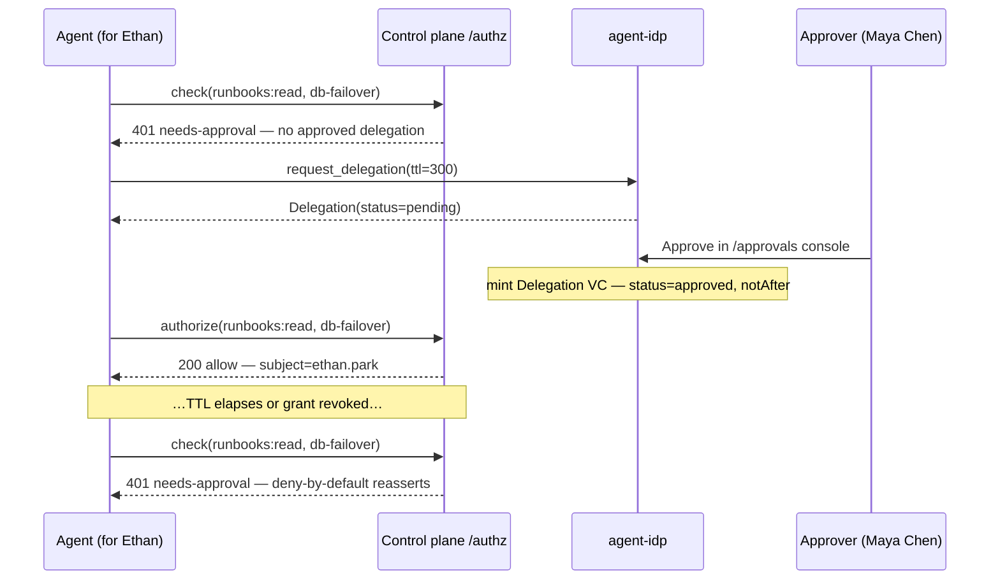
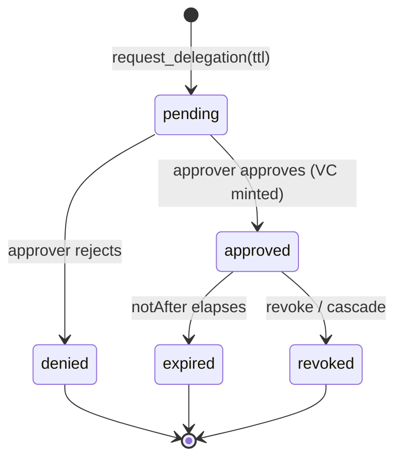

Some actions are too sensitive for a standing credential. A low-trust agent should
read **only the specific runbook for the incident it is actively working**, for
only ~5 minutes, and only after a human approved that delegation. This is the
human-in-the-loop layer.

## The elevation flow at a glance

This is the headline flow of the whole platform: an agent is **denied** a regulated
target, opens a **time-boxed delegation request**, a human **approves** it (minting a
short-lived Delegation VC), the retried call is **allowed** for exactly that task,
and on TTL expiry or revocation deny-by-default reasserts. The
[temporary-elevation walkthrough](/docs/develop/guides/temporary-elevation-walkthrough/)
runs this end-to-end offline; here is the shape of it:



*Sequence: the deny → request → approve → allow → expire/revoke arc. Every hop is a
real `/authz` decision carrying `subject=ethan.park`; the approval is a named human
decision on the audit record, not a standing grant.*

A delegation moves through a small, explicit lifecycle. Only the `approved` state
(while non-expired and non-revoked) makes `/authz` allow; every other state is a
deny:



*State diagram: a delegation is `pending` until an authorized human decides it.
`approved` is the only state that authorizes a call, and it is time-boxed — it
leaves for `expired` (TTL) or `revoked` (live StatusList), both terminal denies.*

### Who can request, approve, operate, audit

Separation of duties is enforced by the **two-gate approval rule**
(`authority.py::decide`): an approver must hold `org:agents:approve` **and**
`covers_scenario` (at least one of the scenario's resource scopes). The owner who
requested the elevation does **not** self-approve.

| Responsibility | Persona (devops-incident) | Authority required | Notes |
|---|---|---|---|
| **Request** elevation | Ethan Park (owner / on-behalf-of) | the agent acts on Ethan's behalf; he holds `deployments:*` but **not** `runbooks:read` | the agent never holds more than the human it represents |
| **Approve** | Maya Chen (sponsor) | `org:agents:approve` **and** covers DevOps (`runbooks:read`) | passes both gates ✅ — and is not the requester |
| **Cannot approve** | Omar Haddad (auditor) | holds `org:agents:approve` but covers **Security** only | `outside_scenario_domain:devops-incident` ❌ — can only audit |
| **Cannot approve** | Claire Evans (negative) | no scopes; invariant-blocked from `org:agents:*` | hard-denied everywhere ❌ |
| **Operate** the task | Arjun Mehta (operator) | runs the agent within granted scopes | no approval authority |
| **Audit** | Omar Haddad (auditor) | read the hash-chained `/audit` log | reviews who approved what, when |

## Time-boxed Delegation VCs

A `dataClass: regulated` tool target makes the egress decision require a valid,
**approved, non-expired, non-revoked** delegation for the exact
`(actor, task, action, resource)`. There is no standing grant; each grant is a
single-link `CapabilityCredential` chaining directly to the `did:web` issuer — the
human approval *is* the root authority — with a short TTL.

The control plane checks this by calling agent-idp `GET /v1/delegations/check`
(the Go `DelegationVerifier`). When no valid delegation exists, `/authz` returns
**`401` with `X-Palonexus-Needs-Approval: true`**. The middleware turns that into a
LangGraph `interrupt()` instead of failing:

<!-- no-doctest: illustrative fragment — uses `decision` from a neighbouring block (not standalone-runnable) -->
```python
if decision["needs_human_approval"]:
    interrupt({"action_requests": [request.tool_call], "reason": decision["reason"]})
```

A human approves in the portal; the console resumes the graph via
`Command(resume=...)`. The interrupt requires a persistent checkpointer.

### Request → approve → use, by hand

The egress decision the middleware would make carries the fine-grained
`Action`/`Resource` so the coarse allowlist gate and the cryptographic resource
gate check **one** delegation:

```bash
# BEFORE delegation -> 401 + needs-approval=true (deny, ask a human)
curl -s -o /dev/null -w "%{http_code} needs-approval=%header{x-palonexus-needs-approval}\n" \
  -XPOST localhost:9191/authz \
  -H 'X-Palonexus-Actor: triage-agent' \
  -H 'X-Palonexus-On-Behalf-Of: sre@corp' \
  -H 'X-Palonexus-Task: INC-123' \
  -H 'X-Palonexus-Service: runbooks-api' \
  -H 'X-Palonexus-Target-Kind: tool' \
  -H 'X-Palonexus-Action: runbook:read' \
  -H 'X-Palonexus-Resource: runbooks-api:/runbooks/db-failover'
```

```bash
# A human approves a 300s time-boxed delegation at the IdP.
REQ_ID=$(curl -s -XPOST localhost:8090/v1/delegations/request -H 'content-type: application/json' -d '{
  "actorName":"triage-agent","task":"INC-123","action":"runbook:read",
  "resource":"runbooks-api:/runbooks/db-failover","reason":"triage INC-123 5xx spike",
  "ttlSeconds":300}' | jq -r .id)
APPROVE=$(curl -s -XPOST "localhost:8090/v1/delegations/$REQ_ID/approve" \
  -H 'content-type: application/json' -d '{"approver":"sre@corp"}')
VC_JTI=$(echo "$APPROVE" | jq -r .vcJti)
# AFTER approval -> re-run the egress curl above -> 200 (allow).
```

`/v1/delegations/check` returns `ok=true` **iff** an approved, non-expired
(`notAfter > now`), non-revoked delegation exists whose `actorName`, `task`,
`action` match and whose stored `resource` covers the requested one (trailing `/*`
glob).

## The runbook DID/VC challenge-response

Holding a valid Delegation VC is necessary but not sufficient. At the resource —
the runbooks-api gate — the agent additionally performs a **challenge-response**
proving it is the *live holder* in the *expected execution state* (this ticket,
this scope), defeating stolen or replayed credentials. The SDK's `runbook_tool.py`
does the two-step `agentdid` flow once a Delegation VC is available, attaching the
exec-state context:

<!-- no-doctest: illustrative fragment — uses `RunbookContext` from a neighbouring block (not standalone-runnable) -->
```python
RunbookContext(
    identity=identity,
    delegation_vcs={resource_for(name): delegation_vc},
    exec_state={"active_ticket_id": incident_id, "scope_in_use": "runbook:read",
                "task": incident_id, "ticketSource": "incy"},
)
```

This is why runbooks-api is registered `dataClass: internal`, not `regulated`: the
proxy does the coarse allowlist gate, and this fine-grained, per-resource gate runs
**server-side**. See [Credential-safe action enforcement § layering](/docs/develop/egress-enforcement/#the-layering-coarse-at-the-proxy-fine-at-the-server).

## The two consoles

The portal surfaces two approval queues that share the same UI pattern (a 3s poll +
React-Query invalidation):


*The `/approvals` console — the human-in-the-loop queue where an operator approves or
denies delegation requests. Shown here in its empty state: the queue is clear (no
pending requests), the resting state between elevations. Set the **Approver** field
(e.g. `maya.chen@northstar.example`) before approving; that string lands on the
delegation and the audit record.*

| Console | Backs | Approves | When it fires |
|---|---|---|---|
| **Approvals** (`/approvals`) | delegation requests at agent-idp | a time-boxed Delegation VC for `(actor, task, action, resource)` | a `regulated` *tool* target needs a fine-grained, server-side-gated delegation |
| **Egress Approvals** (`/egress`) | the control-plane pending-egress queue | a single held egress request | a `regulated` target with **no** server-side gate (e.g. `scale_deployment`) is held at the proxy |

The Egress Approvals path: when the proxy decision is `needs-approval`, it creates
a pending request and **holds** — long-polling its status up to
`EGRESS_APPROVAL_TIMEOUT` (default 120s). Approved → forward; denied/timeout →
`403`. The queue API:

```bash
curl -s localhost:8181/v1/egress/requests                      # list (newest first)
curl -s -XPOST localhost:8181/v1/egress/requests/$ID/approve -d '{"approver":"sre@corp"}'
curl -s -XPOST localhost:8181/v1/egress/requests/$ID/deny     -d '{"approver":"sre@corp","reason":"…"}'
```

## Preview a decision before you run it

Before requesting (or approving) an elevation, you can dry-run the exact decision in
the **Policy simulator** (`/simulate`). Its **Authority-preview** tab answers a
design-time eligibility question — *would persona P, on scenario S, be allowed
authority action A?* — while the **Live decision** tab issues a runtime-faithful
dry-run against the real decision paths:


*The `/simulate` console: what-if over the real decision paths. Use the
Authority-preview tab to check whether an approver passes the two-gate rule, but
trust only the **Live decision** tab for a real allow/deny — design-time preview is a
hint, not a verdict.*

## The live-revocation race

A time-boxed delegation can be cut **mid-flight**, before it expires:

```bash
# Revoke the Delegation VC.
curl -s -XPOST localhost:8090/v1/revoke -H 'content-type: application/json' \
  -d "{\"vcJti\":\"$VC_JTI\"}"
# The NEXT /authz for that delegation -> 401 + needs-approval=true again.
```

Because `/authz` re-checks the StatusList on every call, revocation denies the very
next request regardless of remaining TTL. Prove the whole sequence —
deny → approve → allow → revoke → deny — with the platform smoke script:

```bash
./scripts/phaseB-smoke.sh
```

The full multi-agent version of this, with a peer broker block-polling for the
approval, is the [autonomous flow](/docs/develop/autonomous-flow/).

## See also

- [Temporary elevation walkthrough (INC-4821)](/docs/develop/guides/temporary-elevation-walkthrough/) — this exact flow, end-to-end and runnable offline, with the SDK error table and the elevation flow table.
- [Accountable agent identity](/docs/develop/agent-identity/) — how the agent the delegation is issued to gets its `did:key` + Membership VC.
- [Recipe: revocation race](/docs/develop/recipes/revocation-race/) — revoke mid-task and watch the next check deny.
- [Troubleshooting § SDK typed error tree](/docs/develop/troubleshooting/#the-sdk-typed-error-tree) — map `ApprovalRequired` / `DelegationExpired` / `CredentialRevoked` to their fixes.
