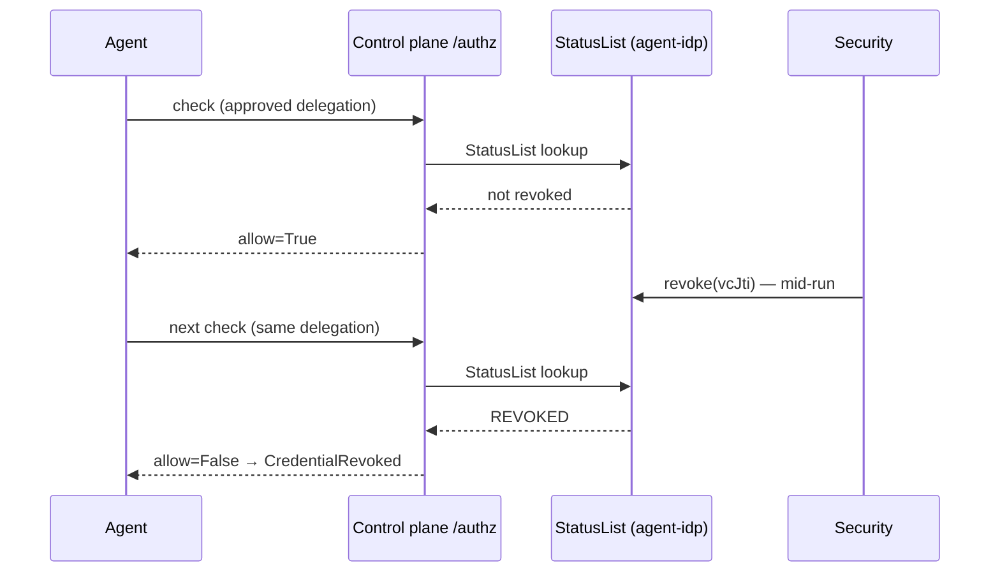

Revocation in PaloNexus is **enforced on the decision path**, not advisory: the
[StatusList](/docs/getting-started/glossary/) is re-checked on
*every* call, so revoking a grant denies the **next** decision immediately — even in the middle
of a long run. This recipe runs the race: allow → revoke → deny.

The race is a timing story, so picture it on a timeline. The agent holds an
**approved** delegation and a call is allowed; security revokes the credential
mid-task; the very next challenge-response re-reads the live StatusList and denies —
with no cache window to wait out:



*Sequence: `/authz` re-checks the live StatusList on every decision, so a revocation
between two checks denies the second one regardless of remaining TTL. There is no
stale-grant window.*

```python
from palonexus import PaloNexus

AGENT = "northstar-devops-incident-agent"
OWNER, APPROVER = "ethan.park@northstar.example", "maya.chen@northstar.example"
ACTION, RESOURCE = "runbooks:read", "runbooks-api:/runbooks/db-failover"

pn = PaloNexus.offline()
agent = pn.agents.register(name=AGENT, owner=OWNER, sponsor=APPROVER, scenario="devops-incident")
agent.provision()

with pn.task(subject=OWNER, task_id="INC-4821", scenario="devops-incident", actor=AGENT) as task:
    deleg = task.request_delegation(action=ACTION, resource=RESOURCE, reason="INC-4821", ttl=300)
    pn._fake.approve_delegation(deleg.id, approver=APPROVER)
    assert task.check(action=ACTION, resource=RESOURCE).allow is True        # allowed now

    # Security revokes the grant mid-run (incident closed / least-privilege).
    pn.revoke(deleg.id, reason="incident closed / least-privilege")

    after = task.check(action=ACTION, resource=RESOURCE)
    assert after.allow is False                                              # next call denies
    print("before revoke: allow=True | after revoke: allow=", after.allow)

pn.close()
```

```text
before revoke: allow=True | after revoke: allow= False
```

## Cascade revocation

Revoking an owner or agent **cascades** — every delegation beneath it is invalidated at once.
Use it when offboarding a human or quarantining an agent:

<!-- no-doctest: illustrative fragment — uses `agent` from a neighbouring block (not standalone-runnable) -->
```python
report = pn.revocation.cascade(parent_did=agent.identity.did)
print(report)        # {'delegations_revoked': N, 'agents_suspended': 0, 'agents_quarantined': 0}
```

On a live deployment this is `POST /v1/revocation/cascade` at agent-idp; the next `/authz` (or
egress-proxy) call that depends on any revoked credential denies in under a second.

## What this proves

- **No stale-grant window.** There is no cache to wait out — the decision re-reads revocation
  state every time.
- **Mid-run safety.** A long-running agent that was authorized a moment ago **stops** the
  instant a grant is pulled. In a framework run the SDK raises
  [`CredentialRevoked`](/docs/develop/troubleshooting/#vc-expiry-revocation-and-clock-skew); the
  shipped `palonexus-governance` skill teaches the agent to stop cleanly and not retry.
- **Least-privilege by construction.** Delegations are task-scoped and time-boxed anyway
  ([TBAC](/docs/getting-started/glossary/)); cascade revocation
  is the immediate override.

## Related

- [Deep Agents adapter](/docs/sdk/deep-agents/#offline-prove-the-contract-with-no-network) — the same flip inside `create_deep_agent`.
- [Agent identity & credentials — revocation at /authz](/docs/concepts/identity-and-credentials/#revocation-enforced-at-authz).
