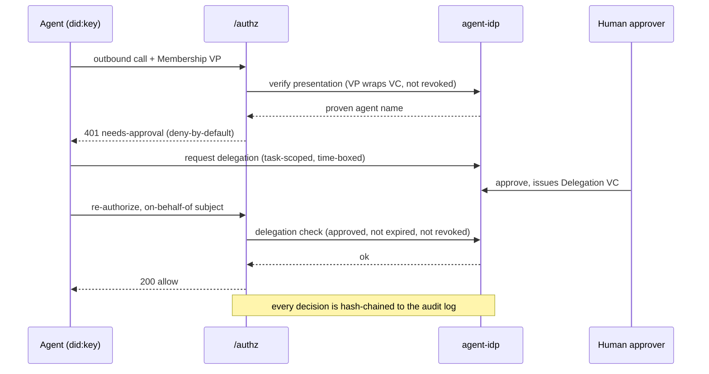

A short tour of the ideas the rest of the docs build on.

## The authority graph

Many systems can intercept an agent's calls. What makes a PaloNexus decision different is
the **authority graph** behind it: every decision resolves a complete chain from a real
person to the recorded action —

```text
human identity
  → organizational role
  → ownership of resource/service
  → authority to delegate
  → agent identity
  → task mandate
  → permitted operation
  → target resource
  → time/risk/budget constraints
  → issued runtime credential
  → recorded action
```

An agent never acts on its own authority. It acts with **delegated authority** — and the
authority graph is what proves *whose* authority it is using, that the person was
*entitled* to delegate it, and that the delegation is *still valid* at the moment of the
call.

## Delegation validation

PaloNexus does not merely record that a human approved an action. It verifies that the
approval itself carries authority:

- the approver is **active** in the workforce directory;
- the approver **has authority over the resource** being acted on;
- the approver **may delegate** that authority;
- the requested operation falls **within the approver's own permissions**;
- the delegation stays **within duration, risk, budget, and environment limits**;
- **separation-of-duties** constraints are satisfied;
- the approving identity **has not changed role** since the approval.

So a random manager cannot approve a production database deletion, a sponsor cannot grant
an agent permissions the sponsor does not hold, and an approval loses force when the
approver changes role or leaves the company.

## Just-in-time access

Agents hold **no standing enterprise credentials**. Access is issued at the moment a task
requires it — scoped to one task, one target, a bounded action set, and a short time
window — and it expires or is revoked automatically. A denial becomes access only through
an approved, time-boxed delegation, never through a durable role grant.

## One authorization contract (`/authz`)

Everything converges on a single authorization call — the platform's **one authorization
contract**. Envoy's `ext_authz` filter asks the control plane *may this caller reach this
target?* on every request. The same `/authz` logic governs **agent egress** — a model call,
tool call, or agent→agent hop is the same shape of question (`actor`, `on-behalf-of`,
`task`, `target`, `action`, `resource`).

## Ingress vs egress

- **Ingress (north–south):** a client → Envoy gateway → `/authz` → upstream service.
  Identity is a bearer token (OIDC via Dex); the target is resolved from the registry.
- **Egress (the hard part):** an agent's outbound call → the egress proxy → `/authz` →
  model/tool/peer/external. Identity is a **signed agent credential, presented fresh on
  each call** (see [Credential formats](#credential-formats-implementation) for the wire
  format); the decision adds allowlist, budget, delegation/TBAC, and OPA.

Egress is enforced at the **network layer** (NetworkPolicy confines the pod to the egress
proxy), so it holds for *any* framework — not just cooperating SDK code.

## Agent identity and ownership

Every agent has its own identity — distinct from any human's — plus a mandatory
**accountable human owner** and **sponsor** before it can run. The identity is backed by a
signed agent credential whose revocation is checked on every decision: revoke an agent and
its egress stops within seconds. See [Accountable agent identity](/docs/develop/agent-identity/) and
[Credential formats](#credential-formats-implementation) below for how this is implemented.

## Delegations (time-boxed, human-approved)

A low-trust agent has *no standing access* to regulated resources. To act, it requests a
**delegation credential** — a time-boxed, task-scoped proof of authorization that a human
approves. The regulated resource (e.g. `runbooks-api`) verifies it server-side via a
cryptographic **challenge-response**.
See [Authority delegation](/docs/develop/delegations-and-approvals/).

## The registry

The source of truth for every **service, agent, model, and tool** — plus each agent's
egress **allowlist** (`allowModels`/`allowTools`/`allowAgents`), **budget**
(tokens/calls/cost), and **data class**. The registry and the policy converge on the
`/authz` answer. See [Budgets & allowlists](/docs/develop/budgets-and-allowlists/).

## The request lifecycle, end to end

These ideas come together on a single regulated egress call. Here is the full lifecycle — VP
verification, deny-by-default, delegation, human approval, re-authorization, and the audit
record — for one agent reading a regulated runbook on behalf of a human:



*One regulated egress call: the agent proves its identity with a signed presentation, the
call is denied by default, a human approves a time-boxed delegation, the re-checked call is
allowed on behalf of the human, and both decisions are written to the verifiable authority
trail.*

## Credential formats (implementation)

Externally, the PaloNexus vocabulary is deliberately format-neutral: **agent identity**,
**signed agent credentials**, **delegated authority**, **proof of authorization**, and
**short-lived runtime credentials**. Beneath that vocabulary, the shipped implementation
uses **DID/VC — one supported credential format, an implementation mechanism rather than
the product category**:

- **Agent identity (DID/VC).** Agents are **`did:key`** subjects (self-certifying, minted
  per agent) issued an **issuer-signed Membership VC** by the **`did:web`** anchor
  (`did:web:agent-idp.agent-idp.svc`). No blockchain. Revocation is a StatusList checked at
  `/authz` — revoke an agent and its egress stops within seconds. See
  [Accountable agent identity](/docs/develop/agent-identity/).
- **Proof of identity on each call.** On every egress call the agent builds a fresh,
  holder-signed **Verifiable Presentation (VP)** wrapping its Membership VC — proving *who
  is calling, right now* without forwarding a raw bearer token.
- **Delegated authority.** An approved delegation is carried as a **Delegation VC** — the
  time-boxed, task-scoped credential from
  [Delegations](#delegations-time-boxed-human-approved) — and regulated resources verify it
  server-side via a DID/VC **challenge-response**. See
  [Authority delegation](/docs/develop/delegations-and-approvals/).

Every acronym above — DID, VC, VP, TBAC, on-behalf-of, deny-by-default — is defined in the
[Glossary](/docs/getting-started/glossary/).

## Where to go next

- [Quickstart](/docs/getting-started/quickstart/) — run the platform + these docs (the "Run the platform locally" tab).
- [Deploy an agent](/docs/develop/deploy-an-agent/) — the developer path.
- [Architecture](/docs/concepts/architecture/) — the decision service in depth.
