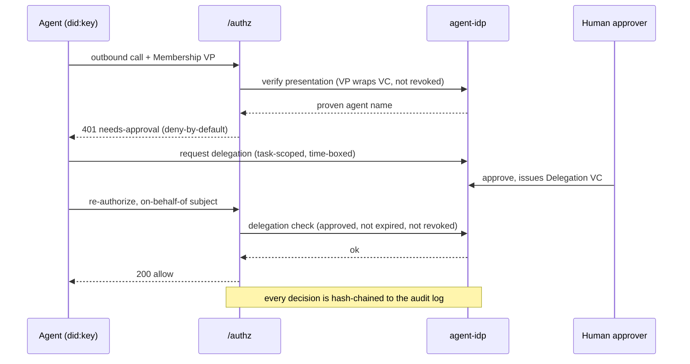

A short tour of the ideas the rest of the docs build on.

## One decision (`/authz`)

Everything converges on a single authorization call. Envoy's `ext_authz` filter asks the
control plane *may this caller reach this target?* on every request. The same `/authz`
logic governs **agent egress** — a model call, tool call, or agent→agent hop is the same
shape of question (`actor`, `on-behalf-of`, `task`, `target`, `action`, `resource`).

## Ingress vs egress

- **Ingress (north–south):** a client → Envoy gateway → `/authz` → upstream service.
  Identity is a bearer token (OIDC via Dex); the target is resolved from the registry.
- **Egress (the hard part):** an agent's outbound call → the egress proxy → `/authz` →
  model/tool/peer/external. Identity is a **Verifiable Presentation** (the agent's
  `did:key` + an issuer-signed Membership VC); the decision adds allowlist, budget,
  delegation/TBAC, and OPA.

Egress is enforced at the **network layer** (NetworkPolicy confines the pod to the egress
proxy), so it holds for *any* framework — not just cooperating SDK code.

## Agent identity (DID/VC)

Agents are **`did:key`** subjects (self-certifying, minted per agent) issued an
**issuer-signed Membership VC** by the **`did:web`** anchor (`did:web:agent-idp.agent-idp.svc`).
No blockchain. Revocation is a StatusList checked at `/authz` — revoke an agent and its
egress stops within seconds. See [Agent identity](/docs/develop/agent-identity/).

## Delegations (time-boxed, human-approved)

A low-trust agent has *no standing access* to regulated resources. To act, it requests a
**Delegation VC** — a time-boxed, task-scoped credential a human approves. The regulated
resource (e.g. `runbooks-api`) verifies it server-side via a DID/VC **challenge-response**.
See [Delegations & approvals](/docs/develop/delegations-and-approvals/).

## The registry

The source of truth for every **service, agent, model, and tool** — plus each agent's
egress **allowlist** (`allowModels`/`allowTools`/`allowAgents`), **budget**
(tokens/calls/cost), and **data class**. The registry and the policy converge on the
`/authz` answer. See [Budgets & allowlists](/docs/develop/budgets-and-allowlists/).

## The request lifecycle, end to end

These ideas come together on a single regulated egress call. Here is the full lifecycle — VP
verification, deny-by-default, delegation, human approval, re-authorization, and the audit
record — for one agent reading a regulated runbook on behalf of a human:

*One regulated egress call: the agent proves its identity with a Verifiable Presentation, the
call is denied by default, a human approves a time-boxed Delegation VC, the re-checked call is
allowed on behalf of the human, and both decisions are written to the tamper-evident audit
chain.*

Every acronym above — DID, VC, VP, TBAC, on-behalf-of, deny-by-default — is defined in the
[Glossary](/docs/getting-started/glossary/).

## Where to go next

- [Local quickstart](/docs/getting-started/quickstart-local/) — run the platform + these docs.
- [Deploy an agent](/docs/develop/deploy-an-agent/) — the developer path.
- [Architecture](/docs/concepts/architecture/) — the six pillars in depth.
