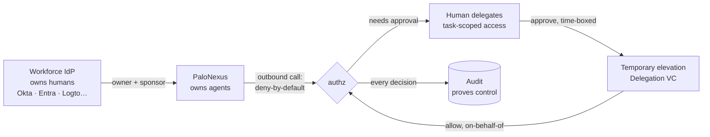

PaloNexus is a Kubernetes-native **control layer** that unifies six pillars —
**gateway, identity, registry, policy, observability, audit** — onto a single
authorization decision. Its headline job is **agent egress governance**: every
outbound action an agent takes — model call, tool call, agent→agent hop — is decided
at one deny-by-default `/authz` that answers *may this agent make this call, on behalf
of this human, for this task, right now?* The same decision point **also** gates
inbound calls — every north-south request entering the gateway asks the same `/authz`
*may this caller reach this service?* via Envoy `ext_authz`. That north-south
capability is the foundation egress is built on, not the headline.

## The one-diagram story

Everything PaloNexus does is one sentence: **Your workforce IdP owns your humans, PaloNexus
owns your agents,** humans delegate task-scoped access to those agents, approvals turn a
denial into a time-boxed elevation, and every decision lands on a tamper-evident audit chain.
That is the whole product:

Read it left to right. **Your workforce IdP** (Okta, Entra ID, Logto in the demo, …) is the
source of truth for *people*; PaloNexus never re-invents human identity. Logto is the
**reference IdP** used in PaloNexus demos; any OIDC/SCIM IdP plugs in the same way → see
[IdP Support Model](/docs/concepts/idp-support/). **PaloNexus** is the source of truth for *agents*
— each one minted a `did:key` and a Membership VC, and required to name an accountable human
**owner** and **sponsor** before it can run. When that agent makes an outbound call, the
default answer at `/authz` is **no** (deny-by-default). To get a yes for a regulated
resource, a human with approval authority **delegates** a single task-scoped, **time-boxed**
grant (a Delegation VC) — a *temporary elevation*, not a standing role. The re-checked call
now passes **on behalf of** that human, and the decision — allow or deny — is written to the
hash-chained **audit** trail. Humans, agents, delegation, approval, elevation, proof: one
loop.

*The PaloNexus control loop: your workforce IdP (Okta, Entra ID, Logto in the demo, …) owns
humans, PaloNexus owns agents, a human delegates task-scoped access, an approval turns a
denial into a time-boxed elevation, and every `/authz` decision is proven on the audit chain.*

See it live on the operator console — authorization decisions, agent identities, active
delegations, and consumption in a single posture view:

*Live posture of the PaloNexus control plane: authorization decisions, agent identities,
delegations, and consumption in one view.*

## The six pillars, one decision

| Pillar | Role |
|---|---|
| **Gateway** | Envoy Gateway routes every request through `/authz` (`SecurityPolicy.extAuth`). |
| **Identity** | Humans via Dex (OIDC); agents via DID/VC (`did:key` subjects + a `did:web` issuer anchor). |
| **Registry** | The source of truth for services, agents, models, tools — plus egress allowlists and budgets. |
| **Policy** | Inline rules then an OPA (Rego) veto; deny-by-default, fail-closed. |
| **Observability** | Decisions, latency, per-agent token/cost as metrics; DID/VC spans as traces. |
| **Audit** | Every decision hash-chains to its predecessor — tamper-evident. |

## What PaloNexus does today — at a glance

A quick orientation for an evaluator: what ships and is enforced today, what is optional
(present but off unless you turn it on), and what is deliberately deferred. This is a
distillation of the full [Feature matrix](/docs/concepts/feature-matrix/) — kept honest and
in sync with it.

| Capability | Status |
|---|---|
| **Agent egress governance** — every model / tool / agent→agent / external call decided at one deny-by-default `/authz` (allowlist → budget → delegation → OPA) | Must-have (shipped) |
| **Ingress authz** — every north-south request decided at the *same* `/authz` via Envoy `ext_authz`, deny-by-default; the foundation egress is built on | Foundational (shipped) |
| **DID/VC agent identity** — `did:key` subjects under a `did:web` issuer, Membership + Capability VCs | Must-have (shipped) |
| **Delegations / TBAC** — human-approved, time-boxed, task-scoped Delegation VCs | Must-have (shipped) |
| **Human-approved egress hold** — needs-approval / external egress held for a human decision | Must-have (shipped) |
| **Tamper-evident audit** — hash-chained decision log; `/v1/audit/verify` recomputes the chain | Must-have (shipped) |
| **Cryptographic egress identity** (`AGENT_IDENTITY_MODE=vc`) — a verified Membership VP is *required*, the actor header is no longer trusted alone | Optional (shipped, opt-in) |
| **Pluggable persistence** — `memory` · `postgres` · `mysql` · `sqlite` · `mongodb` (defaults to in-memory) | Optional (shipped, opt-in) |
| **OPA org policy** — org-wide Rego veto (deny-overrides) over the inline decision | Optional (shipped, opt-in via `OPA_URL`) |
| **Enterprise IAM** — SCIM directory sync, ownership governance, revocation cascade, STS token exchange | Optional (shipped, runs beside your workforce IdP) |
| **Signed policy bundles**, **KMS/HSM issuer key + rotation**, **SPIFFE/SPIRE mTLS**, **multi-approver workflows**, **JWKS for STS** | Backlog (planned / hardening) |

See the [Feature matrix](/docs/concepts/feature-matrix/) for every row with its precise
status and where it is documented.

## Design invariants

- **Deny-by-default / fail-closed.** Unknown service, invalid token, unreachable OPA → deny.
- **Identity propagation, not token forwarding.** On allow, the control plane stamps
  `X-Palonexus-Subject` / `-Upstream`; upstreams trust the edge.
- **Network-layer egress enforcement.** Agents are confined (NetworkPolicy) so every
  outbound call must traverse the egress proxy → `/authz`, regardless of framework.
- **Tamper-evident audit.** Editing or deleting a record breaks the hash chain.

## Next steps

- Want the **ten-minute first success**? Run the
  [Quickstart — your first governed agent](/docs/getting-started/quickstart-agent-dev/) — no
  cluster, no network, no API key.
- New to the platform? Read [Concepts](/docs/getting-started/concepts/) and skim the
  [Glossary](/docs/getting-started/glossary/).
- Want it running locally? Follow the [Local quickstart](/docs/getting-started/quickstart-local/).
- Building an agent? See [Deploy an agent](/docs/develop/deploy-an-agent/).
- Evaluating? The [Feature matrix](/docs/concepts/feature-matrix/) and
  [Architecture](/docs/concepts/architecture/) go pillar by pillar.

## See also

- [Reference — HTTP API](/docs/reference/http-api/), [Headers](/docs/reference/headers/),
  and [Environment variables](/docs/reference/env-vars/) for the code-accurate contracts.
