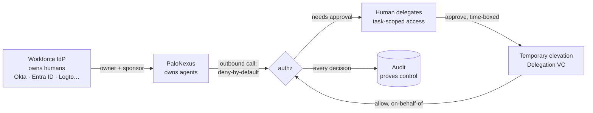
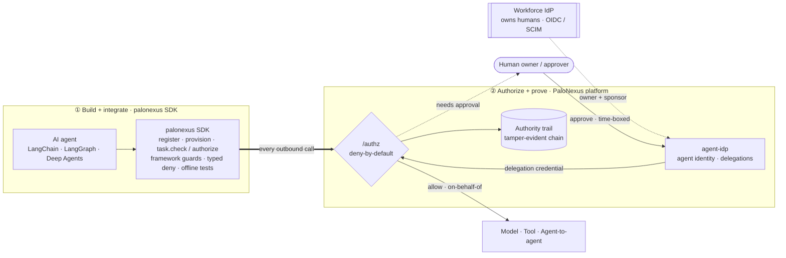

import { Card, CardGrid, LinkCard, Steps } from '@astrojs/starlight/components';
import { Image } from 'astro:assets';
import heroArch from '../../../assets/palonexus-hero-arch.png';

PaloNexus is an **authorization and accountability service for AI-agent actions** — the
identity governance layer between AI agents and the systems they act upon. It decides
**authority, not routing**: whenever an agent attempts an action — a model call, a tool
call, an agent→agent hop — one deny-by-default `/authz` decision answers *may this agent
make this call, on behalf of this human, for this task, right now?* Behind that answer sits
the [authority graph](/docs/getting-started/concepts/): whose authority the agent is using,
whether that person was entitled to delegate it, and whether the delegation is still valid
at this moment.

<Image
	src={heroArch}
	alt="Architecture diagram: agents in any runtime or sandbox — LangGraph, LangChain, Deep Agents, OpenAI Agents SDK, kagent, or a custom runtime — present an agent identity, owner, and task to PaloNexus. Inside PaloNexus, workforce identity providers (Okta, Entra ID, Google Workspace, Logto, HRIS) feed an authority directory; an authorization decision service evaluates agent, owner, task, action, resource, and context, answering allow, deny, or approve; a credential broker then issues short-lived, audience-bound credentials to reach enterprise systems — Kubernetes and cloud, GitHub and CI/CD, MCP servers and tools, SaaS and internal APIs, data platforms — which hold no standing credentials. Every result lands on a verifiable authority trail."
	loading="eager"
/>

> Agent runtimes decide **how an agent works**.
> Sandboxes decide **where its code runs**.
> PaloNexus decides **what it is authorized to do and whose authority it is using**.

PaloNexus makes sure an AI agent can act only with authority that a real person or service owner was entitled to delegate—and only for the task, resource, and time originally approved.

PaloNexus is **not** an agent runtime and **not** a sandbox — it is the layer that governs
what either is allowed to do with real enterprise systems:

| Layer | What it owns | Examples |
|---|---|---|
| **Agent runtime** | *How an agent works* — prompting, tool routing, memory, orchestration | LangChain, LangGraph, Deep Agents, OpenAI Agents SDK, kagent |
| **Sandbox** | *Where its code runs* — isolated filesystems, command execution, workspace lifecycle | Kubernetes Agent Sandbox, E2B, Daytona, Modal |
| **PaloNexus** | *What it is authorized to do and whose authority it is using* — accountable ownership, delegation, just-in-time credentials, revocation, authority trail | Works alongside all of the above |

Keep the existing runtime and sandbox — PaloNexus complements both. See
[What PaloNexus is not](/docs/getting-started/what-palonexus-is-not/) for the honest
category boundaries.

<CardGrid>
  <LinkCard
    title="Quickstart"
    href="/docs/getting-started/quickstart/"
    description="Ten minutes to a first authority-bound agent: register → denied by default → human-approved → succeed, fully offline. A second tab brings the whole platform up locally."
  />
  <LinkCard
    title="Temporary-elevation walkthrough"
    href="/docs/develop/guides/temporary-elevation-walkthrough/"
    description="The end-to-end governed flow, on a sample incident: a production action is denied, an entitled owner grants a time-boxed elevation, the call succeeds on their behalf, and access expires automatically."
  />
  <LinkCard
    title="Reference"
    href="/docs/reference/"
    description="The code-accurate contracts in one place: Python SDK API, HTTP + Enterprise IAM APIs, CLI, environment variables, headers, feature matrix, and glossary."
  />
</CardGrid>

## Core concepts

| Concept | What it means | Learn more |
|---|---|---|
| **Agent identity** | Every agent gets a signed, verifiable identity of its own — it never borrows a human's account. | [Agent identity & credentials](/docs/concepts/identity-and-credentials/) |
| **Owner & delegation** | Every agent names an accountable human owner and sponsor; it may receive only authority an entitled human was permitted to delegate. | [Authority delegation](/docs/develop/delegations-and-approvals/) |
| **Task-scoped credential** | Access is issued just-in-time for one task, one resource scope, and a short time window — never a standing credential. | [Core concepts](/docs/getting-started/concepts/) |
| **Decision** | Every action resolves at one deny-by-default `/authz` answer: allow, deny, or *needs human approval*. | [The authorization model](/docs/concepts/) |
| **Authority trail** | Every verdict is recorded on a hash-chained, tamper-evident log traceable from agent to task, delegation, approver, and outcome. | [Security model](/docs/concepts/security-model/) |

## How a request is authorized

<Steps>

1. An agent attempts an action — a model call, tool call, agent→agent hop, or API request.

2. The call reaches the deny-by-default **`/authz`** decision point — via an SDK guard, the
   egress proxy, or Envoy's external-authorization hook (`ext_authz`) at the gateway. There
   is no path around it.

3. PaloNexus resolves the agent's **identity**, its accountable **owner**, and the
   on-behalf-of **subject** the task is bound to.

4. Policy evaluates the task, action, resource, allowlists, budgets, and any active
   delegation. No valid authority means **deny** — or ***needs approval*** when a human
   *could* grant it.

5. On needs-approval, a human whose entitlement is verified grants a **time-boxed,
   task-scoped delegation**; the re-checked call passes *on that approver's behalf* and the
   access expires automatically.

6. The verdict — allow or deny, and every approval and expiry around it — lands on the
   tamper-evident **authority trail**.

</Steps>

The same loop in one picture — the workforce identity provider (IdP) owns the humans, PaloNexus owns the
agents, and one decision connects them:

*The PaloNexus control loop: the workforce IdP — Logto is the supported IdP — owns
humans, PaloNexus owns agents, a human delegates task-scoped access, an approval turns a
denial into a time-boxed elevation, and every `/authz` decision is proven on the audit chain.
Any IdP speaking OpenID Connect (OIDC) and SCIM (System for Cross-domain Identity
Management) plugs in the same way — see
[Connect agents to enterprise authority](/docs/concepts/enterprise-iam/).*

The same one authorization contract also gates inbound (north–south) requests entering the
gateway — *may this caller reach this service?* via Envoy `ext_authz`. That ingress
capability is the foundation egress governance is built on; the gateway, ingress, and
Kubernetes wiring behind it are deployment mechanics covered in
[Self-host & operate](/docs/operations/self-hosting/).

## How the SDK and the platform fit together

PaloNexus is two complementary halves. Agents are **built and integrated** with the `palonexus` SDK —
a typed, framework-aware front door that wraps every model, tool, and agent-to-agent call an
agent makes, with typed deny/approve and an `offline()` mode for tests. The **platform** then
**authorizes** each of those calls at one deny-by-default `/authz`, drawing identity from
the **workforce IdP** (humans) and **PaloNexus** (agents). A denial becomes a *time-boxed
elevation* only when a human with the authority to approve it does — and every decision lands
on the authority trail.

*Two halves of one system, with PaloNexus sitting **between** agents and the systems
they act upon. The **SDK** (①) is the build surface — a guard drops into LangChain, LangGraph,
or Deep Agents and the whole flow runs offline. The **platform** (②) is how every action is
authorized: the thick arrow is the single integration point — every outbound agent action
flows through `/authz`, which resolves the agent's identity and its owner's authority, asks
an entitled human to approve a time-boxed delegation when a regulated target needs one, and
records the verdict on the authority trail.*

## Works with

- **Working today:** LangChain · LangGraph · Deep Agents · Logto as the workforce IdP,
  speaking OpenID Connect (OIDC) and SCIM (System for Cross-domain Identity Management) ·
  Kubernetes/Envoy
- **Planned:** Okta · Entra ID · kagent · Kubernetes Agent Sandbox · OpenAI Agents SDK ·
  Model Context Protocol (MCP)

See [Integrations](/docs/integrations/) for the per-ecosystem pages, and the
[Feature matrix](/docs/concepts/feature-matrix/) for what ships today, what is opt-in, and
what is planned — tracked row by row.

## When to use PaloNexus

- AI agents — or coding sandboxes — need access to production systems, and handing them
  **standing production credentials** is not acceptable.
- Every agent action must be traceable to an **accountable human owner** and a valid,
  verifiable delegation of authority.
- Access should be **just-in-time**: one task, one resource scope, a short time window,
  automatic expiry.
- Joiner / mover / leaver changes in the workforce IdP must **cascade immediately** into
  agent access and ownership state.
- Security and audit teams need **tamper-evident evidence** of who authorized what,
  when, and under whose authority.

## The five pillars

| Pillar | What it guarantees |
|---|---|
| **Accountable ownership** | Every production agent has an active accountable owner and an organizational sponsor. |
| **Authority-bound delegation** | An agent may receive only authority that an entitled human, group, or service owner is permitted to delegate. |
| **Just-in-time access** | No standing enterprise credentials. Access is issued for one task, target, action set, and short time window. |
| **Lifecycle-linked revocation** | Human and organizational changes cascade immediately into agent access and ownership state. |
| **Verifiable authority trail** | Every action can be traced from the agent to the task, delegation, approver, policy, runtime credential, and target outcome. |

Network enforcement, signed credentials, Decentralized Identifiers (DIDs), Verifiable
Credentials (VCs), Open Policy Agent (OPA), Envoy, and
Kubernetes are **implementation mechanisms beneath these pillars** — they are how the
guarantees are enforced, not what the product is.

## Implementation mechanisms

Beneath the pillars, six cooperating mechanisms — gateway, identity, registry, policy,
observability, audit — converge on the single `/authz` answer:

| Mechanism | Role |
|---|---|
| **Gateway** | Envoy Gateway routes every request through `/authz` (`SecurityPolicy.extAuth`). |
| **Identity** | Humans via Dex (OIDC); agents via DID/VC (`did:key` subjects + a `did:web` issuer anchor). |
| **Registry** | The source of truth for services, agents, models, tools — plus egress allowlists and budgets. |
| **Policy** | Inline rules then an OPA (Rego) veto; deny-by-default, fail-closed. |
| **Observability** | Decisions, latency, per-agent token/cost as metrics; DID/VC spans as traces. |
| **Audit** | Every decision hash-chains to its predecessor — tamper-evident. |

The security invariants behind every decision — deny-by-default, fail-closed on every
dependency, identity propagation (not token forwarding), and the tamper-evident authority
trail — are specified in the [Security model](/docs/concepts/security-model/); the
Kubernetes enforcement mechanics behind them are deployment detail in
[Credential-safe action enforcement (Ops)](/docs/operations/egress-enforcement-ops/) and
[Self-hosting](/docs/operations/self-hosting/).

See it live on the operator console — authorization decisions, agent identities, active
delegations, and consumption in a single posture view:

*Live posture of the PaloNexus authorization service: authorization decisions, agent identities,
delegations, and consumption in one view.*

## Choose a path

<CardGrid>
  <Card title="Path A — Govern an agent" icon="rocket">
    Build agents; PaloNexus decides what they're authorized to do.

    1. [Quickstart — govern an agent](/docs/getting-started/quickstart/) (Python SDK tab):
       `pip install palonexus`, then register → denied → approved → succeed, fully offline.
    2. [Guides — build & govern an agent](/docs/develop/deploy-an-agent/): accountable
       identity, [authority delegation](/docs/develop/delegations-and-approvals/),
       [budgets & allowlists](/docs/develop/budgets-and-allowlists/), and the
       [temporary-elevation walkthrough](/docs/develop/guides/temporary-elevation-walkthrough/).
    3. [Integrations](/docs/integrations/): drop the [LangChain](/docs/sdk/langchain/),
       [LangGraph](/docs/sdk/langgraph/), or [Deep Agents](/docs/sdk/deep-agents/) adapter
       into the framework already in use.
  </Card>
  <Card title="Path B — Run the platform" icon="setting">
    Operate the control layer the agents are governed by.

    1. [Quickstart — run the platform locally](/docs/getting-started/quickstart/)
       (local-platform tab): the whole stack on a local kind cluster with one command.
    2. Self-host for real: [Docker Compose](/docs/operations/docker-compose/),
       [Kustomize](/docs/operations/self-hosting/), or
       [Terraform / DOKS](/docs/operations/terraform-doks/), then wire
       [the workforce IdP](/docs/operations/bring-your-own-idp/) and
       [persistence](/docs/operations/persistence/).
    3. Operate Day-2: [observability](/docs/operations/observability/),
       [backups](/docs/operations/backups/), [upgrades](/docs/operations/upgrades/),
       [hardening](/docs/operations/hardening/).
  </Card>
</CardGrid>
