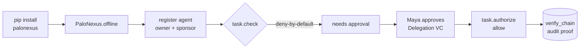

This is the **ten-minute first success**: from `pip install` to a governed call that is
**denied by default**, then **approved**, then **succeeds** — with **no cluster, no network,
no API key**. Everything runs against `PaloNexus.offline()`, an in-memory control plane
seeded with the real **devops-incident** personas.

The story you'll run is the Northstar `devops-incident` scenario from the
[demo seed (the reference Logto org)](/docs/develop/enterprise-iam/): an SRE agent (`northstar-devops-incident-agent`)
owned by **Ethan Park**, sponsored and approved by **Maya Chen**, wants to read a regulated
runbook during incident `INC-4821`. Deny-by-default means it can't — until Maya approves a
task-scoped delegation.

:::note[No invented users]
Every name here is a seeded persona: **Ethan Park** (owner), **Maya Chen** (sponsor +
approver), **Arjun Mehta** (operator), **Omar Haddad** (auditor), and **Claire Evans** (the
negative persona who must be denied). They are demo fixtures, seeded straight from the
demo seeder in `platform/seed-logto` (the reference Logto org).
:::

## The path you're about to walk

Seven steps, one denial that turns into an approval, and a proof at the end:



*The ten-minute first-success path: install, spin up the offline control plane, register a
governed agent, watch the regulated call get denied by default, have the approver grant a
time-boxed delegation, re-authorize to a clean allow, and verify the audit chain.*

The same loop has a portal face. On a live cluster, the Day-0 onboarding wizard walks an
operator through exactly these beats — connect your IdP (**Logto in the demo**), seed the demo
data, register the first agent, then run the hero flow:


*Reference demo: the Day-0 wizard's 'Connect Logto' step uses the demo's reference Logto IdP.
Production deployments connect their own OIDC/SCIM IdP — see
[IdP Support Model](/docs/concepts/idp-support/). This quickstart reproduces the same loop
entirely offline.*

## 1. Install

The base package is lean — facade, the ten typed models, the typed error tree, the idp
client, and the crypto layer. Framework bindings are opt-in extras.

```bash
pip install palonexus
```

You don't need the LangChain or LangGraph extras for this quickstart — the base package
ships the offline control plane and the hero flow.

## 2. Run the hero flow

`PaloNexus.offline()` gives you an in-memory control plane that reproduces the real
deny-by-default contract. `run_hero_flow` drives the complete
register → deny → delegate → approve → succeed story end to end:

```python
from palonexus import PaloNexus
from palonexus.testing import run_hero_flow

with PaloNexus.offline() as pn:
    result = run_hero_flow(pn)

print("agent      :", result.agent)
print("subject    :", result.subject, "(owner, devops-incident)")
print("1) check   : needs_approval =", result.first_decision.needs_approval)
print("2) delegate: ", result.delegation.id, "->", result.delegation.status)
print("3) authorize: allow =", result.final_decision.allow)
print("audit      :", len(result.audit), "hash-chained events, chain_ok =", result.chain_ok)
assert result.succeeded   # denied by default, allowed only after approval
```

Output:

```text
agent      : northstar-devops-incident-agent
subject    : ethan.park@northstar.example (owner, devops-incident)
1) check   : needs_approval = True
2) delegate:  deleg-… -> approved
3) authorize: allow = True
audit      : 2 hash-chained events, chain_ok = True
```

That's the whole platform value in one function: a regulated action **cannot** happen until
a human with the right authority (Maya, who holds `org:agents:approve`) approves it, and the
decision is recorded on a tamper-evident audit chain.

## 3. The same flow, spelled out

`run_hero_flow` is a convenience wrapper. Here is exactly what it does, using the public SDK
surface — this is the shape of code you'll write in a real agent:

```python
from palonexus import PaloNexus

with PaloNexus.offline() as pn:
    # Register the agent. Owner + sponsor are MANDATORY (the no-orphaned-agents rule):
    # omit either and pn.agents.register raises GovernanceError before any network call.
    agent = pn.agents.register(
        name="northstar-devops-incident-agent",
        owner="ethan.park@northstar.example",     # mandatory
        sponsor="maya.chen@northstar.example",    # mandatory
        scenario="devops-incident",
    )
    agent.provision()   # mints the agent's did:key + Membership VC (idempotent)

    # A task binds the on-behalf-of subject + incident id + scenario for every call inside it.
    with pn.task(
        subject="ethan.park@northstar.example",
        task_id="INC-4821",
        scenario="devops-incident",
        actor="northstar-devops-incident-agent",
    ) as task:
        # 1) Ask the control plane. Deny-by-default: a regulated runbook needs approval.
        decision = task.check(
            action="runbooks:read",
            resource="runbooks-api:/runbooks/db-failover",
        )
        print("1) check  needs_approval:", decision.needs_approval, "-", decision.reason)

        # 2) Request a task-scoped, time-boxed delegation (starts as 'pending').
        deleg = task.request_delegation(
            action="runbooks:read",
            resource="runbooks-api:/runbooks/db-failover",
            reason="INC-4821 db failover",
            ttl=300,
        )
        print("2) delegation:", deleg.id, deleg.status)

        # In production, Maya clicks "Approve" in the portal. Offline, we drive the
        # in-memory control plane to simulate that human action:
        pn._fake.approve_delegation(deleg.id, approver="maya.chen@northstar.example")

        # 3) Re-authorize. Now the delegation lets the call through (raises on deny).
        final = task.authorize(
            action="runbooks:read",
            resource="runbooks-api:/runbooks/db-failover",
        )
        print("3) authorize allow:", final.allow)

    # Everything is on the tamper-evident audit chain, correlated by task_id.
    for ev in pn.audit.tail(task_id="INC-4821"):
        print(f"   audit seq={ev.seq} {ev.decision:5} {ev.action}")
    assert pn.audit.verify_chain()
```

```text
1) check  needs_approval: True - needs human-approved delegation
2) delegation: deleg-… pending
3) authorize allow: True
   audit seq=1 deny  runbooks:read
   audit seq=2 allow runbooks:read
```

:::caution[Approval is a human action]
`pn._fake.approve_delegation(...)` exists **only in offline mode** to stand in for a real
person. In a live deployment the approval comes from the approver (Maya) in the
[Approvals console](/docs/develop/delegations-and-approvals/) or via the agent-idp API — the
SDK never approves on a human's behalf.
:::

## 4. See deny-by-default bite

Swap Ethan for **Claire Evans** — the seeded *negative* persona for this scenario — and the
same call is a **hard deny**, not a needs-approval. There is no delegation she can request:

```python
from palonexus import PaloNexus

with PaloNexus.offline() as pn:
    with pn.task(
        subject="claire.evans@northstar.example",   # negative persona
        task_id="INC-4821",
        scenario="devops-incident",
        actor="northstar-devops-incident-agent",
    ) as task:
        decision = task.check(
            action="runbooks:read",
            resource="runbooks-api:/runbooks/db-failover",
        )
        print("allow:", decision.allow, "| needs_approval:", decision.needs_approval)
        print("reason:", decision.reason)
```

```text
allow: False | needs_approval: False
reason: claire.evans@northstar.example is not authorized for scenario devops-incident
```

This is the difference the SDK makes obvious: `needs_approval` means *ask a human*; a flat
deny with neither `allow` nor `needs_approval` means *no path forward*. See
[Glossary](/docs/getting-started/glossary/) for `deny-by-default`, `TBAC`, `Membership VC`,
and the rest of the vocabulary.

## What just happened

| Step | SDK call | Platform concept |
|---|---|---|
| Register | `pn.agents.register(owner=, sponsor=)` | Mandatory ownership governance |
| Provision | `agent.provision()` | `did:key` + Membership VC minted |
| Bind work | `with pn.task(subject=, task_id=, scenario=)` | On-behalf-of + TBAC task binding |
| Ask | `task.check(action=, resource=)` | `/authz` decision (deny-by-default) |
| Delegate | `task.request_delegation(...)` | Task-scoped, time-boxed grant |
| Approve | *(human / portal)* | `org:agents:approve` authority |
| Enforce | `task.authorize(...)` | Raises `ApprovalRequired` / `PolicyDenied` |
| Prove | `pn.audit.tail()` / `verify_chain()` | Tamper-evident hash chain |

## Next

- [SDK quickstart](/docs/sdk/quickstart/) — init, register, task, check, delegate, audit,
  revoke, and the typed error tree, copy-pasteable.
- [Guard a LangChain tool](/docs/sdk/langchain/) — drop the gate into `create_agent`.
- [Govern a LangGraph node (HITL)](/docs/sdk/langgraph/) — deny → interrupt → approve →
  resume, with the durable-checkpointer requirement.
- [Glossary](/docs/getting-started/glossary/) — every acronym used in these docs.
