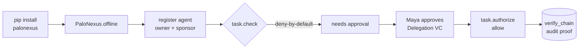

import { Tabs, TabItem, Aside } from '@astrojs/starlight/components';

One quickstart, two paths. Pick the tab that matches what you're here to do:

- **Govern an agent (Python SDK)** — the ten-minute first success: `pip install`, then
  register → **denied by default** → human-approved → **succeed**, with no cluster, no
  network, no API key.
- **Run the platform locally** — bring the full control layer up on a local
  [kind](https://kind.sigs.k8s.io) cluster, plus how to run this docs site itself.

<Tabs>

<TabItem label="Govern an agent (Python SDK)">

This is the **ten-minute first success**: from `pip install` to a governed call that is
**denied by default**, then **approved**, then **succeeds** — with **no cluster, no network,
no API key**. Everything runs against `PaloNexus.offline()`, an in-memory control plane
seeded with the personas of the real **devops-incident** demo scenario.

The story you'll run is the `devops-incident` scenario at Northstar — the fictional demo
organization — from the
[demo seed (the reference Logto org)](/docs/develop/enterprise-iam/): a site-reliability (SRE) agent (`northstar-devops-incident-agent`)
owned by **Ethan Park**, sponsored and approved by **Maya Chen**, wants to read a regulated
runbook during incident `INC-4821` — the sample incident used across these docs.
Deny-by-default means it can't — until Maya approves a
task-scoped delegation.

<Aside type="note" title="No invented users">
Every name here is a seeded persona: **Ethan Park** (owner), **Maya Chen** (sponsor +
approver), **Arjun Mehta** (operator), **Omar Haddad** (auditor), and **Claire Evans** (the
negative persona who must be denied). They are demo fixtures, seeded straight from the
demo seeder in `platform/seed-logto` (the reference Logto org).
</Aside>

<Aside type="note" title="The SDK is partner-neutral — this page uses a reference demo">
PaloNexus core is about **agents, owners, delegations, tasks, resources, and decisions** —
not any specific identity provider (IdP) or protected resource. This page uses the **runbooks** demo resource
(`runbooks-api:/runbooks/…`, action `runbooks:read`) and the Northstar/Logto reference seed
because they're concrete and runnable — but they are **one reference integration, not a
requirement**. Any resource and scope work the same way: swap in `payments-api` /
`payments:write`, point at any SCIM (System for Cross-domain Identity Management) IdP (Logto is just the reference), and the calls below are
unchanged. The demo's service→scope mapping lives in `palonexus.reference`; the generic core
ships without it.
</Aside>

## The path you're about to walk

Seven steps, one denial that turns into an approval, and a proof at the end:



*The ten-minute first-success path: install, spin up the offline control plane, register an
authority-bound agent, watch the regulated call get denied by default, have the approver grant a
time-boxed delegation, re-authorize to a clean allow, and verify the audit chain.*

<Aside type="tip" title="Run it in the browser first — no install">
The operator portal ships an in-browser **SDK playground** (`/playground`) that runs the same
canonical `PaloNexus.offline()` hero flow you'll build below — pick a persona, edit the governed
call, and run register → deny → delegate → approve → succeed with no `pip install`, no cluster,
and no API key.
</Aside>

The same loop has a portal face. On a live cluster, the Day-0 onboarding wizard walks an
operator through exactly these beats — connect your IdP (**Logto in the demo**), seed the demo
data, register the first agent, then run the hero flow:


*Reference demo: the Day-0 wizard's 'Connect Logto' step uses the demo's reference Logto IdP.
Production deployments connect their own OpenID Connect (OIDC)/SCIM IdP — see
[Connect agents to enterprise authority](/docs/concepts/enterprise-iam/). This quickstart
reproduces the same loop entirely offline.*

## 1. Install

The base package is lean — facade, the ten typed models, the typed error tree, the idp
client, and the crypto layer. Framework bindings are opt-in extras.

```bash
pip install palonexus
```

You don't need the LangChain or LangGraph extras for this quickstart — the base package
ships the offline control plane and the hero flow.

## 2. Initialize

Three ways to build the facade. Always close it (or use it as a context manager).

```python
from palonexus import PaloNexus

# 1. From environment (recommended for real deployments): reads PALONEXUS_* vars.
pn = PaloNexus.from_env()

# 2. Explicit:
pn = PaloNexus(
    control_plane_url="http://localhost:9191",
    idp_url="http://localhost:8090",
    api_key="pn_live_…",
)

# 3. Offline — in-memory FakeControlPlane, no cluster (tests, CI, this page):
pn = PaloNexus.offline()
```

`from_env()` honors `PALONEXUS_OFFLINE=1`, so the same code path runs in CI with no cluster:

```python
import os
os.environ["PALONEXUS_OFFLINE"] = "1"

from palonexus import PaloNexus

pn = PaloNexus.from_env()   # -> offline mode
with pn.task(
    subject="ethan.park@northstar.example",
    task_id="INC-1",
    scenario="devops-incident",
    actor="northstar-devops-incident-agent",
) as task:
    decision = task.check(action="runbooks:read",
                          resource="runbooks-api:/runbooks/db-failover")
    print("needs_approval:", decision.needs_approval)
pn.close()
```

The env vars `from_env()` reads: `PALONEXUS_CONTROL_PLANE_URL`, `PALONEXUS_MGMT_URL`,
`PALONEXUS_IDP_URL`, `PALONEXUS_API_KEY`, `PALONEXUS_TENANT_ID`, `PALONEXUS_AGENT_TOKEN`, and
`PALONEXUS_OFFLINE`. See [Configuration & environment](/docs/sdk/config-env/).

## 3. Run the hero flow

`PaloNexus.offline()` gives you an in-memory control plane that reproduces the real
deny-by-default contract. `run_hero_flow` drives the complete
register → deny → delegate → approve → succeed story end to end:

```python
from palonexus import PaloNexus
from palonexus.testing import run_hero_flow

with PaloNexus.offline() as pn:
    result = run_hero_flow(pn)

print("agent      :", result.agent)
print("subject    :", result.subject, "(owner, devops-incident)")
print("1) check   : needs_approval =", result.first_decision.needs_approval)
print("2) delegate: ", result.delegation.id, "->", result.delegation.status)
print("3) authorize: allow =", result.final_decision.allow)
print("audit      :", len(result.audit), "hash-chained events, chain_ok =", result.chain_ok)
assert result.succeeded   # denied by default, allowed only after approval
```

Output:

```text
agent      : northstar-devops-incident-agent
subject    : ethan.park@northstar.example (owner, devops-incident)
1) check   : needs_approval = True
2) delegate:  deleg-… -> approved
3) authorize: allow = True
audit      : 2 hash-chained events, chain_ok = True
```

That's the whole platform value in one function: a regulated action **cannot** happen until
a human with the right authority (Maya, who holds `org:agents:approve`) approves it, and the
decision is recorded on a tamper-evident audit chain.

## 4. The same flow, spelled out

`run_hero_flow` is a convenience wrapper. Here is exactly what it does, using the public SDK
surface — this is the shape of code you'll write in a real agent:

```python
from palonexus import PaloNexus

with PaloNexus.offline() as pn:
    # Register the agent. Owner + sponsor are MANDATORY (the no-orphaned-agents rule):
    # omit either and pn.agents.register raises GovernanceError before any network call.
    agent = pn.agents.register(
        name="northstar-devops-incident-agent",
        owner="ethan.park@northstar.example",     # mandatory
        sponsor="maya.chen@northstar.example",    # mandatory
        scenario="devops-incident",
    )
    agent.provision()   # mints the agent's did:key + Membership VC (idempotent)

    # A task binds the on-behalf-of subject + incident id + scenario for every call inside it.
    with pn.task(
        subject="ethan.park@northstar.example",
        task_id="INC-4821",
        scenario="devops-incident",
        actor="northstar-devops-incident-agent",
    ) as task:
        # 1) Ask the control plane. Deny-by-default: a regulated runbook needs approval.
        decision = task.check(
            action="runbooks:read",
            resource="runbooks-api:/runbooks/db-failover",
        )
        print("1) check  needs_approval:", decision.needs_approval, "-", decision.reason)

        # 2) Request a task-scoped, time-boxed delegation (starts as 'pending').
        deleg = task.request_delegation(
            action="runbooks:read",
            resource="runbooks-api:/runbooks/db-failover",
            reason="INC-4821 db failover",
            ttl=300,
        )
        print("2) delegation:", deleg.id, deleg.status)

        # In production, Maya clicks "Approve" in the portal. Offline, we drive the
        # in-memory control plane to simulate that human action:
        pn._fake.approve_delegation(deleg.id, approver="maya.chen@northstar.example")

        # 3) Re-authorize. Now the delegation lets the call through (raises on deny).
        final = task.authorize(
            action="runbooks:read",
            resource="runbooks-api:/runbooks/db-failover",
        )
        print("3) authorize allow:", final.allow)

    # Everything is on the tamper-evident audit chain, correlated by task_id.
    for ev in pn.audit.tail(task_id="INC-4821"):
        print(f"   audit seq={ev.seq} {ev.decision:5} {ev.action}")
    assert pn.audit.verify_chain()
```

```text
1) check  needs_approval: True - needs human-approved delegation
2) delegation: deleg-… pending
3) authorize allow: True
   audit seq=1 deny  runbooks:read
   audit seq=2 allow runbooks:read
```

<Aside type="caution" title="Approval is a human action">
`pn._fake.approve_delegation(...)` exists **only in offline mode** to stand in for a real
person. In a live deployment the approval comes from the approver (Maya) in the
[Authority Delegation console](/docs/develop/delegations-and-approvals/) or via the agent-idp API — the
SDK never approves on a human's behalf.
</Aside>

### More on each step

**Register** accepts richer governance metadata than the minimal call above, and enforces
the no-orphaned-agents rule client-side, fail closed, *before any network call*:

```python
from palonexus import PaloNexus

pn = PaloNexus.offline()

agent = pn.agents.register(
    name="northstar-devops-incident-agent",
    owner="ethan.park@northstar.example",     # mandatory
    sponsor="maya.chen@northstar.example",    # mandatory
    team="DevOps",
    risk_tier="high",                         # low | medium | high | critical
    runtime="doks_prod",                      # an approved runtime
    scenario="devops-incident",               # ties to the seed scenario
)
identity = agent.provision()                  # mint did:key + Membership VC (idempotent)
print(identity.did)                           # did:key:z…
```

<Aside type="note" title="`runtime` is just a label">
`runtime="doks_prod"` is an example **runtime label** describing *where* the agent
runs — a free-form tag like `k8s_prod` or `local_dev`. It is not a DigitalOcean Kubernetes
Service (DOKS) requirement; PaloNexus runs on any Kubernetes or via Docker Compose.
</Aside>

The mandatory-ownership rule, demonstrated:

```python
from palonexus import PaloNexus
from palonexus.errors import GovernanceError

with PaloNexus.offline() as pn:
    try:
        pn.agents.register(name="orphan-agent", owner="", sponsor="")
    except GovernanceError as e:
        print("rejected:", e)   # agent registration requires an owner (no orphaned agents)
```

**Check vs. authorize.** `task.check(...)` is synchronous and explicit, and returns a typed
`PolicyDecision` carrying `allow`, `needs_approval`, `reason`, `subject`, `upstream`, and
`trace_id`. It does **not** raise on deny — inspect `allow` and `needs_approval`. It still
raises `ControlPlaneUnavailable` if the decision point is unreachable (fail closed) — a
`check` is never a silent allow. `task.authorize(...)` is `check` that **raises** on
non-allow — use it where you want the deny to stop execution. The typed error tree (catch
the one you care about):

{/* no-doctest: illustrative fragment — uses `task` from a neighbouring block (not standalone-runnable) */}
```python
from palonexus.errors import ApprovalRequired, PolicyDenied, ControlPlaneUnavailable

try:
    task.authorize(action="runbooks:read",
                   resource="runbooks-api:/runbooks/db-failover")
except ApprovalRequired as e:        # 401 + needs-approval: drive request_delegation / interrupt
    print("needs approval:", e.reason)
except PolicyDenied as e:            # 403 hard deny: no path forward
    print("denied:", e.reason)
except ControlPlaneUnavailable:      # decision point down: fail closed, never a silent allow
    raise
```

The full tree: `PaloNexusError` (base) → `GovernanceError`, `PolicyDenied`,
`ApprovalRequired`, `DelegationExpired`, `CredentialRevoked`, `IdentityNotProvisioned`,
`ControlPlaneUnavailable`.

**Waiting for a human.** On a live cluster the approval isn't instantaneous — poll until
the human decides:

{/* no-doctest: illustrative fragment — uses `task` from a neighbouring block (not standalone-runnable) */}
```python
deleg = task.await_delegation(deleg.id, timeout=600)   # blocks until approved/denied/expired
```

## 5. See deny-by-default bite

Swap Ethan for **Claire Evans** — the seeded *negative* persona for this scenario — and the
same call is a **hard deny**, not a needs-approval. There is no delegation she can request:

```python
from palonexus import PaloNexus

with PaloNexus.offline() as pn:
    with pn.task(
        subject="claire.evans@northstar.example",   # negative persona
        task_id="INC-4821",
        scenario="devops-incident",
        actor="northstar-devops-incident-agent",
    ) as task:
        decision = task.check(
            action="runbooks:read",
            resource="runbooks-api:/runbooks/db-failover",
        )
        print("allow:", decision.allow, "| needs_approval:", decision.needs_approval)
        print("reason:", decision.reason)
```

```text
allow: False | needs_approval: False
reason: claire.evans@northstar.example is not authorized for scenario devops-incident
```

This is the difference the SDK makes obvious: `needs_approval` means *ask a human*; a flat
deny with neither `allow` nor `needs_approval` means *no path forward*. See
[Glossary](/docs/getting-started/glossary/) for `deny-by-default`, `TBAC`, `Membership VC`,
and the rest of the vocabulary.

## 6. Revoke

Revoke a single delegation, or cascade everything under an agent. After revocation the next
`check` is denied again — deny-by-default reasserts immediately:

{/* no-doctest: illustrative fragment — uses `deleg` from a neighbouring block (not standalone-runnable) */}
```python
pn.revoke(deleg, reason="incident closed")          # accepts a Delegation or a raw jti -> True

after = task.check(action="runbooks:read",
                   resource="runbooks-api:/runbooks/db-failover")
print(after.allow)            # False — the grant is gone

# Revoke everything under an agent (e.g. security response):
report = pn.revocation.cascade(parent_did=agent.identity.did)
print(report)                 # {'delegations_revoked': N, 'agents_suspended': …, …}
```

## What just happened

| Step | SDK call | Platform concept |
|---|---|---|
| Register | `pn.agents.register(owner=, sponsor=)` | Mandatory ownership governance |
| Provision | `agent.provision()` | `did:key` + Membership VC minted |
| Bind work | `with pn.task(subject=, task_id=, scenario=)` | On-behalf-of + Task-Based Access Control (TBAC) task binding |
| Ask | `task.check(action=, resource=)` | `/authz` decision (deny-by-default) |
| Delegate | `task.request_delegation(...)` | Task-scoped, time-boxed grant |
| Approve | *(human / portal)* | `org:agents:approve` authority |
| Enforce | `task.authorize(...)` | Raises `ApprovalRequired` / `PolicyDenied` |
| Prove | `pn.audit.tail()` / `verify_chain()` | Tamper-evident hash chain |

</TabItem>

<TabItem label="Run the platform locally">

Two things you can run locally: **this docs site**, and the **platform** itself.

## Run the docs site locally

The docs site is an [Astro Starlight](https://starlight.astro.build) project under
`../palonexus-web`, served from the `/docs` context.

```bash
cd palonexus-web
npm install
npm run dev          # http://localhost:4321/docs/
```

Build the static site (output in `dist/`):

```bash
npm run build        # static HTML + Pagefind search index
npm run preview      # serve the built site locally
```

## Run the platform locally (kind)

The whole control layer comes up on a local [kind](https://kind.sigs.k8s.io) cluster
with one command (real Kubernetes, nothing mocked). On a Docker-less Mac, use podman.

```bash
cd platform
make demo-up         # build images, create the kind cluster, apply the overlay, port-forward
```

This brings up the full decision stack — gateway, identity, registry, policy, observability,
and audit, the implementation mechanisms beneath the five pillars — plus the four demo
agents, the Grafana LGTM observability stack (Loki, Grafana, Tempo, Mimir), and the portal.
When it finishes, the consoles are port-forwarded:

- **Portal** — http://localhost:3000 (Overview — the Authority Command Center — Registry, Decisions,
  Authority Trail, Identity, Authority Delegation, Credential-Safe Enforcement, Agents, Traces)
- **Grafana** — http://localhost:3001

Tear it down with `make demo-down`.

Open the portal's **Tenant settings** to see the organization defaults applied to every new
agent you register — the org id, the environment, and the default data-class and risk-tier:


*Organization defaults for the tenant: org id, environment, and the data-class and risk-tier
applied to new agents. These feed the `dataClass` and risk-tier the registry records — see the
[Registry schema](/docs/reference/http-api/) and [Glossary](/docs/getting-started/glossary/).*

### Decision engine only (no cluster)

```bash
make test            # policy matrix + audit hash-chain unit tests
make smoke           # boot the binary, exercise allow(200)/deny(403) over ext_authz
make render          # render the full Kustomize manifest set (no apply)
```

## See the hero flow

With the platform up, run the narrated walkthrough (deny → human-approve → allow → revoke,
model allowlist, audit verify):

```bash
scripts/demo.sh
```

For the **network-layer egress** + human egress-approval demo (3 beats), and the fully
autonomous multi-agent flow, see [Authority delegation](/docs/develop/delegations-and-approvals/)
and [the autonomous flow](/docs/develop/autonomous-flow/).

</TabItem>

</Tabs>

## Next

Built and governed your first agent (tab 1)?

- [Guard a LangChain tool](/docs/sdk/langchain/) — drop the gate into `create_agent`.
- [Govern a LangGraph node (HITL)](/docs/sdk/langgraph/) — a human-in-the-loop (HITL)
  deny → interrupt → approve → resume flow, with the durable-checkpointer requirement.
- [SDK overview & layers](/docs/sdk/) and the [API reference](/docs/sdk/reference/).
- [Temporary elevation walkthrough (INC-4821)](/docs/develop/guides/temporary-elevation-walkthrough/) —
  the full hero flow, narrated end to end.
- [Glossary](/docs/getting-started/glossary/) — every acronym used in these docs.

Running the platform (tab 2)?

- [Deploy your own agent](/docs/develop/deploy-an-agent/)
- [Self-host on your cluster](/docs/operations/self-hosting/)
