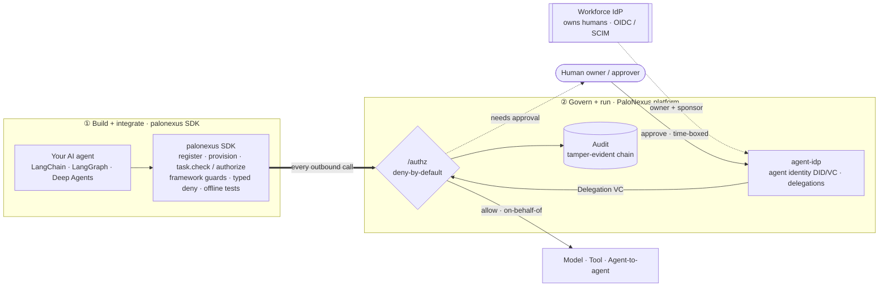

import { Card, CardGrid, LinkCard } from '@astrojs/starlight/components';

PaloNexus is an **IdP-neutral control plane and Python SDK** for AI agents. Your workforce
IdP (Okta, Entra ID, Auth0, Logto in the demo, …) owns your **humans**; PaloNexus owns your
**agents** — minting each one a cryptographic identity, requiring an accountable human owner,
and deciding every outbound action (model call, tool call, agent→agent hop) at one
**deny-by-default `/authz`** decision that lands on a tamper-evident audit chain.

## How the SDK and the platform fit together

PaloNexus is two complementary halves. You **build and integrate** with the `palonexus` SDK —
a typed, framework-aware front door that wraps every model, tool, and agent-to-agent call your
agent makes, with typed deny/approve and an `offline()` mode for tests. The **platform** then
**governs and runs** each of those calls at one deny-by-default `/authz`, drawing identity from
your **workforce IdP** (humans) and **PaloNexus** (agents). A denial becomes a *time-boxed
elevation* only when a human approves — and every decision lands on a tamper-evident audit chain.



*Two halves of one system. The **SDK** (①) is how you build — drop a guard into LangChain,
LangGraph, or Deep Agents and test the whole flow offline. The **platform** (②) is how every
call is governed: the thick arrow is the single integration point — every outbound agent action
flows through `/authz`, which checks the agent's identity, asks a human to approve a time-boxed
delegation when a regulated target needs one, and records the verdict on the audit chain.*

## Choose your path

<CardGrid>
  <LinkCard
    title="Build an agent →"
    href="/docs/getting-started/quickstart-agent-dev/"
    description="Developer path. pip install palonexus, run the register → denied → approved → succeed flow offline (no cluster, no signup), then govern a LangChain / LangGraph / Deep Agents app."
  />
  <LinkCard
    title="Operate the platform →"
    href="/docs/operations/self-hosting/"
    description="Operator path. Stand up the control plane with Docker Compose or DOKS, wire OIDC + persistence, and run the Day-2 runbooks: backups, upgrades, hardening, observability."
  />
  <LinkCard
    title="Understand the model →"
    href="/docs/concepts/architecture/"
    description="Architecture path. The six pillars, the one-decision design, IdP-neutral identity, delegation & temporary elevation, and how egress is enforced at the network layer."
  />
  <LinkCard
    title="Evaluate: Security & Trust →"
    href="/docs/concepts/security-and-trust/"
    description="Buyer path. Trust boundaries, what PaloNexus verifies, data handling, deny-by-default + tamper-evident audit, hardening, and an honest compliance posture."
  />
</CardGrid>

## Ten-minute first success

The fastest way to understand PaloNexus is to watch a governed call get **denied, approved,
then succeed** — with no cluster, no network, and no API key:

```bash
pip install palonexus
```

```python
from palonexus import PaloNexus

with PaloNexus.offline() as pn:                       # in-memory control plane, seeded demo personas
    agent = pn.agents.register(
        name="northstar-devops-incident-agent",
        owner="ethan.park@northstar.example",         # an accountable human owner + sponsor is mandatory
        sponsor="maya.chen@northstar.example",
        scenario="devops-incident",
    )
    agent.provision()                                 # mint did:key + Membership VC
    # → run register → deny → delegate → approve → succeed in the quickstart.
```

[**Run the full 10-minute quickstart →**](/docs/getting-started/quickstart-agent-dev/) · the same
flow, end to end, copy-pasteable.

## What you'll find here

<CardGrid>
  <Card title="Getting Started" icon="open-book">
    [Overview](/docs/getting-started/overview/) of the one-decision model, the
    [10-minute quickstart](/docs/getting-started/quickstart-agent-dev/), a
    [local quickstart](/docs/getting-started/quickstart-local/), and a
    [glossary](/docs/getting-started/glossary/).
  </Card>
  <Card title="Developer Integration" icon="puzzle">
    [Deploy a governed agent](/docs/develop/deploy-an-agent/),
    [delegations & approvals](/docs/develop/delegations-and-approvals/), the
    [temporary-elevation walkthrough](/docs/develop/guides/temporary-elevation-walkthrough/),
    [egress enforcement](/docs/develop/egress-enforcement/), and a
    [recipes cookbook](/docs/develop/recipes/).
  </Card>
  <Card title="Python SDK" icon="seti:python">
    The [`palonexus` SDK](/docs/sdk/) — a typed, framework-aware front door — with
    [LangChain](/docs/sdk/langchain/), [LangGraph](/docs/sdk/langgraph/), and
    [Deep Agents](/docs/sdk/deep-agents/) adapters and an [API reference](/docs/sdk/reference/).
  </Card>
  <Card title="Operations" icon="setting">
    [Self-hosting](/docs/operations/self-hosting/),
    [Docker Compose](/docs/operations/docker-compose/), the
    [DOKS runbook](/docs/operations/doks-runbook/), and Day-2:
    [backups](/docs/operations/backups/), [upgrades](/docs/operations/upgrades/),
    [hardening](/docs/operations/hardening/).
  </Card>
  <Card title="Architecture & Features" icon="random">
    The [six pillars](/docs/concepts/architecture/),
    [security model](/docs/concepts/security-model/),
    [IdP support model](/docs/concepts/idp-support/),
    [enterprise IAM](/docs/concepts/enterprise-iam/), and the
    [feature matrix](/docs/concepts/feature-matrix/).
  </Card>
  <Card title="Reference" icon="list-format">
    Code-accurate contracts: the [HTTP API](/docs/reference/http-api/),
    [headers](/docs/reference/headers/), [environment variables](/docs/reference/env-vars/),
    and [releases & changelog](/docs/reference/changelog/).
  </Card>
</CardGrid>

---

**IdP-neutral by design.** PaloNexus sits beside your existing workforce IAM and never replaces
it. Logto is the **first supported enterprise IdP**; Okta, Entra ID, and others integrate on the
same standard OIDC/SCIM surfaces as near-term roadmap. See the
[IdP Support Model](/docs/concepts/idp-support/). For the security
posture and an honest compliance statement, see [Security & Trust](/docs/concepts/security-and-trust/).
