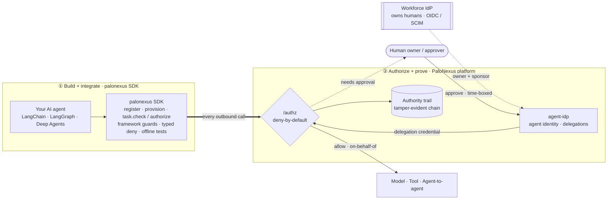

import { Card, CardGrid, LinkCard } from '@astrojs/starlight/components';

**PaloNexus makes sure an AI agent can act only with authority that a real person or service owner was entitled to delegate—and only for the task, resource, and time originally approved.**

> Agent runtimes decide **how an agent works**.
> Sandboxes decide **where its code runs**.
> PaloNexus decides **what it is authorized to do and whose authority it is using**.

PaloNexus is an **authorization and accountability service for AI-agent actions** — the
identity governance layer between AI agents and the systems they act upon. Your workforce
IdP (Okta, Entra ID, Auth0, Logto in the demo, …) owns your **humans**; PaloNexus owns your
**agents** — giving each a signed identity and a mandatory accountable human owner, and
deciding every action an agent takes (model call, tool call, agent→agent hop) at one
**deny-by-default `/authz`** decision: *may this agent make this call, on behalf of this
human, for this task, right now?* Every verdict is recorded on a verifiable authority
trail, and the same decision also gates inbound calls.

## One concrete scenario: INC-4821

During incident **INC-4821**, Northstar's devops agent needs to restart a production
service. PaloNexus **denies** the call — the agent holds no standing production access.
The service owner — a human PaloNexus verifies is *entitled* to approve this action for
this resource — grants a **time-boxed, task-scoped elevation**. The re-checked call
succeeds *on the owner's behalf*, the access expires automatically, and every step —
deny, approval, allow, expiry — lands on the authority trail.

[**Walk through the full temporary-elevation flow →**](/docs/develop/guides/temporary-elevation-walkthrough/)

## Works with

- **Working today:** LangChain · LangGraph · Deep Agents · OIDC/SCIM workforce IdPs
  (Okta, Entra ID, Logto) · Kubernetes/Envoy
- **Planned:** kagent · Kubernetes Agent Sandbox · OpenAI Agents SDK · Model Context
  Protocol (MCP)

See [Integrations](/docs/integrations/) for the per-ecosystem pages, and
[What PaloNexus is not](/docs/getting-started/what-palonexus-is-not/) for how PaloNexus
complements — rather than competes with — runtimes and sandboxes.

## How the SDK and the platform fit together

PaloNexus is two complementary halves. You **build and integrate** with the `palonexus` SDK —
a typed, framework-aware front door that wraps every model, tool, and agent-to-agent call your
agent makes, with typed deny/approve and an `offline()` mode for tests. The **platform** then
**authorizes** each of those calls at one deny-by-default `/authz`, drawing identity from
your **workforce IdP** (humans) and **PaloNexus** (agents). A denial becomes a *time-boxed
elevation* only when a human with the authority to approve it does — and every decision lands
on the authority trail.



*Two halves of one system, with PaloNexus sitting **between** your agents and the systems
they act upon. The **SDK** (①) is how you build — drop a guard into LangChain, LangGraph,
or Deep Agents and test the whole flow offline. The **platform** (②) is how every action is
authorized: the thick arrow is the single integration point — every outbound agent action
flows through `/authz`, which resolves the agent's identity and its owner's authority, asks
an entitled human to approve a time-boxed delegation when a regulated target needs one, and
records the verdict on the authority trail.*

## Choose your path

<CardGrid>
  <Card title="Path A — Govern an agent" icon="rocket">
    You build agents; PaloNexus decides what they're authorized to do.

    1. [Quickstart — govern an agent](/docs/getting-started/quickstart/) (Python SDK tab):
       `pip install palonexus`, then register → denied → approved → succeed, fully offline.
    2. [Guides — build & govern an agent](/docs/develop/deploy-an-agent/): accountable
       identity, [authority delegation](/docs/develop/delegations-and-approvals/),
       [budgets & allowlists](/docs/develop/budgets-and-allowlists/), and the
       [temporary-elevation walkthrough](/docs/develop/guides/temporary-elevation-walkthrough/).
    3. [Integrations](/docs/integrations/): drop the [LangChain](/docs/sdk/langchain/),
       [LangGraph](/docs/sdk/langgraph/), or [Deep Agents](/docs/sdk/deep-agents/) adapter
       into the framework you already use.
  </Card>
  <Card title="Path B — Run the platform" icon="setting">
    You operate the control layer your agents are governed by.

    1. [Quickstart — run the platform locally](/docs/getting-started/quickstart/)
       (local-platform tab): the whole stack on a local kind cluster with one command.
    2. Self-host for real: [Docker Compose](/docs/operations/docker-compose/),
       [Kustomize](/docs/operations/self-hosting/), or
       [Terraform / DOKS](/docs/operations/terraform-doks/), then wire
       [your own IdP](/docs/operations/bring-your-own-idp/) and
       [persistence](/docs/operations/persistence/).
    3. Operate Day-2: [observability](/docs/operations/observability/),
       [backups](/docs/operations/backups/), [upgrades](/docs/operations/upgrades/),
       [hardening](/docs/operations/hardening/).
  </Card>
</CardGrid>

<LinkCard
  title="Reference"
  href="/docs/reference/"
  description="Everything look-up-able in one place: the Python SDK API, HTTP + Enterprise IAM APIs, CLI, environment variables, headers, feature matrix, glossary, and changelog."
/>

## Ten-minute first success

The fastest way to understand PaloNexus is to watch an authorized call get **denied, approved,
then succeed** — with no cluster, no network, and no API key:

```bash
pip install palonexus
```

```python
from palonexus import PaloNexus

with PaloNexus.offline() as pn:                       # in-memory control plane, seeded demo personas
    agent = pn.agents.register(
        name="northstar-devops-incident-agent",
        owner="ethan.park@northstar.example",         # an accountable human owner + sponsor is mandatory
        sponsor="maya.chen@northstar.example",
        scenario="devops-incident",
    )
    agent.provision()                                 # mint did:key + Membership VC
    # → run register → deny → delegate → approve → succeed in the quickstart.
```

[**Run the full 10-minute quickstart →**](/docs/getting-started/quickstart/) · the same
flow, end to end, copy-pasteable.

---

**IdP-neutral by design.** PaloNexus sits beside your existing workforce IAM and never replaces
it. Logto is the **first supported enterprise IdP**; Okta, Entra ID, and others integrate on the
same standard OIDC/SCIM surfaces as near-term roadmap. See
[Connect agents to enterprise authority](/docs/concepts/enterprise-iam/). For the security
posture and an honest compliance statement, see the [Security model](/docs/concepts/security-model/).
