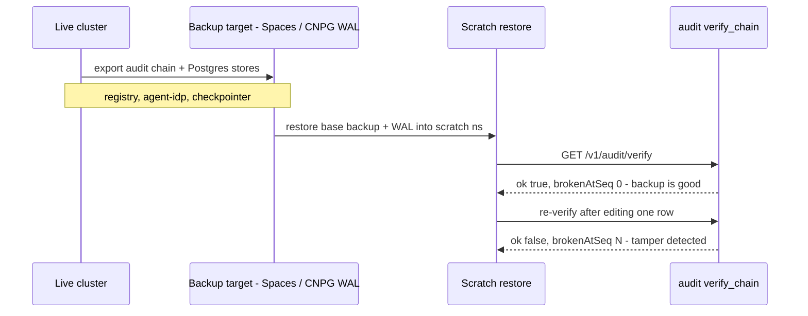

The thing that makes PaloNexus *trustworthy* — the **tamper-evident audit hash-chain** — is also
the thing you most need to back up and be able to **prove intact**. This page covers what to back
up, how, and a restore drill that ends in a chain-verify.

## What to back up

| Data | Where | Why it matters |
|---|---|---|
| **Audit hash-chain** | control-plane audit store (Loki for the shipped shipper; or the persisted audit log) | Tamper-evidence + the system of record for every decision. **Highest priority.** |
| **Registry** | `REGISTRY_DB_URL` (Postgres/…) | Which services/agents exist and their `requireScope`/allowlist/budget. Re-creatable from your declarative source, but back it up to avoid a re-seed. |
| **agent-idp store** | `IDP_DB_URL` | Agent provisioning, delegations, **revocations / StatusList**. Losing revocation state could resurrect a revoked credential — back it up. |
| **LangGraph checkpointer** | `PALONEXUS_AGENT_DB_URL` | In-flight HITL threads (paused approvals). Lose it and paused runs can't resume. |
| **Issuer key** | `agent-idp` secret | Not "data" but **must** survive — without it every issued VC fails to verify. Handle via [Secrets](/docs/operations/secrets/), back up in your secret manager. |

## The audit chain is the crown jewel

Each audit record hash-chains to its predecessor (`prev_hash == previous.hash`). That property is
exactly what a backup must preserve: a restored chain that still verifies proves the backup was
not tampered with in transit or at rest.

```bash
# Verify the live chain before and after any backup/restore:
curl -s localhost:8181/v1/audit/verify        # control-plane management plane
# or from the SDK:
python -c "from palonexus import PaloNexus; print(PaloNexus.from_env().audit.verify_chain())"
# -> True
```

In the shipped stack the chain is hash-chained JSON on the control-plane stdout, tailed by the
audit-shipper DaemonSet into **Loki** (`service.name=control-plane-audit`). Back up by either
snapshotting Loki's storage, or by streaming the audit log to durable object storage (e.g. DO
Spaces) with retention. If you run a persisted audit store, back that up like any DB.

## Backing up the databases

With the [`postgres` component](/docs/operations/persistence/#the-postgres-component-cloudnativepg)
(CloudNativePG), use CNPG's native backups — scheduled base backups + WAL archiving to object
storage give point-in-time recovery:

```yaml
apiVersion: postgresql.cnpg.io/v1
kind: ScheduledBackup
metadata: { name: palonexus-pg-daily, namespace: palonexus }
spec:
  schedule: "0 2 * * *"
  backupOwnerReference: self
  cluster: { name: palonexus-pg }
```

Repeat for the `agentidp-pg` cluster. For a SQLite (PVC) backend, snapshot the PVC or copy the
`.db` file while the writer is quiesced. For MongoDB, `mongodump`.

## Restore drill (do this before you need it)

A backup you've never restored is a hope, not a backup. The drill exports the
audit chain plus the Postgres stores, restores them into a scratch
namespace/cluster, and gates on `verify_chain()` — a restored chain that still
verifies proves the backup is complete and untampered, and a deliberately edited
row must break it. The sequence below is that drill end to end:



*The restore drill: export the chain + stores, restore into scratch, then prove
both that a clean chain verifies and that a single edited record is caught — the
tamper-evidence guarantee, demonstrated.*

Run this drill on a scratch namespace/cluster quarterly:

1. **Provision** a fresh Postgres (CNPG `Cluster` or a throwaway instance) and restore the latest
   base backup + WAL (CNPG: bootstrap a new `Cluster` `from: { backup: ... }`).
2. **Restore the audit chain** — point a control-plane at the restored audit store (or replay the
   archived audit log into Loki).
3. **Re-point** `REGISTRY_DB_URL` / `IDP_DB_URL` / `PALONEXUS_AGENT_DB_URL` at the restored DBs and
   start the control plane + agent-idp.
4. **Restore the issuer key** from your secret manager (so VCs still verify).
5. **Verify the chain** — the drill's pass/fail gate:

   ```bash
   curl -s localhost:8181/v1/audit/verify        # must report the chain intact
   python -c "from palonexus import PaloNexus; assert PaloNexus.from_env().audit.verify_chain()"
   ```

6. **Spot-check** — list registry services, confirm a known agent is provisioned, confirm a known
   **revoked** credential is still denied (revocation survived the restore).

:::tip[The verify is the point]
`verify_chain()` returning `True` on the restored data is the proof the backup is both complete
and untampered. If it fails, the chain has a gap or an edit — investigate before trusting the
restore.
:::

## Retention

Audit is a compliance artifact — set retention to your regulatory window (Loki retention, or
object-storage lifecycle rules on the archived log). The registry/agent-idp DBs only need enough
history for operational recovery; the audit chain is what you keep long-term.

## Related

- [Migrations](/docs/operations/migrations/) — the schemas you're backing up.
- [Observability](/docs/operations/observability/) — where the audit chain is shipped (Loki).
- [Upgrades](/docs/operations/upgrades/) — back up before every upgrade.
