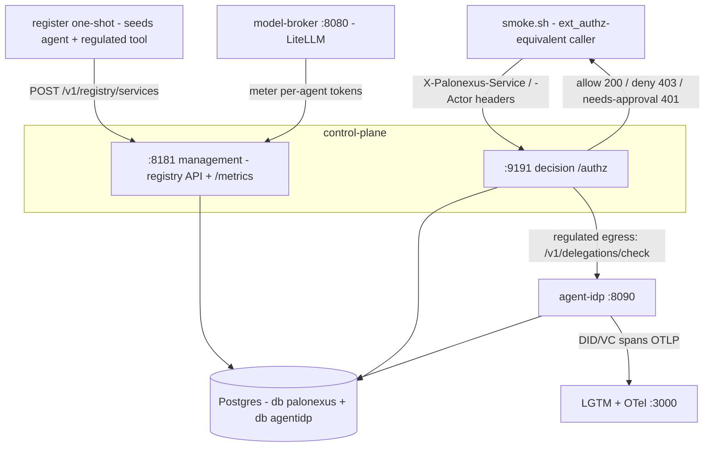

Kubernetes is the right home for PaloNexus in production, but you should not have
to stand up a cluster, install Gateway API CRDs, and learn Envoy Gateway just to
*evaluate* it. The **Docker Compose** stack brings the full control layer up on a
laptop with one command, builds every image locally from the in-repo
Dockerfiles, and ships a smoke test that proves the core decision contract:
**allow (200) / deny (403) / needs-approval (401)**.

> Status: built and verified locally on arm64. The stack mirrors the
> `overlays/dev` posture — OIDC is **off** (anonymous passthrough) but the
> registry-driven public-vs-private policy **and** the regulated-egress
> (needs-approval / TBAC) path are fully enforced, gated on the real `agent-idp`
> delegation authority.

## What you get

`platform/deploy/compose/` is a complete, non-Kubernetes stack:

| Service | Image | Role | Host port |
|---|---|---|---|
| **control-plane** | built from `control-plane/Dockerfile` (distroless/static) | The decision point. `:9191` decision (`/authz`), `:8181` management (registry API, `/metrics`, `/readyz`). | `9191`, `8181` |
| **agent-idp** | built from `agent-idp/Dockerfile` (context = repo root) | did:web issuer + human-approved time-boxed delegation authority. Answers `/v1/delegations/check`. | `8090` (internal) |
| **model-broker** | built from `model-broker/Dockerfile` (LiteLLM) | Holds the provider key; meters per-agent tokens back to the control-plane. | `8080` |
| **postgres** | `postgres:16-alpine` | Durable registry (db `palonexus`) **and** agent-idp store (db `agentidp`). | `5432` (internal) |
| **lgtm** | `grafana/otel-lgtm:0.8.1` | Grafana + Prometheus + Tempo + Loki + OTel collector in one container. | `3000` (Grafana), `4317`/`4318` (OTLP) |
| **register** | `curlimages/curl` (one-shot) | Waits for the control-plane, then registers the demo agent + its regulated tool so the needs-approval path is exercisable. Exits `0`. | — |

### Topology

The diagram below maps the compose stack: the one-shot `register` seeds the
registry through the control-plane **management** plane (`:8181`); `smoke.sh`
exercises the **decision** plane (`:9191`) exactly as Envoy's `ext_authz` filter
would; the control-plane calls **agent-idp** for the regulated-egress delegation
check; **Postgres** holds both durable stores; and **agent-idp** ships DID/VC
spans to the bundled **LGTM** backend. The decision is read from the HTTP status:
`200` allow, `403` deny, `401` needs-approval.



*The Docker Compose topology: one decision point with two listeners, the
delegation authority it calls for regulated egress, one Postgres serving two
databases, and the smoke caller standing in for Envoy `ext_authz`.*

### How `ext_authz` is represented (read this)

In Kubernetes the enforcement point is **Envoy Gateway's `SecurityPolicy.extAuth`**,
which calls the control-plane `/authz` on `:9191` for every request and, on a
`200`, forwards the request to the upstream. Compose has **no Envoy Gateway** — a
faithful L7 data-plane proxy is out of scope for a laptop evaluation stack.

Instead, the control-plane `/authz` **decision endpoint is exposed directly** on
`localhost:9191`, and the smoke test calls it exactly the way Envoy's ext_authz
filter would: by setting the `X-Palonexus-Service` (ingress target) and
`X-Palonexus-Actor` / `X-Palonexus-Action` / `X-Palonexus-Resource` (agent
egress) headers and reading the HTTP status as the verdict. This is the **same
handler, the same headers, and the same verdicts** that run in production — what
compose omits is only the proxy hop that forwards an allowed request onward. If
you need end-to-end request forwarding through Envoy, use the
[Kustomize self-hosting path](/docs/operations/self-hosting/).

## Bring it up

From `platform/deploy/compose/`:

```bash
cp .env.example .env          # defaults work; set OPENAI_API_KEY for real model calls
docker compose up --build -d  # builds 3 local images, pulls postgres + lgtm
```

First build takes a few minutes (Go build + Python deps + the LiteLLM image).
Subsequent `up`s are instant. Check the stack:

```bash
docker compose ps
```

```text
NAME                        SERVICE         STATUS
palonexus-agent-idp-1       agent-idp       Up (healthy)
palonexus-control-plane-1   control-plane   Up
palonexus-lgtm-1            lgtm            Up (healthy)
palonexus-model-broker-1    model-broker    Up (healthy)
palonexus-postgres-1        postgres        Up (healthy)
palonexus-register-1        register        Exited (0)
```

> **Why control-plane has no health column:** its image is
> `distroless/static` — no shell, `curl`, or `wget` to self-probe with. Its
> readiness is proven externally instead: the one-shot `register` service polls
> `/readyz` before it registers (so a clean `Exited (0)` means the control-plane
> answered), and `./smoke.sh` asserts `/authz`. You can probe it yourself at
> `http://localhost:8181/readyz` and `http://localhost:9191/healthz`.

## Smoke test

The acceptance criterion for this stack is the decision trio. `smoke.sh` runs it
against the live control-plane and exits non-zero on any wrong verdict:

```bash
./smoke.sh
```

```text
== PaloNexus compose smoke (http://localhost:9191/authz) ==
  PASS  allow (public 'echo'): 200 (want 200)
  PASS  deny (private 'orders'): 403 (want 403)
  PASS  needs-approval (regulated egress): 401 (want 401) [X-Palonexus-Needs-Approval: true]
== 3 passed, 0 failed ==
```

What each line proves, and the exact call:

```bash
# ALLOW 200 — public service, anonymous: the registry marks 'echo' public.
curl -s -o /dev/null -w '%{http_code}\n' \
  -H 'X-Palonexus-Service: echo' http://localhost:9191/authz          # 200

# DENY 403 — private service, anonymous: 'orders' requires auth, none presented.
curl -s -o /dev/null -w '%{http_code}\n' \
  -H 'X-Palonexus-Service: orders' http://localhost:9191/authz        # 403

# NEEDS-APPROVAL 401 — agent egress to a regulated tool with no human-approved
# delegation. The control-plane asks agent-idp /v1/delegations/check, gets a
# deny, and returns 401 + X-Palonexus-Needs-Approval so the agent's middleware
# interrupts for approval rather than failing hard.
curl -s -D - -o /dev/null \
  -H 'X-Palonexus-Actor: northstar-devops-incident-agent' \
  -H 'X-Palonexus-Service: runbooks-operator' \
  -H 'X-Palonexus-Action: runbooks:read' \
  -H 'X-Palonexus-Resource: runbooks-api:/runbooks/db-failover' \
  http://localhost:9191/authz                                         # 401
```

`echo` (public) and `orders` (private) are self-seeded by the control-plane at
startup. The agent (`northstar-devops-incident-agent`, with `runbooks-operator`
on its egress allowlist) and the regulated tool (`runbooks-operator`,
`dataClass: regulated`) are registered by the one-shot `register` service via the
management API — both persisted in Postgres, so they survive restarts.

## Environment

The stack comes up healthy with every value at its default; you only need a real
`OPENAI_API_KEY` for the model-broker to make live completions. Minimum-viable
`.env`:

| Variable | Default | Consumed by | Purpose |
|---|---|---|---|
| `POSTGRES_USER` | `palonexus` | postgres, control-plane, agent-idp | DB user for both databases. |
| `POSTGRES_PASSWORD` | `palonexus` | postgres, control-plane, agent-idp | DB password. |
| `OPENAI_API_KEY` | `sk-dummy-replace-me` | model-broker | Provider key — the **one** place it lives. Dummy lets the stack start; real key needed for `model.invoke`. |
| `LITELLM_MASTER_KEY` | _(empty)_ | model-broker | Optional LiteLLM admin / virtual-key surface. |
| `AGENT_IDENTITY_MODE` | `header` | control-plane | `header` trusts `X-Palonexus-Actor` (VP optional, demo); `vc` requires a verified Verifiable Presentation (production). |

The compose file wires the rest to match the control-plane env contract and the
[Persistence](/docs/operations/persistence/) backends:

| Variable | Value in compose | Notes |
|---|---|---|
| `DECISION_ADDR` / `MGMT_ADDR` | `:9191` / `:8181` | The two control-plane listeners. |
| `REGISTRY_BACKEND` / `REGISTRY_DB_URL` | `postgres` / `postgres://…@postgres:5432/palonexus?sslmode=disable` | Durable registry. `sslmode=disable` because the local Postgres serves no TLS (CNPG does in k8s). |
| `IDP_STORE_BACKEND` / `IDP_DB_URL` | `postgres` / `postgresql://…@postgres:5432/agentidp?sslmode=disable` | Durable agent-idp store. |
| `AGENT_IDP_URL` | `http://agent-idp:8090` | Wires the delegation authority — **this is what makes the 401 path real** rather than a blanket fail-closed deny. |
| `OTEL_EXPORTER_OTLP_ENDPOINT` | `http://lgtm:4317` | agent-idp ships DID/VC spans to LGTM (degrades to stdout if absent). |
| `OPA_URL` | _(unset)_ | Inline policy only in compose — no OPA container. The org-wide Rego veto is a k8s add-on. |
| `OIDC_ISSUER` / `OIDC_JWKS_URL` / `OIDC_AUDIENCE` | _(unset)_ | Anonymous passthrough (dev posture). See below to turn workforce identity on. |

## Observability

Grafana is at **http://localhost:3000** (anonymous Viewer). `agent-idp` exports
DID/VC delegation spans over OTLP to the bundled collector; explore them in
Tempo. The control-plane exposes Prometheus metrics at
`http://localhost:8181/metrics` (decision counts by `allow`/`deny`/rule, latency)
— point a scrape at it or query ad hoc. See
[Observability](/docs/operations/observability/) for what good looks like.

## Turning on OIDC (workforce identity)

The default stack is anonymous-passthrough, identical to `overlays/dev`. To
enforce real workforce identity, run **any OIDC issuer** (Okta, Microsoft Entra ID,
Auth0, Keycloak, Dex, Logto, …) and set `OIDC_ISSUER` / `OIDC_JWKS_URL` (plus
`OIDC_AUDIENCE`) on the control-plane service, then recreate it. PaloNexus is
**IdP-neutral** — it needs an OIDC issuer for workforce sign-in, not any specific
vendor:

```yaml
# docker-compose.yml → services.control-plane.environment
# (Logto shown as the demo; substitute your own OIDC issuer)
OIDC_ISSUER:   https://<your-oidc-issuer>/oidc
OIDC_JWKS_URL: https://<your-oidc-issuer>/oidc/jwks
OIDC_AUDIENCE: palonexus
```

```bash
docker compose up -d control-plane
```

With OIDC on, the `deny` smoke line returns **401** (invalid/absent credential)
instead of 403, and authenticated callers carrying the right scope are allowed —
the registry still decides public-vs-private. No IdP is bundled in this stack —
point `OIDC_ISSUER`/`OIDC_JWKS_URL` at whatever OIDC issuer you already run. The
**optional** `seed-logto` demo seed is a separate, Logto-specific path for loading
the Northstar **demo** identity model (Logto needs its own Postgres + migrations and
is heavier than an evaluation laptop warrants); run it alongside and seed a tenant
with the [`seed-logto`](/docs/concepts/enterprise-iam/) tool if you want the demo
personas — otherwise bring your own OIDC/SCIM IdP (see
[IdP Support Model](/docs/concepts/enterprise-iam/#idp-support-model)).

## Persistence, reset, and teardown

Registry + agent-idp state lives in the `pgdata` volume; Grafana/Prometheus/Tempo
history in `lgtmdata`. Both survive `docker compose restart` and `down` (without
`-v`).

```bash
docker compose stop          # pause, keep data
docker compose up -d         # resume
docker compose down          # remove containers, KEEP volumes
docker compose down -v       # remove containers AND volumes (full reset)
```

## When to graduate to Kubernetes

Compose is for evaluation and local development. Move to the
[Kustomize self-hosting path](/docs/operations/self-hosting/) when you need: real
Envoy Gateway request forwarding (not just the decision), the OPA org-wide veto,
network-enforced egress (proxy-only NetworkPolicies + the admission webhook),
mTLS on the decision plane, and HA. Every env var is identical across both — only
the orchestration changes.
