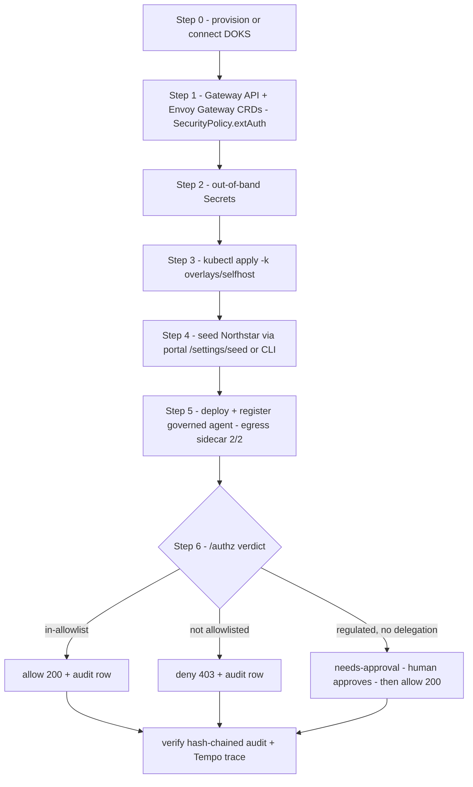

:::note[Cluster-agnostic]
These steps work on **any** Kubernetes — kind, EKS, GKE, on-prem, DOKS. DOKS is
the worked example here; substitute your cluster's kubeconfig/context. PaloNexus
does not depend on DigitalOcean.
:::

This is the **cold-start path**: from nothing to a *governed* agent — one whose
model, tool, and agent-to-agent egress is decided at the control plane's
`/authz` — on **any Kubernetes (DOKS shown)**, in under 30 minutes. It stitches
together the pieces that already have their own pages so you run them in the right
order with the right prerequisites:

- [Terraform / DOKS](/docs/operations/terraform-doks/) provisions the cluster, registry, and VPC.
- [Self-hosting](/docs/operations/self-hosting/) is the Kustomize deploy and the opt-in hardening components.
- [Secrets](/docs/operations/secrets/) is the never-in-image secret catalog.
- The `deploy-langgraph-agent-to-palonexus` skill (`platform/.claude/skills/`) is the agent-deployment workflow this runbook's Step 5 reuses.

:::tip[The 30-minute target]
The clock assumes the **container images already exist** in a registry the
cluster can pull (`ghcr.io/palonexus/*` or your DOCR). Building+pushing ten
multi-arch images from cold is *not* in the 30 minutes — see
[What can blow the 30-minute budget](#what-can-blow-the-30-minute-budget).
:::

## Prerequisites & env/secret matrix

Have these before you start the clock:

| Tool | Why |
|---|---|
| `doctl` (authenticated) + Terraform ≥ 1.5 | provision DOKS + DOCR ([Terraform / DOKS](/docs/operations/terraform-doks/)) |
| `kubectl` + `kustomize` (or `kubectl kustomize`) | apply the overlay |
| `helm` | install Envoy Gateway |
| a reachable image registry | the cluster must be able to *pull* the platform images |

The platform is **same-image-everywhere**; every behavioural switch is an env var
delivered via Kustomize + out-of-band Secrets. The minimum-viable set for a
governed-agent demo on the selfhost overlay:

| Secret / env | Namespace | Consumed by | Required for | Default if absent |
|---|---|---|---|---|
| `model-broker-secrets` → `OPENAI_API_KEY` | `palonexus` | model-broker | a real **allowed** model call to return 200 | broker won't serve model calls (deploy still succeeds) |
| `agent-idp-issuer` → `ISSUER_PRIVATE_KEY_B64` | `agent-idp` | agent-idp | stable VC/STS signing across restarts | ephemeral dev key, warns (VCs break on restart) |
| `logto-m2m` (5 keys, see below) | `palonexus` | portal seed surface | seed-from-UI against a live Logto tenant | portal seed falls back to file/offline mode (`optional: true`, never crash-loops) |
| `agent-db` → `uri` | `apps` | the agent pods | a durable LangGraph checkpointer (HITL approval survives restarts) | `MemorySaver` (HITL still works in-process) |

The `logto-m2m` Secret carries the five keys the portal's `/settings/logto` +
`/settings/seed` surfaces read (`envConnection()`): `LOGTO_BASE_URL`,
`LOGTO_TENANT_ID`, `LOGTO_M2M_APP_ID`, `LOGTO_M2M_APP_SECRET`,
`LOGTO_MGMT_API_RESOURCE`. The `selfhost` overlay wires them onto the portal via
the `components/portal-seed-logto` component (with `optional: true`). For
production, deliver all of these via **External Secrets / sealed-secrets**, never
hand-applied — see [Secrets](/docs/operations/secrets/).

:::caution[Bundled portal image required for seed-from-UI]
The portal `/settings/seed` button runs the `seed-logto` CLI via a Node
`child_process.spawn("python3", …)` **inside the portal container**, so the
portal image must bundle Python 3.11 + the `seed-logto` tool (the `Dockerfile`
is already rewritten for this — `SEED_LOGTO_DIR=/opt/seed-logto`,
`SEED_LOGTO_PYTHON=/opt/seedvenv/bin/python3`, `ALLOW_LOGTO_SEED=true`). A plain
`node:*` portal image will `ENOENT` on the spawn. If you can't run the bundled
image, seed from the CLI instead (Step 4, Option B). See the Ops deploy note at
`docs/requirements/ops-portal-deploy-note.md`.
:::

### New-surface env (fold in as the parallel waves land)

These env vars belong to surfaces being built in adjacent waves; set them when
those images ship so the runbook stays one source of truth:

| Env / secret | Where | Enables | Notes |
|---|---|---|---|
| `SIMULATE_OPERATOR_TOKEN` | control-plane (`palonexus`) | the `/authz` **dry-run** ("Live decision" policy simulator) | **Empty = disabled / fail-closed.** When set, every dry-run must carry a matching `X-Palonexus-Simulate-Operator` header. The portal `/simulate` BFF must hold the *same* token server-side. (REM-136 / REM-160) |
| `SEED_LOGTO_DIR` (+ `nsr_seeder` on `PYTHONPATH`) | agent-idp (`agent-idp`) | the `POST /v1/authority/preview` ("Authority preview" mode) | agent-idp resolves the seed package + Northstar manifests from `SEED_LOGTO_DIR` (default `<repo>/seed-logto`); **unavailable → 503, fail-closed**, never a guess. The portal image already mounts the seed tree at `/opt/seed-logto`. |
| `logto-m2m` (above) + `ALLOW_LOGTO_SEED=true` | portal (`palonexus`) | portal seed-from-UI | already wired by `components/portal-seed-logto`. |
| **TODO** API-keys / tenant env (`PALONEXUS_API_KEY`, `pn_live_…`/`pn_test_…`; tenant `org_id` defaults) | agent-idp `/v1/keys` (new) + portal `/settings/keys`, `/settings/tenant` | SDK key auth + tenant registration defaults | **Not yet final** — the keys+tenant wave (REM-161) is in flight; its storage/env (the new agent-idp keys endpoint backing store) is not landed. Treat this row as a placeholder and reconcile against REM-161's Linear callouts before the batched rollout. |

## The 30-minute checklist

| # | Step | Budget | Gate to next step |
|---|---|---|---|
| 0 | Provision / connect DOKS | ~8 min (cold), ~1 min (existing) | `kubectl get nodes` → all `Ready` |
| 1 | Gateway API + Envoy Gateway CRDs | ~3 min | `envoy-gateway` deploy `Available` |
| 2 | Out-of-band Secrets | ~2 min | secrets present in `palonexus` / `agent-idp` |
| 3 | `kubectl apply -k overlays/selfhost` | ~6 min | all Deployments `Available`; Gateway `Programmed` |
| 4 | Seed (portal button or CLI) | ~3 min | seed validation report passes |
| 5 | Deploy + register a governed agent | ~5 min | agent pod `Ready` (2/2 with egress sidecar) |
| 6 | Verify allow / deny / needs-approval | ~3 min | the three decisions + audit rows |
| | **Total** | **~30 min** | a governed agent + a denied→approved call |

The flow below is the same six steps as a dependency graph: nothing reconciles
until the Gateway API + Envoy Gateway CRDs exist (Step 1 gates everything that
follows), seeding gives the governed call real personas to decide against, and the
path ends at the three verdicts plus a verifiable audit row — the proof the spine
is live.



*Zero-to-governed-agent as a dependency graph: CRDs first, then deploy, seed,
register, and verify the allow / deny / needs-approval trio into a tamper-evident
audit.*

---

## Step 0 — Provision or connect the DOKS cluster

The live demo cluster is **`palonexus-doks`** (nyc1, `1.36.0-do.1`, HA control
plane; node pool `palonexus-default` = `s-2vcpu-4gb` ×3, autoscale 2→4; amd64;
`registry_enabled`). To stand up a fresh one:

```bash
cd infra/terraform-doks
cp terraform.tfvars.example terraform.tfvars   # edit region/sizes if desired
make up                 # init + plan + apply, then saves the kubeconfig
make registry-login     # doctl registry login → DOCR
```

GKE and EKS have their own equivalent modules (`infra/terraform-gke/`,
`infra/terraform-eks/`, same `make up`/`make down` shape) if you'd rather
provision on one of those instead — see
[Terraform / DOKS](/docs/operations/terraform-doks/) for the DOKS-specific
walkthrough this runbook uses as its worked example.

`make up` writes the kubeconfig and merges it into your context. Confirm:

```bash
kubectl get nodes        # all Ready (3× s-2vcpu-4gb)
```

To connect to an **existing** cluster instead:

```bash
doctl kubernetes cluster kubeconfig save palonexus-doks
```

Full variables, costs (~$77/mo), and the ghcr.io vs DOCR trade-off are on the
[Terraform / DOKS](/docs/operations/terraform-doks/) page.

## Step 1 — Install Gateway API + Envoy Gateway (once per cluster)

The gateway pillar — Envoy Gateway's `SecurityPolicy.extAuth`, the keystone that
routes **every** request through `/authz` — needs the Gateway API CRDs and the
Envoy Gateway controller before any platform manifest will reconcile:

```bash
# 1. Gateway API CRDs
kubectl apply -f https://github.com/kubernetes-sigs/gateway-api/releases/download/v1.1.0/standard-install.yaml

# 2. Envoy Gateway (GatewayClass controller + SecurityPolicy)
helm install eg oci://docker.io/envoyproxy/gateway-helm --version v1.1.0 \
  -n envoy-gateway-system --create-namespace

kubectl -n envoy-gateway-system rollout status deploy/envoy-gateway --timeout=120s
```

This is the one prerequisite `make deploy` / `make install-selfhost` assume is
already present.

## Step 2 — Provide the out-of-band Secrets

These are intentionally gitignored and absent from the rendered manifest set.
The minimum for a governed-agent demo (see the matrix above):

```bash
# Provider key (the ONLY place it lives) — needed for an allowed model call to 200
cp deploy/kustomize/base/model-broker/secret.example.yaml \
   deploy/kustomize/base/model-broker/secret.yaml          # edit OPENAI_API_KEY
kubectl apply -f deploy/kustomize/base/model-broker/secret.yaml

# Stable issuer key (so VCs survive restarts)
kubectl -n agent-idp create secret generic agent-idp-issuer \
  --from-literal=ISSUER_PRIVATE_KEY_B64="$(your-keygen)"

# Logto M2M (only if you'll seed against a live tenant from the portal)
kubectl -n palonexus create secret generic logto-m2m \
  --from-literal=LOGTO_BASE_URL=https://<tenant>.logto.app \
  --from-literal=LOGTO_TENANT_ID=<tenant-id> \
  --from-literal=LOGTO_M2M_APP_ID=<m2m-app-id> \
  --from-literal=LOGTO_M2M_APP_SECRET=<m2m-secret> \
  --from-literal=LOGTO_MGMT_API_RESOURCE=https://<tenant>.logto.app/api
```

For real clusters wire all of these through External Secrets / sealed-secrets
rather than `kubectl create secret`. See [Secrets](/docs/operations/secrets/).

## Step 3 — Deploy the platform (selfhost overlay)

The `selfhost` overlay is the cluster-agnostic production overlay: it deploys the
whole control layer, runs the egress decision in anonymous-passthrough (registry
+ policy + delegation still fully enforce), and wires the portal seed component.

Point the images at your registry, then apply. The OPA Rego ConfigMap is
generated from the repo-root `policy/rego/authz.rego`, so you must allow loading
files outside the kustomization dir (`LoadRestrictionsNone`):

```bash
cd deploy/kustomize/overlays/selfhost
# Point each image at your registry (DOCR or ghcr); tag defaults to :dev
kustomize edit set image \
  ghcr.io/palonexus/control-plane=<reg>/control-plane:<tag> \
  ghcr.io/palonexus/portal=<reg>/portal:<tag>            # …repeat per image
cd -

kubectl kustomize --load-restrictor LoadRestrictionsNone \
  deploy/kustomize/overlays/selfhost | kubectl apply -f -
```

Or let the one-shot wrapper build+push+apply+register against the current
context (works on any cluster, not just DOKS):

```bash
REGISTRY="registry.digitalocean.com/<your-docr>" OPENAI_API_KEY="sk-..." \
  make install-selfhost
```

Wait for readiness and the Gateway address:

```bash
kubectl -n palonexus rollout status deploy/control-plane --timeout=180s
kubectl -n palonexus rollout status deploy/portal        --timeout=180s
kubectl -n agent-idp  rollout status deploy/agent-idp     --timeout=180s
kubectl get gateway -A           # PROGRAMMED=True; note the ADDRESS (LB IP)
```

On the live cluster the portal is exposed via `service/portal-public`
(LoadBalancer). Render-check before applying anything custom:

```bash
kubectl kustomize --load-restrictor LoadRestrictionsNone \
  deploy/kustomize/overlays/selfhost | head     # rc=0, ~2.7k lines
```

:::note[Hardening components]
The `selfhost` overlay already wires `components/portal-seed-logto`. The egress
*enforcement* hardenings (`egress-enforcement`, `egress-sidecar`,
`agent-admission`, `egress-identity-vc`, `postgres`) are commented opt-ins in the
overlay — enable them in the `components:` block for a production-grade governed
agent. Order matters; see [Self-hosting → opt-in components](/docs/operations/self-hosting/#the-opt-in-hardening-components).
:::

## Step 4 — Seed the demo identity model

:::note[Step 4 is OPTIONAL — reference demo (Logto)]
Seeding the demo identity model is **Logto-specific to the reference demo** and is
**not required** to stand up a governed agent — the governed-agent path itself needs
no Logto. This step exists only to load the Northstar **demo** personas so the
allow/deny/needs-approval verdicts have realistic subjects to decide against. A
**"bring-your-own IdP"** deployment skips this and connects its own OIDC/SCIM
workforce IdP (Okta, Microsoft Entra ID, Auth0, Ping, Google Workspace, Amazon
Cognito, Keycloak, Logto, …) instead — see
[IdP Support Model](/docs/concepts/idp-support/).
:::

Load the Northstar org (28 personas, 6 agent scenarios, `org:agents:*` authority,
~64 task scopes) so the governed call has real personas and scopes to decide
against.

**Option A — from the portal (no CLI):** open `/settings/logto`, confirm the
connection (read-only when `logto-m2m` is set → Ops-managed), then `/settings/seed`
→ **Plan** (preview) → **Apply**. The page streams the validation report. This
requires the bundled portal image (Python 3.11 + `seed-logto` co-located).


*Reference demo: the `/settings/seed` console drives the `seed-logto` CLI against
the demo's Logto tenant. Optional — only for loading the demo identity model.
**Plan** previews the upserts, **Apply** loads the Northstar identity environment,
and **Reseed**/**Cleanup** reset it — the same actions as Option B's commands,
streamed back as a live report. The offline toggle dry-runs the seeder without a
live tenant.*

**Option B — from the CLI** (no portal image dependency):

```bash
cd platform/seed-logto
python3 seed_logto.py check                 # safety preflight (exit 0 = OK)
python3 seed_logto.py plan                   # preview the upserts
python3 seed_logto.py --no-dry-run apply     # apply against the connected tenant
```

Use `--offline` on any subcommand to dry-run the seeder with the in-memory
`FakeLogtoClient` (no live tenant) — useful to prove the path before real creds.

## Step 5 — Deploy & register a governed agent

Follow the `deploy-langgraph-agent-to-palonexus` skill (the canonical workflow).
Match the user's ask to a phase; for a *governed* (egress-gated, HITL-capable)
agent on the selfhost overlay:

1. **Package** the LangGraph `StateGraph` as a FastAPI/uvicorn container with a
   **persistent checkpointer** (`AsyncPostgresSaver` via the `agent-db` Secret) —
   HITL approval requires durable threads. Templates:
   `platform/.claude/skills/deploy-langgraph-agent-to-palonexus/templates/`.
2. **Attach the egress middleware** (`palonexus_middleware.py`): it fetches the
   agent's workload token, gates every `wrap_tool_call` / `wrap_model_call`
   through the egress `/authz` with `actor` (agent) + `subject` (on-behalf-of) +
   `task` (thread id), and turns a `needs_human_approval` decision into a
   LangGraph `interrupt()`. It **fails closed**.
3. **Manifests** under `deploy/kustomize/base/agents/<agent-name>/` — the default
   shape ships the **egress-sidecar** (model `base_url` → `localhost:8788`, since
   `langchain_openai` won't honour `HTTPS_PROXY`), the shared identity emptyDir,
   the proxy env, and the `palonexus.io/agent: "true"` label. Pair with the
   `egress-enforcement` + `egress-sidecar` + `agent-admission` components for the
   proxy-only NetworkPolicy + admission enforcement.
4. **Register** the agent, its tools, and the model-broker entries in the
   registry (`templates/register-services.sh` against the mgmt API on `:8181`).
   Mark a sensitive tool `dataClass: regulated` to force human-approved
   delegation via Rego. Registry mutations are themselves audited.

```bash
kubectl -n apps rollout status deploy/<agent-name> --timeout=180s
kubectl -n apps get pod -l app=<agent-name>     # 2/2 Ready (agent + egress sidecar)
```

The four demo SRE agents (`incident-triage`, `access-broker`, `diagnostics`,
`remediation`) ship in the base and are a working reference — the
`devops-incident` scenario (agent `northstar-devops-incident-agent`, owner Ethan,
sponsor/approver Maya) is the one this runbook verifies below.

## Step 6 — Verify a governed allow / deny / needs-approval

Prove the decision spine end to end. The exact contract is in the skill's
verification checklist; the three decisions to demonstrate:

**Allow** — an in-allowlist model/tool call returns 200 with an `egress.proxy`
`allow=true,reason=forwarded` audit row (`actor=<agent>`):

```bash
# in-allowlist model call → 200, metered at the broker
kubectl -n apps logs deploy/<agent-name> -c agent | grep -i 'allow=true'
```

**Deny** — a call to a model/tool/peer **not** in the agent's egress allowlist is
denied (403) with an `egress.proxy` `allow=false` audit row, e.g.
`reason: model "…" is not in <agent>'s egress allowlist`. A direct provider call
must also fail the proxy-only NetworkPolicy.

**Needs-approval (denied → approved)** — a `dataClass: regulated` tool call
interrupts for human approval:

1. The agent calls the regulated tool → `/authz` returns **needs-approval**; the
   middleware raises a LangGraph `interrupt()` and a delegation request appears in
   the portal **Approvals** surface.
2. The approver (e.g. Maya, `org:agents:approve`) approves; the console resumes the
   run via `Command(resume=...)`.
3. The agent re-issues the call carrying the Delegation VC → **allowed (200)**.
4. The whole run is reconstructable from the hash-chained audit
   (`actor=<agent>, subject=<user>, task=<thread>`), trace-correlated in Tempo.

Confirm the audit chain is intact:

```bash
curl -s http://<mgmt>:8181/v1/audit/verify        # chain verifies (tamper-evident)
```

### Optional — dry-run "what-if" without touching the agent

If `SIMULATE_OPERATOR_TOKEN` is set on the control-plane, the policy simulator can
replay the same decision spine with **no side effects** (no enforcement audit, no
budget burn, no token mint):

```bash
curl -i http://<mgmt>:9191/authz \
  -H 'X-Palonexus-Dry-Run: true' \
  -H "X-Palonexus-Simulate-Operator: $SIMULATE_OPERATOR_TOKEN" \
  -H 'X-Palonexus-Simulate-Subject: ethan.park@northstar.example' \
  -H 'X-Palonexus-Simulate-Actor: northstar-devops-incident-agent' \
  -H 'X-Palonexus-Action: runbooks:read' \
  -H 'X-Palonexus-Resource: runbooks-api:/runbooks/db-failover'
```

Empty token ⇒ the dry-run is disabled and fail-closed. Design-time *eligibility*
(who may own/sponsor/approve a scenario, before any agent is deployed) is the
separate `POST /v1/authority/preview` on agent-idp, which returns **503** if the
seed package isn't mounted (`SEED_LOGTO_DIR`).

## What can blow the 30-minute budget

Be explicit about the real-cluster risks; none are in the happy-path timings:

- **Image build/push, not pull.** The 30 minutes assumes images are already in a
  pull-able registry. Building ten images from cold — especially **cross-arch
  (the DOKS nodes are amd64; an Apple-silicon laptop is arm64)** — is an emulated
  `buildx` build that can take far longer than the whole runbook. Pre-build on an
  amd64 host / CI, or pull pre-built tags. This is the single most likely overrun.
- **Bundled portal image for seed-from-UI.** A plain `node:*` portal image
  `ENOENT`s the `python3` spawn; Step 4 Option A needs the Python-bundled image.
  Until that image is built+pushed, seed via the CLI (Option B). The live demo
  cluster's `portal:h10` predates this — see
  `docs/requirements/ops-portal-deploy-note.md` for the exact rollout.
- **LoadBalancer provisioning.** A `type: LoadBalancer` Service (portal-public)
  can take a few minutes to get an external IP on DO; use `kubectl port-forward`
  to stay inside the budget for the demo.
- **CRDs missing.** If Gateway API CRDs / Envoy Gateway aren't installed first
  (Step 1), the Gateway/HTTPRoute/SecurityPolicy never program and `/authz` is
  never on the path — every later step looks broken.
- **Stable issuer key.** Without `agent-idp-issuer`, agent-idp mints an ephemeral
  key; a restart invalidates every previously-issued VC mid-demo.
- **CNI NetworkPolicy support.** DOKS (Cilium) enforces NetworkPolicy, so the
  proxy-only egress lockdown is real — unlike kind's default kindnet where it's
  advisory. Good for fidelity; budget a moment to confirm the netpols applied.

## Related

- [Terraform / DOKS](/docs/operations/terraform-doks/) — provision the cluster + DOCR + VPC.
- [Self-hosting](/docs/operations/self-hosting/) — the overlay + opt-in hardening components.
- [Secrets](/docs/operations/secrets/) — the never-in-image secret catalog and ESO/sealed-secrets.
- [Egress enforcement (ops)](/docs/operations/egress-enforcement-ops/) — the proxy, proxy-only netpols, admission webhook.
- The `deploy-langgraph-agent-to-palonexus` skill — the agent-deployment workflow Step 5 reuses.
</content>
</invoke>
