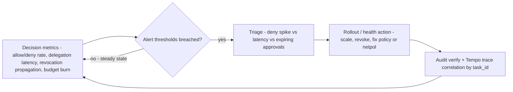

Every `/authz` decision is also a telemetry event: counting it is observability.
The stack is a budget single-binary backend plus a standalone collector, all
converging on one pod.

## Grafana LGTM (single binary)

`base/observability/lgtm.yaml` runs `grafana/otel-lgtm` — **Grafana + Prometheus +
Tempo + Loki + a built-in OTel Collector in one pod**, sized for a 2vCPU/4GB node.
It lives in the `observability` namespace with a PVC for persistence and
provisioning ConfigMaps (datasources + the dashboard).

Three telemetry sources converge on it:

- **App traces/logs** (agent-idp, runbooks-api, the agents) ship OTLP directly to
  `lgtm:4317`. They set DID/VC span attributes — `did`, `vcJti`, `task`,
  `action`, `decision` — so a verifiable-credential-scoped agent action can be
  followed end to end. Python services emit OTLP only when
  `OTEL_EXPORTER_OTLP_ENDPOINT` is set (via the `otel-telemetry-env` ConfigMap);
  otherwise they log spans to stdout and never crash.
- **Control-plane metrics** are scraped by the standalone OTel Collector (it owns
  the Prometheus service-discovery RBAC) and remote-written into LGTM's Prometheus.
- **Audit** (hash-chained JSON on the control-plane stdout) is tailed by the
  audit-shipper DaemonSet and pushed to LGTM's Loki, tagged
  `service.name=control-plane-audit`.

## The standalone OTel collector

`base/observability/otel-collector.yaml` is a separate collector (distinct from
the one bundled in LGTM) that owns the Prometheus SD RBAC, scrapes the
control-plane `/metrics` endpoint (the management plane, `:8181`), and
remote-writes into LGTM's Prometheus. Keeping scrape RBAC in its own collector
keeps the LGTM pod's permissions minimal.

## The `palonexus-overview` dashboard

Provisioned into the **PaloNexus** folder. It surfaces the core control-plane
signals:

| Panel | Query |
|---|---|
| Allow vs deny by service | `palonexus_authz_decisions_total` |
| Decision latency p50/p99 | `palonexus_authz_duration_seconds_bucket` |
| Per-agent token usage | `palonexus_token_usage_total` |
| Per-agent cost (USD) | `palonexus_agent_cost_usd_total` |
| Trace search | Tempo panel |

## Metrics reference

Exposed by the control plane on the management plane (`MGMT_ADDR`, `:8181`) at
`GET /metrics`, defined in `internal/metrics`:

| Metric | Type | Meaning |
|---|---|---|
| `palonexus_authz_decisions_total` | counter | allow/deny decisions, labelled by service/decision |
| `palonexus_authz_duration_seconds` | histogram | decision latency (default buckets) |
| `palonexus_token_usage_total` | counter | per-agent LLM token consumption, reported by the model-broker |
| `palonexus_agent_cost_usd_total` | counter | per-agent spend in USD, reported by the model-broker |

The token/cost counters are how the egress budget gate is observed — see
[Egress enforcement (ops)](/docs/operations/egress-enforcement-ops/).

## The Day-2 operational loop

Running a governed cluster is a closed loop: the decision metrics below feed
alerts, an alert drives a triage and a rollout/health action, and every action is
reconciled against the tamper-evident audit before the loop repeats. The diagram
names the signals that open the loop and the audit verify that closes it.



*The Day-2 loop: decision metrics → alert → triage → rollout/health action →
audit verify, then back to metrics. Deny-by-default means the signal to watch is a
**change** in a rate, not its presence.*

## What good looks like

A healthy governed cluster has a recognizable signal shape. Use these as the SLO/alert baseline:

| Signal | PromQL | What good looks like | Alert when |
|---|---|---|---|
| **Authz allow/deny rate** | `sum by (decision) (rate(palonexus_authz_decisions_total[5m]))` | a steady allow baseline; deny is non-zero but flat (deny-by-default is *working*, not *spiking*) | deny rate for one service/agent jumps — a misconfig, a revoked agent looping, or an attack |
| **Decision latency p99** | `histogram_quantile(0.99, sum by (le) (rate(palonexus_authz_duration_seconds_bucket[5m])))` | low single-digit ms; the hot path is pure except the budget meter | p99 climbs → OPA/agent-idp slow (both have 2s timeouts → fail-closed denies) |
| **Delegation / approval latency** | time from `request_delegation` to `approved` (audit timestamps; or the egress-hold `ApprovalTimeout`, default 120s) | well under the timeout; most approvals in minutes | approvals routinely expiring (`egress approval expired`) → understaffed approvers or too-tight TTL |
| **Revocation propagation** | time from `POST /v1/revoke` to the next dependent decision denying | **sub-second** — the StatusList is re-checked every call | any measurable lag → verification not re-checking (a cache bug); should be ~immediate |
| **Budget burn** | `rate(palonexus_token_usage_total[1h])`, `palonexus_agent_cost_usd_total` | smooth, within the per-agent ceiling | approaching `tokensPerHour` → a runaway agent; pair with the deny-rate alarm |

### Sample alerts

```yaml
groups:
  - name: palonexus
    rules:
      - alert: PalonexusDenySpike
        expr: |
          sum by (service) (rate(palonexus_authz_decisions_total{decision="deny"}[5m])) > 1
        for: 10m
        annotations:
          summary: "Sustained deny spike on {{ $labels.service }} — misconfig, looping agent, or attack"
      - alert: PalonexusAuthzLatencyHigh
        expr: |
          histogram_quantile(0.99, sum by (le) (rate(palonexus_authz_duration_seconds_bucket[5m]))) > 0.25
        for: 10m
        annotations:
          summary: "authz p99 > 250ms — check OPA / agent-idp reachability (fail-closed denies follow)"
```

A deny **spike** is the signal to watch: deny-by-default means a flat low deny rate is normal, so a
*change* in the deny rate — not its mere presence — is what indicates a problem. Correlate any
spike to a `task_id` or agent via the [audit chain](/docs/operations/backups/#the-audit-chain-is-the-crown-jewel)
and the Tempo trace below.

## DID/VC traces (Tempo)

The portal's Traces tab embeds Grafana Explore (Tempo). Open **Explore → Tempo**
and filter on span attributes to follow a verifiable-credential-scoped action:

```
{ .vcJti = "<jti>" }
```

Tempo links out to Loki (logs) and Prometheus (metrics) for the same trace, so a
single agent action — model call, tool call, the `/authz` decision behind it, the
audit row — is one navigable thread. Grafana runs anonymous **Viewer** with iframe
embedding enabled.

## Access

Both the portal and Grafana are exposed on the tailnet (Tailscale) by default, with
port-forward as the fallback:

```bash
kubectl -n observability port-forward svc/lgtm 3000:3000   # Grafana (anonymous Viewer)
kubectl -n palonexus     port-forward svc/control-plane 8181:8181   # /metrics
```

The portal server-side-proxies Grafana for the Traces iframe via `GRAFANA_URL` /
`GRAFANA_PUBLIC_URL`. See [Self-hosting](/docs/operations/self-hosting/) for the
full access matrix.
