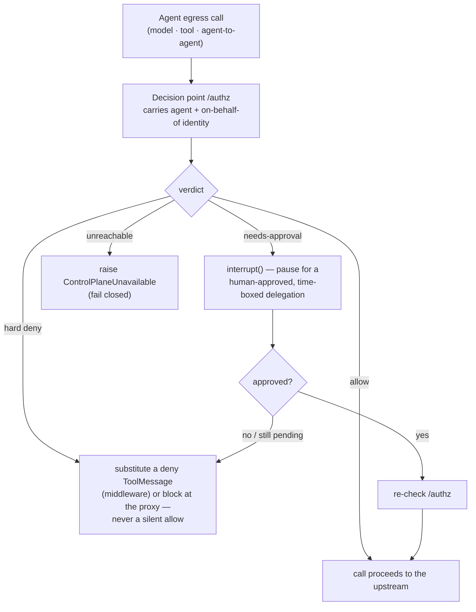

The hard part of governing an agent is **egress**: making every outbound call
(model, tool, peer agent) pass through the same `/authz` decision carrying the
agent's identity. PaloNexus does this at the **network layer** so it works for
*any* Python HTTP library, not just LangChain middleware.

The contract: Kubernetes injects `HTTPS_PROXY`/`HTTP_PROXY` pointing at the egress
proxy (`egress-proxy.palonexus.svc`), and the pod's NetworkPolicy permits egress
**only** to that proxy (plus DNS and agent-idp). So every outbound call is
physically forced through `/authz`. These helpers make the agent's *legitimate*
calls carry a verifiable identity; a raw `curl` (no VP) is denied by the proxy —
which is the point.

## How a call is routed

Whether the gate sits in the in-process [middleware](/docs/sdk/langchain/) (which calls
`/authz` directly) or in the network-layer proxy/sidecar (which presents the Membership VP at
the proxy, and the proxy calls `/authz`), the **decision is the same** and the client behaviour
is fail-closed. Every model / tool / agent-to-agent call resolves to exactly one of four
outcomes — and there is no path where an unreachable decision point becomes a silent allow:



*Egress-proxy client decision: every outbound call routes through `/authz`; the client substitutes a deny, interrupts for human approval, or fails closed — the gate is in the request path, not an afterthought.*

## egress_proxy — framework-agnostic proxied clients

Source: `agents/palonexus_agent/palonexus_agent/egress_proxy.py`. These helpers
build httpx clients whose traffic goes through the egress proxy with the agent's
Membership VP attached as `Proxy-Authorization: Bearer <vp>`.

| Symbol | Purpose |
|---|---|
| `proxy_url() -> str \| None` | The configured `HTTPS_PROXY`/`HTTP_PROXY` (any case), or `None` (offline/tests). |
| `proxy_auth_vp() -> str` | A fresh Membership VP (`agentdid.build_vp`, audience `palonexus-egress`, random nonce, TTL `PROXY_VP_TTL_S`) for the bound identity (`get_identity()`), or `""` if none. Never raises — VP-build failure returns `""` and lets the proxy decide. |
| `proxied_client(**kwargs) -> httpx.Client` | An `httpx.Client` routed through the egress proxy with the VP attached. Falls back to a **plain** client when no proxy is set (tests/offline unaffected). Use for the broker (model), runbooks-api (tool), and peer/external calls — **not** the agent-idp bootstrap (that bypasses the proxy via `NO_PROXY`). |
| `proxied_async_client(**kwargs) -> httpx.AsyncClient` | Async counterpart — **required** for LangChain `ainvoke`, which uses the model's async HTTP client; without it, async model calls bypass the gate and the proxy-only NetworkPolicy then blocks them. |
| `PROXY_VP_TTL_S` | Long-TTL for the proxy-auth VP, `PALONEXUS_PROXY_VP_TTL_S` (default `43200` = 12h). |
| `EGRESS_AUDIENCE` | `"palonexus-egress"` — the VP audience the proxy expects. |

<!-- no-doctest: legacy `palonexus_agent` scaffold (graduated into `palonexus`) — not the shipped package; page pending REM-159 -->
```python
from palonexus_agent.egress_proxy import proxied_client

# Gated outbound call carrying the agent's Membership VP as Proxy-Authorization.
with proxied_client(timeout=30.0) as c:
    r = c.get("https://example.internal/data")
```

### Why a long VP TTL is safe

A persistent client (e.g. the model client) would otherwise present a VP that
expires mid-workflow. The long TTL is safe because the egress proxy **re-checks
the Membership VC against the StatusList on every call** (agent-idp's
verify-presentation), so **revocation still cuts egress immediately**, regardless
of VP expiry.

## The egress identity sidecar

Source: `agents/egress-sidecar/app.py`. `langchain_openai`'s transport injection
**drops** the proxy env, so the in-process `proxied_client` cannot catch the model
client. The sidecar is the fix.

It runs as a second container in each agent pod and is the agent's model-egress
endpoint: the agent points its broker `base_url` at the sidecar on localhost — a
setting LangChain/OpenAI clients honour and **cannot strip** (unlike
`HTTP(S)_PROXY`). For every request the sidecar:

1. mints a **fresh, long-TTL, revocable** Verifiable Presentation from the agent's
   shared identity (`did:key` + issuer Membership VC, read from the shared volume
   file), and
2. forwards the call to the real model broker **through** the PaloNexus egress
   proxy, with that VP as `Proxy-Authorization` — so the model egress is decided at
   `/authz` at the network layer, transparently to the agent framework.

```
  agent (build_llm, base_url=localhost sidecar)
        │  plain HTTP, in-pod
        ▼
  egress-sidecar  ── mints fresh VP ──┐
        │  Proxy-Authorization: VP     │
        ▼                              │
  egress proxy  ──► /authz (model allowlist · identity · revocation)
        │  on allow
        ▼
  real model broker
```

### Sidecar environment

| Env var | Default | Purpose |
|---|---|---|
| `PALONEXUS_IDENTITY_FILE` | `/var/run/palonexus-identity/identity.json` | The **shared** identity file written by the agent (`{did, privateKeyB64, membershipVc}`) and read by the sidecar each call to mint a fresh VP. |
| `REAL_BROKER_URL` | `http://model-broker.palonexus.svc.cluster.local:8080` | The real model broker the sidecar forwards to (after the proxy allows). |
| `EGRESS_PROXY_URL` | `http://egress-proxy.palonexus.svc.cluster.local` | The egress proxy the sidecar routes through (carrying the VP as `Proxy-Authorization`). |
| `VP_TTL_S` | `43200` (12h) | VP lifetime; revocation is still enforced per-call at `/authz`. |

The sidecar exposes `GET /healthz` (reports `did` + `broker`, or `503`
`waiting-for-identity` until the identity file exists) and proxies all other paths
to the broker.

### The shared identity file

On startup, `create_app` calls `_write_identity_file(identity)`: when
`PALONEXUS_IDENTITY_FILE` is set and a Membership VC exists, it writes
`{"did", "privateKeyB64", "membershipVc"}` to that path on a shared `emptyDir`
volume. The sidecar reads it on every call (cheap; always current after a pod
restart re-provisions). The private key lives only in the pod — never on disk
outside the shared volume, never persisted across pod restarts.

### Why the model `base_url` points at the sidecar

`HTTP(S)_PROXY` env can be silently dropped by `langchain_openai`'s transport
injection, which would let model calls bypass the gate — and then the proxy-only
NetworkPolicy hangs them. `base_url` is a first-class OpenAI-client setting that
LangChain cannot strip. So in sidecar mode the agent sets
`PALONEXUS_USE_EGRESS_SIDECAR=1` and points `PALONEXUS_BROKER_URL` at the
localhost sidecar; `build_llm` then uses a plain client straight to it, and the
sidecar owns the proxy + fresh VP. See [build_llm](/docs/sdk/palonexus-agent/) for
how the two routing paths are selected.

## See also

- [palonexus_agent scaffold](/docs/sdk/palonexus-agent/) — `build_llm` and `set_identity`.
- [Configuration & environment variables](/docs/sdk/config-env/) — the full agent env table.
- [LangChain adapter](/docs/sdk/langchain/) · [LangGraph adapter](/docs/sdk/langgraph/) — the in-process gate that makes the same `/authz` decision shown above.
- [Egress enforcement](/docs/concepts/egress-enforcement/) — the concept this implements.
