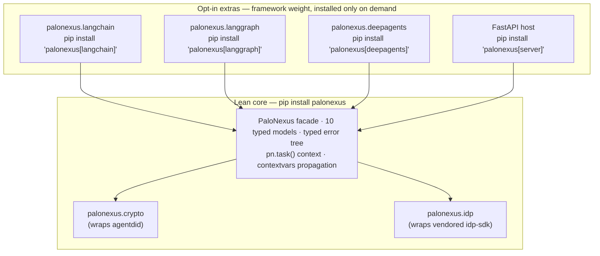

PaloNexus ships **one installable front door**: the `palonexus` package.

```bash
pip install palonexus
```

It is a typed, framework-aware facade that **wraps — does not replace** the platform's
existing packages. The base install is deliberately lean: the `PaloNexus` facade, the
[ten typed models](#the-ten-typed-models), the typed [error tree](/docs/getting-started/quickstart/#more-on-each-step),
the idp HTTP client, and the crypto layer. Framework bindings are **opt-in extras** so an
agent author who only needs `task.check(...)` never installs a graph runtime.

:::tip[New here? Start with the quickstart]
The fastest path is the [10-minute quickstart](/docs/getting-started/quickstart/) —
`pip install`, `PaloNexus.offline()`, register → denied → approved → succeed, no cluster — and
it covers every call copy-pasteably.
:::

## One package, three layers

`palonexus` re-exports three existing packages as sub-modules — *layers*, not separate
products — and adds the facade, models, and errors on top:

| Layer | Import | Wraps | Role |
|---|---|---|---|
| **crypto** | `palonexus.crypto` | [`agentdid`](/docs/sdk/agentdid/) | Ed25519 keys, `did:key` / `did:web`, JWT-VC, Verifiable Presentations, delegation chains, challenge-response, StatusList revocation. The crypto foundation. |
| **idp** | `palonexus.idp` | `idp-sdk` | The HTTP client to **agent-idp**: governance, provisioning, delegations, revocation, directory. |
| **agent** | `palonexus.langchain` · `palonexus.langgraph` · `palonexus.deepagents` | [`palonexus_agent`](/docs/sdk/palonexus-agent/) | The runtime gates and framework adapters, graduated from the agent scaffold. |

The diagram below shows the shape of that dependency: the **lean core** (`pip install
palonexus`) is the facade plus the two wrapped platform packages it re-exports, and every
**framework adapter** sits *above* the core as an opt-in extra that depends on it — never the
other way round. Installing the client for a service that only needs `task.check(...)` pulls
the bottom two rows and nothing heavier.



*SDK layering: the umbrella `palonexus` package is a lean core (the facade over `palonexus.crypto` and `palonexus.idp`) with each framework adapter added as an opt-in extra that depends on the core.*

`palonexus.crypto` (`agentdid`) stays an independently-versioned, dependency-light package
because the **servers** import it directly too (agent-idp issues VCs; runbooks-operator
verifies VPs). The SDK re-exports it as an ordinary dependency rather than folding it in — so
installing the client never drags a web server into a service that only needs `verify_vp()`.

## Install (core + extras)

```bash
pip install palonexus                 # core: facade, models, idp client, crypto
pip install 'palonexus[langchain]'    # + palonexus.langchain.middleware / guarded_tool
pip install 'palonexus[langgraph]'    # + palonexus.langgraph.governed_node / resume_after_approval
pip install 'palonexus[deepagents]'   # + palonexus.deepagents.tool_guard / governance_middleware
pip install 'palonexus[server]'       # + the FastAPI host
pip install 'palonexus[all]'          # every extra at once
```

The base package is the hybrid's *lean core*; each extra adds exactly one framework binding's
dependency on top — nothing else:

| `pip install …` | Adds the module | What it pulls in | When you need it |
|---|---|---|---|
| `palonexus` | `PaloNexus`, the [ten models](#the-ten-typed-models), the [error tree](#deny-by-default-as-typed-exceptions), `palonexus.crypto`, `palonexus.idp` | `httpx`, `pydantic`, `agentdid`, `idp-sdk` | Always — `task.check()` / `authorize()`, register, delegate, audit, revoke. |
| `palonexus[langchain]` | `palonexus.langchain` | `langchain>=0.3` | Guard a `create_agent` tool with `middleware(pn)` + `guarded_tool`. |
| `palonexus[langgraph]` | `palonexus.langgraph` | `langgraph>=0.2` | Govern a graph node with `governed_node` + HITL `interrupt()`. |
| `palonexus[deepagents]` | `palonexus.deepagents` | `deepagents` (on LangChain/LangGraph) | Govern `create_deep_agent(...)` with `tool_guard` + `governance_middleware`. |
| `palonexus[server]` | the FastAPI host | `fastapi`, `uvicorn` | Host the SDK as a service. |
| `palonexus[otel]` | span export | `opentelemetry-api` / `-sdk` | Export the `pn.task(...)` OTel spans. |
| `palonexus[all]` | everything above | all of the above | Demos / one-shot environments. |

The adapter modules (`palonexus.langchain`, `.langgraph`, `.deepagents`) are *importable* on a
base install, but **calling** their functions without the matching extra raises a clear
`ImportError` naming the extra to install — never a bare `ModuleNotFoundError`.

## Initialize

```python
from palonexus import PaloNexus

pn = PaloNexus.from_env()    # PALONEXUS_* env (honors PALONEXUS_OFFLINE=1)
pn = PaloNexus.offline()     # in-memory FakeControlPlane — no cluster, for tests/CI
pn = PaloNexus(control_plane_url="http://localhost:9191",
               idp_url="http://localhost:8090", api_key="pn_live_…")
```

`PaloNexus.offline()` mirrors the demo seeder's `FakeLogtoClient` philosophy: the full
register → deny → delegate → approve → succeed flow runs against an in-memory control plane
seeded with the real **devops-incident** personas, so unit tests and the doc snippets on this
site need no cluster.

## The ten typed models

The SDK replaces "dicts everywhere" with ten Pydantic models, each mapping to a concrete
platform surface:

| Model | Backed by |
|---|---|
| `AgentIdentity` | agent-idp `/v1/agents` + `/provision` (`did:key` + Membership VC) |
| `HumanOwner` | the workforce directory (synced from your IdP) via agent-idp `/v1/directory` (stable subject, `org:agents:*`) |
| `Delegation` | agent-idp `/v1/delegations` (`pending → approved → …`) |
| `TaskSession` | the unit of governed work (bound by `pn.task(...)`) |
| `PolicyDecision` | control-plane `/authz` (`allow`, `needs_approval`, `reason`, …) |
| `Credential` | a Membership / Delegation / Capability VC (`agentdid`) |
| `AuditEvent` | control-plane `/v1/audit` (hash-chained) |
| `Resource` | a registry service + verbatim `requireScope` target |
| `AssetType` | the PaloNexus-only asset taxonomy (not held in the workforce IdP) |
| `PolicyDecisionLog` | convenience alias for `list[AuditEvent]` |

## Deny-by-default, as typed exceptions

Deny is a *typed contract*, not a return code you might forget to check:

| Exception | Means |
|---|---|
| `GovernanceError` | A governance rule was violated (e.g. missing owner/sponsor at registration). |
| `PolicyDenied` | Hard deny (HTTP 403) — no path forward. |
| `ApprovalRequired` | Allowed in principle, needs a human-approved delegation (401 + needs-approval). |
| `DelegationExpired` | The delegation's time-box elapsed. |
| `CredentialRevoked` | A credential was revoked (StatusList check failed mid-run). |
| `IdentityNotProvisioned` | An operation needs a provisioned identity (`agent.provision()`). |
| `ControlPlaneUnavailable` | The decision point was unreachable — **raised, never swallowed** (fail closed). |

## Choosing a framework adapter

All three adapters make the **same** `/authz` decision through the **same** `pn._decide` seam
and the same offline `FakeControlPlane`, so the deny / needs-approval / allow contract is
identical across them. They differ only in *where* the gate sits in your agent:

| | [LangChain](/docs/sdk/langchain/) | [LangGraph](/docs/sdk/langgraph/) | [Deep Agents](/docs/sdk/deep-agents/) |
|---|---|---|---|
| Extra | `palonexus[langchain]` | `palonexus[langgraph]` | `palonexus[deepagents]` |
| Declare intent | `guarded_tool(tool, action=…, resource=…)` | `@governed_node(pn, action=…, resource=…)` | `tool_guard(pn, tool, action=…, resource=…)` |
| Gate point | `create_agent` middleware (per tool/model call) | a graph **node** (per node) | `create_deep_agent` middleware (reuses the LangChain gate) |
| Hard deny | deny `ToolMessage` substituted | raises `PolicyDenied` (fail closed) | deny `ToolMessage` substituted |
| HITL on needs-approval | `interrupt()` for approval | auto-`request_delegation` + `interrupt()`, re-check on resume | `interrupt()` via `interrupt_on={…}` |
| Checkpointer required for HITL | yes (`thread_id`) | yes (`thread_id`) | yes (`thread_id`) |
| Also ships | `gate_model=True` for the model edge | `resume_after_approval(pn)` explicit-resume node | the `palonexus-governance` SKILL.md |

Not sure which layer you need? If your tools are already LangChain `@tool`s, start with the
[LangChain adapter](/docs/sdk/langchain/); reach for [LangGraph](/docs/sdk/langgraph/) when you
have an explicit graph, and [Deep Agents](/docs/sdk/deep-agents/) for planner/sub-agent runtimes.

## Where to go next

- [Quickstart](/docs/getting-started/quickstart/) — init, register, task, check, delegate, audit, revoke.
- [LangChain adapter](/docs/sdk/langchain/) · [LangGraph adapter](/docs/sdk/langgraph/) — the framework extras.
- [agentdid API reference](/docs/sdk/agentdid/) — every credential primitive (`palonexus.crypto`).
- [palonexus_agent scaffold](/docs/sdk/palonexus-agent/) — identity bootstrap, egress gates, `create_app`.
- [Configuration & environment variables](/docs/sdk/config-env/) — the full env-var table.
- [Glossary](/docs/getting-started/glossary/) — every acronym used in these docs.

> **Looking for the enterprise-IAM APIs?** Directory sync, employee identity, ownership
> governance, revocation cascade, human-authority delegation, and the STS token exchange are
> HTTP APIs on the agent-idp service — see the
> [Enterprise IAM API reference](/docs/reference/enterprise-iam-api/), the
> [how-to guide](/docs/develop/enterprise-iam/), and the [concept](/docs/concepts/enterprise-iam/).
