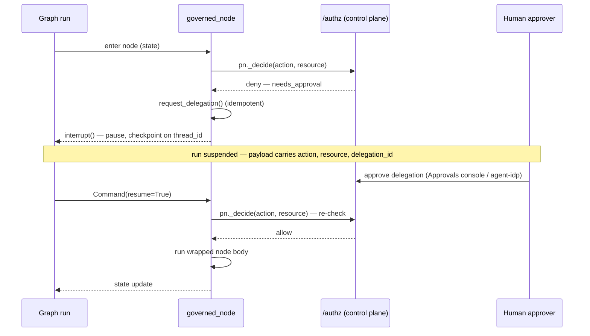

`palonexus.langgraph` governs a LangGraph node with one decorator. `governed_node(pn, …)`
wraps a node so it runs **only if** `/authz` allows, and reproduces the
`incident-triage` flow — deny → `interrupt()` → approve → re-read — with the boilerplate
removed:

- **allow** → the wrapped node runs;
- **needs-approval** → a delegation is requested automatically (idempotent) and `interrupt()`
  pauses the graph for human approval; on resume the decision is re-checked and the node runs
  only if it is now allowed;
- **hard deny** → `PolicyDenied` (fail closed);
- **decision point unreachable** → `ControlPlaneUnavailable`.

## The HITL cycle

The sequence below traces the needs-approval path end to end. The node asks `/authz` *before*
running; on a needs-approval verdict it auto-starts the `request_delegation` flow and
`interrupt()`s, which checkpoints the graph and returns control to your caller. A human approves
out of band; resuming with `Command(resume=…)` re-enters the node, which **re-checks** `/authz`
and runs the wrapped body only now that the delegation is approved. The decision is made twice —
deny-by-default holds until the grant exists.



*LangGraph governed-node HITL: `governed_node` denies by default, `interrupt()`s for a human-approved delegation, then re-checks `/authz` on resume before the node body runs. (This page is the SDK home for this diagram; the develop/ guides reference it rather than duplicating it.)*

## Install

```bash
pip install 'palonexus[langgraph]'
```

## The durable-checkpointer requirement

HITL pause/resume is **not optional plumbing** — it depends on LangGraph persistence. To
`interrupt()` on needs-approval and later resume after a human approves, the graph **must** be
compiled with a durable **checkpointer** and invoked with a `thread_id`:

<!-- no-doctest: illustrative fragment — uses `builder` from a neighbouring block (not standalone-runnable) -->
```python
from langgraph.checkpoint.memory import MemorySaver        # dev / tests
# from langgraph.checkpoint.postgres.aio import AsyncPostgresSaver  # production

graph = builder.compile(checkpointer=MemorySaver())        # <- required for HITL
config = {"configurable": {"thread_id": "INC-4821"}}       # <- required: the run id state is keyed by
```

:::caution[No checkpointer, no resume]
Without a checkpointer + `thread_id`, an `interrupt()` cannot be resumed and the approval flow
cannot complete. Use `MemorySaver` in dev/tests and `AsyncPostgresSaver` (durable) in
production — the same requirement as the scaffold's `checkpointer.py`.
:::

## Govern a node

<!-- no-doctest: illustrative fragment — uses `TriageState` from a neighbouring block (not standalone-runnable) -->
```python
from langgraph.graph import START, END, StateGraph
from langgraph.checkpoint.memory import MemorySaver
from palonexus import PaloNexus
from palonexus.langgraph import governed_node

pn = PaloNexus.from_env()                      # or PaloNexus.offline() for tests

@governed_node(pn, action="runbooks:read",
               resource=lambda s: f"runbooks-api:/runbooks/{s['runbook_name']}")
def read_runbook(state):
    # Only runs once /authz allows (after the delegation is approved).
    return {"runbook_steps": runbooks[state["runbook_name"]]}

graph = (StateGraph(TriageState)
         .add_node("read_runbook", read_runbook)
         .add_edge(START, "read_runbook").add_edge("read_runbook", END)
         .compile(checkpointer=MemorySaver()))   # durable checkpointer required for HITL
```

`resource` may be a callable deriving the concrete target from graph state. Decisions are made
against the bound request context, so drive the graph inside `with pn.task(subject=…,
task_id=…) as _:`.

## Full HITL flow, offline

This is the shipped `examples/langgraph_runbook_hitl.py`, runnable with no network. It walks
the complete deny → interrupt → approve → resume cycle with the **devops-incident** personas.

```python
from langgraph.checkpoint.memory import MemorySaver
from langgraph.graph import END, START, StateGraph
from langgraph.types import Command
from typing_extensions import TypedDict
from palonexus import PaloNexus
from palonexus.langgraph import governed_node

RUNBOOKS = {"db-failover": "1. Fail over to the standby primary.\n2. Verify replica lag is zero."}
AGENT = "northstar-devops-incident-agent"
OWNER = "ethan.park@northstar.example"
APPROVER = "maya.chen@northstar.example"

class TriageState(TypedDict, total=False):
    runbook_name: str
    runbook_steps: str
    triage_plan: str

pn = PaloNexus.offline()
agent = pn.agents.register(name=AGENT, owner=OWNER, sponsor=APPROVER, scenario="devops-incident")
agent.provision()

@governed_node(pn, action="runbooks:read",
               resource=lambda s: f"runbooks-api:/runbooks/{s['runbook_name']}")
def read_runbook(state: TriageState) -> dict:
    return {"runbook_steps": RUNBOOKS[state["runbook_name"]]}

def propose(state: TriageState) -> dict:
    return {"triage_plan": f"Follow runbook:\n{state.get('runbook_steps', '(none)')}"}

graph = (StateGraph(TriageState)
         .add_node("read_runbook", read_runbook)
         .add_node("propose", propose)
         .add_edge(START, "read_runbook")
         .add_edge("read_runbook", "propose")
         .add_edge("propose", END)
         .compile(checkpointer=MemorySaver()))     # durable checkpointer required for HITL

config = {"configurable": {"thread_id": "INC-4821"}}

with pn.task(subject=OWNER, task_id="INC-4821", scenario="devops-incident", actor=AGENT):
    # 1) First pass: deny-by-default -> the node interrupts for approval.
    out = graph.invoke({"runbook_name": "db-failover"}, config)
    assert "__interrupt__" in out
    payload = out["__interrupt__"][0].value["palonexus"]
    print(f"[interrupt] needs approval: {payload['action']} on {payload['resource']}")

    # 2) Human approval (Maya), out-of-band. Offline we drive the in-memory control plane;
    #    in production the approver clicks Approve in the portal.
    pending = pn._fake.open_delegations(OWNER)
    pn._fake.approve_delegation(pending[0].id, approver=APPROVER)
    print(f"[approve ] {APPROVER} approved delegation {pending[0].id}")

    # 3) Resume: the node re-checks, is now allowed, and reads the runbook.
    out = graph.invoke(Command(resume=True), config)

print("[done    ]", out["runbook_steps"].splitlines()[0])
pn.close()
```

```text
[interrupt] needs approval: runbooks:read on runbooks-api:/runbooks/db-failover
[approve ] maya.chen@northstar.example approved delegation deleg-…
[done    ] 1. Fail over to the standby primary.
```

The interrupt payload carries `{"action", "resource", "delegation_id", "subject", "task"}`
under the `palonexus` key, so your UI (or the [Approvals console](/docs/develop/delegations-and-approvals/))
has everything it needs to render the approval request.

## Explicit resume node

For graphs that prefer an explicit resume step over interrupt-in-place, pair `governed_node`
with `resume_after_approval(pn)` — a node that confirms the human-approved delegation and emits
a state update so the graph can loop back into the governed node:

<!-- no-doctest: illustrative fragment — needs a live `StateGraph` wiring -->
```python
from palonexus.langgraph import governed_node, resume_after_approval

graph = (StateGraph(TriageState)
         .add_node("read_runbook", read_runbook)
         .add_node("resume", resume_after_approval(pn))
         .compile(checkpointer=postgres_saver))   # durable checkpointer required for HITL
```

It returns `{"palonexus_resumed": True, "palonexus_delegation_status": "approved"}` on
success, raises `ApprovalRequired` if the delegation is still pending, and `PolicyDenied` if
there is none to resume.

## Next

- [LangChain adapter](/docs/sdk/langchain/) — guard a tool in `create_agent`.
- [Quickstart](/docs/getting-started/quickstart/) · [Glossary](/docs/getting-started/glossary/)
